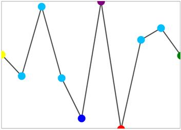

# Marker Customization

We can customize the markers by initializing the marker template selector class, and we can differentiate the first, last, high, low, negative points.

* [`FirstPointBrush`](http://help.syncfusion.com/cr/cref_files/uwp/sfchart/index.html#frlrfSyncfusionUIXamlChartsSegmentTemplateSelectorClassFirstPointBrushTopic.html) – Gets or sets the brush to paint the first point of the sparkline.
* [`LastPointBrush`](http://help.syncfusion.com/cr/cref_files/uwp/sfchart/frlrfSyncfusionUIXamlChartsSegmentTemplateSelectorClassLastPointBrushTopic.html) – Gets or sets the brush to paint the last point of the sparkline.
* [`LowPointBrush`](http://help.syncfusion.com/cr/cref_files/uwp/sfchart/frlrfSyncfusionUIXamlChartsSegmentTemplateSelectorClassLowPointBrushTopic.html) – Gets or sets the brush to paint the low point of the sparkline.
* [`HighPointBrush`](http://help.syncfusion.com/cr/cref_files/uwp/sfchart/index.html#frlrfSyncfusionUIXamlChartsSegmentTemplateSelectorClassHighPointBrushTopic.html) – Gets or sets the brush to paint the high point of the sparkline.
* [`NegativePointBrush`](http://help.syncfusion.com/cr/cref_files/uwp/sfchart/frlrfSyncfusionUIXamlChartsSegmentTemplateSelectorClassNegativePointBrushTopic.html) – Gets or sets the brush to paint the negative point of the sparkline.
* [`MarkerHeight`](http://help.syncfusion.com/cr/cref_files/uwp/sfchart/frlrfSyncfusionUIXamlChartsMarkerTemplateSelectorClassMarkerHeightTopic.html) – Gets or sets the height of the marker.
* [`MarkerWidth`](http://help.syncfusion.com/cr/cref_files/uwp/sfchart/frlrfSyncfusionUIXamlChartsMarkerTemplateSelectorClassMarkerWidthTopic.html) – Gets or sets the width of the marker.
* [`MarkerBrush`](http://help.syncfusion.com/cr/cref_files/uwp/sfchart/frlrfSyncfusionUIXamlChartsMarkerTemplateSelectorClassMarkerBrushTopic.html) – Gets or sets the brush to paint the markers of the sparkline.
* [`MarkerTemplate`](http://help.syncfusion.com/cr/cref_files/uwp/sfchart/frlrfSyncfusionUIXamlChartsMarkerTemplateSelectorClassMarkerTemplateTopic.html) – Gets or sets the data template to sparkline marker.



<Syncfusion:SfLineSparkline  Interior="#4a4a4a"   

BorderBrush="DarkGray" MarkerVisibility="Visible"   

BorderThickness="1" ItemsSource="{Binding UsersList}"    

YBindingPath="NoOfUsers">

<Syncfusion:SfLineSparkline.MarkerTemplateSelector>

<Syncfusion:MarkerTemplateSelector FirstPointBrush="Yellow" 

LastPointBrush="Green" LowPointBrush="Red"

MarkerHeight="15" MarkerWidth="15"    

MarkerBrush="DeepSkyBlue" NegativePointBrush="Blue"

HighPointBrush="Purple" >

</Syncfusion:MarkerTemplateSelector>

</Syncfusion:SfLineSparkline.MarkerTemplateSelector>

</Syncfusion:SfLineSparkline >



**Marker Template**



<Syncfusion:SfLineSparkline Interior="#4a4a4a"  

BorderBrush="DarkGray" MarkerVisibility="Visible"   

BorderThickness="1" ItemsSource="{Binding UsersList}"  

YBindingPath="NoOfUsers">

<Syncfusion:SfLineSparkline.MarkerTemplateSelector>

<Syncfusion:MarkerTemplateSelector >

<Syncfusion:MarkerTemplateSelector.MarkerTemplate>

<DataTemplate>

<Grid>

<Ellipse Height="15" Width="15" Fill="LightGoldenrodYellow" 

Stroke="Black" StrokeDashArray="1,1" 

StrokeThickness="1" />

<Ellipse Height="12" Width="12" Fill="Blue" Stroke="Black"   

StrokeDashArray="1,1" StrokeThickness="1"/>

</Grid>

</DataTemplate>

</Syncfusion:MarkerTemplateSelector.MarkerTemplate>

</Syncfusion:MarkerTemplateSelector>

</Syncfusion:SfLineSparkline.MarkerTemplateSelector>

</Syncfusion:SfLineSparkline >



