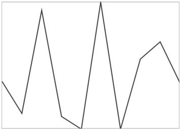
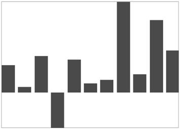
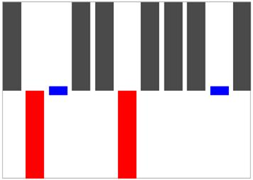

# Sparkline Types

## Line Sparkline

Line sparkline rendered using polyline and the following code is used to create line sparkline.



<Grid.DataContext>

<local:UsersViewModel/>

</Grid.DataContext>

<Syncfusion:SfLineSparkline Interior="#4a4a4a"  

BorderBrush="DarkGray" BorderThickness="1"                 

ItemsSource="{Binding UsersList}" 

YBindingPath="NoOfUsers">

</Syncfusion:SfLineSparkline >



## Column Sparkline

Column sparkline used to visualize the raw data as a rectangle and following code is used to create column sparkline.



<Syncfusion:SfColumnSparkline 
	
Interior="#4a4a4a" BorderBrush="DarkGray"    

BorderThickness="1" ItemsSource="{Binding UsersList}" 

YBindingPath="NoOfUsers">

</Syncfusion:SfColumnSparkline >



## Area Sparkline

An area sparkline is a line sparkline with the area between its points and the horizontal axis colored in. The following code is used to create an area sparkline. All line sparkline features are applicable for area sparklines.



<Syncfusion:SfAreaSparkline  

Interior="#4a4a4a" BorderBrush="DarkGray"     

BorderThickness="1" ItemsSource="{Binding UsersList}"   

YBindingPath="NoOfUsers">

</Syncfusion:SfAreaSparkline >



## Win-Loss Sparkline

A win-loss sparkline renders as column segments and shows positive, negative, and neutral values.



<Syncfusion:SfWinLossSparkline Interior="#4a4a4a" BorderBrush="DarkGray"    

BorderThickness="1" 

x:Name="sparkline" ItemsSource="{Binding Match}"   

YBindingPath="Result" >

</Syncfusion:SfWinLossSparkline>



