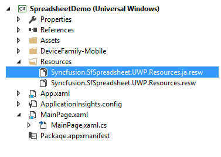
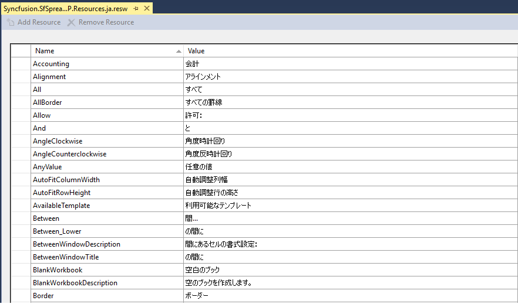
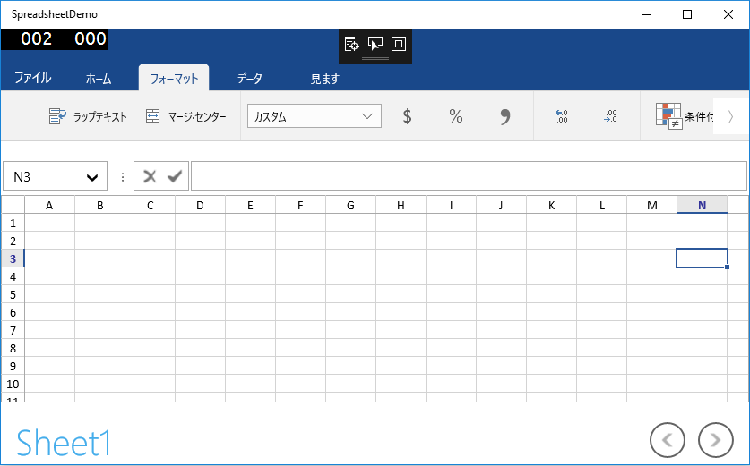

# Localization

Localization is the process of configuring the application to a specific language. SfSpreadsheet provides support to localize all the static text in a Ribbon and all dialogs to any desired language. Localization can be done by adding resource file and setting the specific culture in the application.

SfSpreadsheet allows you to set custom resource using Resw file. You can define your string values in resource file for a specific culture and set the culture in your application.

## Set Current UI Culture to the Application

To set the CultureInformation in the Application, set the `CurrentUICulture` before the InitializeComponent() method is called. 

Setting of the culture information,



   
public MainPage()
{
    System.Threading.Thread.CurrentThread.CurrentUICulture = new CultureInfo("ja");

    InitializeComponent();
}




Now, the Application is set to the Japanese Culture info. 

## Localization using Resource file

The following steps show how to implement the localization in SfSpreadsheet,

* Create folder name as ‘Resources’ in your application.
* Add default English("en-US") [Resw](http://www.syncfusion.com/downloads/support/directtrac/general/ze/Syncfusion.SfSpreadsheet.UWP.Resources1773657760) (resource) file of `SfSpreadsheet` in the 'Resources' folder named as Syncfusion.SfSpreadsheet.UWP.resw
* Create Resw(resource) file and name it as Syncfusion.SfSpreadsheet.UWP.[Culture name].resw. For example, Syncfusion.SfSpreadsheet.UWP.ja.resw for japanese culture.
  For your reference, Japanese("ja-JP") [Resw](http://www.syncfusion.com/downloads/support/directtrac/general/ze/Syncfusion.SfSpreadsheet.UWP.Resources.ja2068752327) file

* Add the resource key such as name and its corresponding localized value in Resource Designer of Syncfusion.SfSpreadsheet.UWP.ja.resw file.

The following screenshot shows you the localization in SfSpreadsheet,

