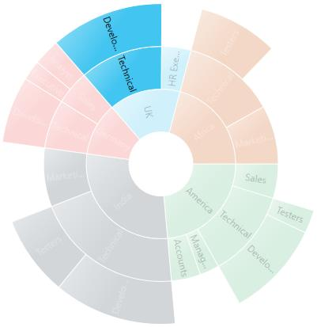
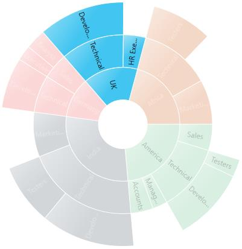
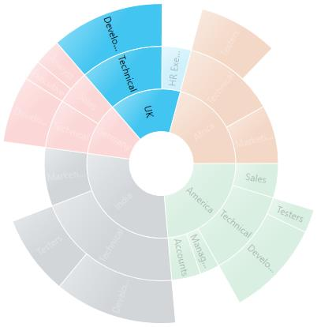
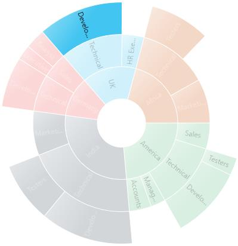

---

layout: post
title: Selection behavior of Sunburst.
description: This section explains the selection behavior of the SunburstChart.
platform: wpf 
control: SfSunburstChart 
documentation: ug

---

# Selection

Sunburst chart supports selection that enables you to select a segment by using [`SunburstSelectionBehavior`](https://help.syncfusion.com/cr/cref_files/wpf/sfsunburstchart/Syncfusion.SfSunburstChart.WPF~Syncfusion.UI.Xaml.SunburstChart.SunburstSelectionBehavior.html). 

The below code shows, how to enable the selection behavior.  





<sunburst:SfSunburstChart.Behaviors>

   <sunburst:SunburstSelectionBehavior/>

</sunburst:SfSunburstChart.Behaviors>





SunburstSelectionBehavior selection = new SunburstSelectionBehavior();
chart.Behaviors.Add(selection);





## SelectionDisplayMode

You can customize the selected segment appearance by using brush or opacity. You can choose between color or opacity using the [`SelectionDisplayMode`](https://help.syncfusion.com/cr/cref_files/wpf/sfsunburstchart/Syncfusion.SfSunburstChart.WPF~Syncfusion.UI.Xaml.SunburstChart.SunburstSelectionBehavior~SelectionDisplayMode.html) property in the selection behavior 

* HighlightByColor – To display the selected segment appearance using brush.
* HighlightByOpacity – To display the selected segment appearance using opacity.

The following code shows, how to set the display mode using brush.





<sunburst:SfSunburstChart.Behaviors>

                <sunburst:SunburstSelectionBehavior EnableSelection="True"
                                                    SelectionBrush="Black"
                                                    SelectionDisplayMode="HighlightByColor"/>
            
</sunburst:SfSunburstChart.Behaviors>





SunburstSelectionBehavior selection = new SunburstSelectionBehavior();
selection.EnableSelection = true;
selection.SelectionBrush = new SolidColorBrush(Colors.Black);
selection.SelectionDisplayMode = SelectionDisplayMode.HighlightByColor;
chart.Behaviors.Add(selection);





N> The default value of SelectionDisplayMode is HighlightByOpacity.

## SelectionMode

Sunburst chart provides support to select or highlight the segment by clicking or hovering the mouse over a segment. By default, this property value is MouseClick.

* Both – Select the segment using mouse move and mouse click.
* MouseClick – Select the segment using mouse click.
* MouseMove – Select the segment using mouse move.





 <sunburst:SfSunburstChart.Behaviors>

     <sunburst:SunburstSelectionBehavior EnableSelection="True"
                                         SelectionMode="MouseClick"/>
</sunburst:SfSunburstChart.Behaviors>





SunburstSelectionBehavior selection = new SunburstSelectionBehavior();
selection.EnableSelection = true;
selection.SelectionMode = Syncfusion.UI.Xaml.SunburstChart.SelectionMode.MouseClick;
chart.Behaviors.Add(selection);





## SelectionType

Sunburst chart provides multiple option to represent the selected categories. You can select the segment categories by using the [`SelectionType`](https://help.syncfusion.com/cr/cref_files/wpf/sfsunburstchart/Syncfusion.SfSunburstChart.WPF~Syncfusion.UI.Xaml.SunburstChart.SunburstSelectionBehavior~SelectionType.html) property in selection behavior.

* Child – To select the child of selected parent.
* Group – To select the entire categories in group.
* Parent – To select the parent of selected child.
* Single - To select single item in the category.

### Child

The following code shows, how to set the selection type as child.





 <sunburst:SfSunburstChart.Behaviors>

                <sunburst:SunburstSelectionBehavior EnableSelection="True"
                                                    SelectionType="Child"  />
</sunburst:SfSunburstChart.Behaviors>





SunburstSelectionBehavior selection = new SunburstSelectionBehavior();
selection.EnableSelection = true;
selection.SelectionType = SelectionType.Child;
chart.Behaviors.Add(selection);





### Group

The following code shows, how to set the selection type as group.



<sunburst:SfSunburstChart.Behaviors>

                <sunburst:SunburstSelectionBehavior EnableSelection="True"
                                                    SelectionType="Group"  />
</sunburst:SfSunburstChart.Behaviors>



### Parent

The following code shows, how to set the selection type as parent.



<sunburst:SfSunburstChart.Behaviors>

                <sunburst:SunburstSelectionBehavior EnableSelection="True"
                                                    SelectionType="Parent"  />
</sunburst:SfSunburstChart.Behaviors>



### Single

The following code shows, how to set the selection type as single.



<sunburst:SfSunburstChart.Behaviors>

                <sunburst:SunburstSelectionBehavior EnableSelection="True"
                                                    SelectionType="Single"  />
</sunburst:SfSunburstChart.Behaviors>



## Selection Cursor

SelectionCursor property allows you to customize the cursor when mouse is hovered over the segment. 

The following code shows, how to set the selection cursor as hand.





<sunburst:SfSunburstChart.Behaviors>

              <sunburst:SunburstSelectionBehavior EnableSelection="True"
                                                  SelectionCursor="Hand" />

</sunburst:SfSunburstChart.Behaviors>





SunburstSelectionBehavior selection = new SunburstSelectionBehavior();
selection.EnableSelection = true;
selection.SelectionCursor = Windows.UI.Core.CoreCursorType.Hand;
chart.Behaviors.Add(selection);





