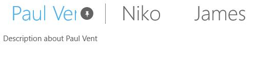

# Dealing with Pinnable Tabitems

Tab Items in SfTabControl can be pinned or unpinned using the pin button next to its header text. 

* A pinned tab item will move to the last position in pinned tab items panel (Appears prior to unpinned items panel).
* An unpinned tab item will move to the first position in unpinned tab items panel (Appears next to pinned items panel).
* Pin (or) unpin button is visible when the item is selected or pointer is over (for unselected) the item.

## Show Pinnable Button 

To enable this feature, set the property ShowPinnableButton to true for the tab items.

The following code example and screen shot illustrate this.





<navigation:SfTabControl>

<navigation:SfTabItem Header="Paul Vent" x:Name="paul"
                      Content="Description about Paul Vent" ShowPinnableButton="True"/>

<navigation:SfTabItem Header="Niko"
                      Content="Description about Niko" ShowPinnableButton="True"/>

<navigation:SfTabItem Header="James"
                      Content="Description about James" ShowPinnableButton="True"/>

<navigation:SfTabItem Header="Carl"
                      Content="Description about Carl" ShowPinnableButton="True"/>

</navigation:SfTabControl>









paul.ShowPinnableButton = true;





## Enable scroll buttons for pinned items panel

The pinned item tab panel is scrollable. The scroll buttons can be enabled by setting the property “PinnedTabScrollButtonVisibility”.





<navigation:SfTabControl x:Name="tabControl" PinnedTabScrollButtonVisibility="Visible">

<navigation:SfTabItem Header="Paul Vent" Content="Description about Paul Vent" ShowPinnableButton="True"/>

<navigation:SfTabItem Header="Niko" Content="Description about Niko" ShowPinnableButton="True"/>

<navigation:SfTabItem Header="James" Content="Description about James" ShowPinnableButton="True"/>

<navigation:SfTabItem Header="Carl" Content="Description about Carl" ShowPinnableButton="True"/>

</navigation:SfTabControl>









tabControl.PinnedTabScrollButtonVisibility = Syncfusion.UI.Xaml.Controls.Navigation.TabScrollButtonVisibility.Visible;





