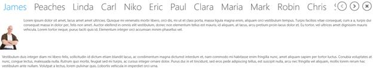
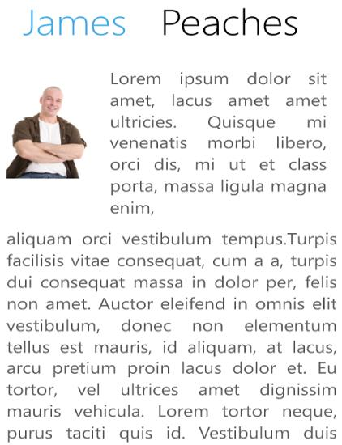
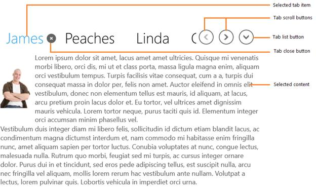

# Overview

SfTabControl is similar to dividers in a notebook or the labels in a file cabinet. It can be used to create a tabbed interface in an application. 

## Features

* Support to position the tab strip in Left, Right, Top or Bottom of the control
* Ability to customize the display mode of the close button
* Option to choose selection style for tab item header  
* Built-in tab list support

## Visual structure

1.WinRT

2.Windows phone

