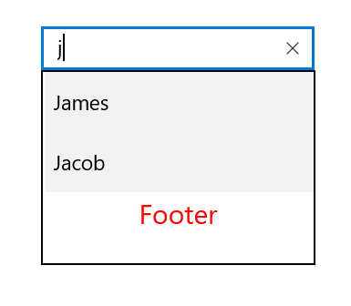

# Header and Footer

You can provide header and footer views in a suggestion list in AutoComplete by enabling the `ShowDropDownHeaderView` and `ShowDropDownFooterView` properties. 

## Header content

You can provide the header content at the top of the suggestion box. The `DropDownHeaderView` property is used to set content to the header. The height of the header in the SfAutoComplete can be adjusted using the `DropDownHeaderViewHeight` property.





<Page
    x:Class="TextBoxExtSample.MainPage"
    xmlns="http://schemas.microsoft.com/winfx/2006/xaml/presentation"
    xmlns:x="http://schemas.microsoft.com/winfx/2006/xaml"
    xmlns:local="using:TextBoxExtSample"
    xmlns:d="http://schemas.microsoft.com/expression/blend/2008"
    xmlns:mc="http://schemas.openxmlformats.org/markup-compatibility/2006"
    xmlns:editors="using:Syncfusion.UI.Xaml.Controls.Input"
    mc:Ignorable="d"
    Background="{ThemeResource ApplicationPageBackgroundThemeBrush}">
    <Page.DataContext>
        <local:EmployeeCollection/>
    </Page.DataContext>
    <Grid Background="{StaticResource ApplicationPageBackgroundThemeBrush}">

        <editors:SfTextBoxExt x:Name="textBoxExt" 
                              HorizontalAlignment="Center" 
                              VerticalAlignment="Center" 
                              AutoCompleteMode="Suggest"
                              Width="200"
                              SearchItemPath="Name"
                              ShowDropDownHeaderView="True"
                              DropDownHeaderViewHeight="50"
                              AutoCompleteSource="{Binding Employees}">
            <editors:SfTextBoxExt.DropDownHeaderView>
                <StackPanel>
                    <TextBlock x:Name="SearchLabel" 
                               Text="Header"
                               FontSize="20" 
                               VerticalAlignment="Center" 
                               HorizontalTextAlignment="Center" 
                               Foreground="Red"/>
                </StackPanel>
            </editors:SfTextBoxExt.DropDownHeaderView>
        </editors:SfTextBoxExt>
    </Grid>
</Page>





using Syncfusion.UI.Xaml.Controls.Input;
using System.Collections.Generic;
using Windows.UI;
using Windows.UI.Xaml;
using Windows.UI.Xaml.Controls;
using Windows.UI.Xaml.Media;

// The BlankPage item template is documented at https://go.microsoft.com/fwlink/?LinkId=402352&clcid=0x409.

namespace TextBoxExtSample
{
    /// 

    /// An empty page that can be used on its own or navigated within a frame.
    /// 

   public sealed partial class MainPage : Page
    {
        TextBlock SearchLabel;
        public MainPage()
        {
            this.InitializeComponent();
            EmployeeCollection employeeCollection = new EmployeeCollection();
            this.DataContext = employeeCollection;
            SfTextBoxExt textBoxExt = new SfTextBoxExt()
            {
                HorizontalAlignment = HorizontalAlignment.Center,
                VerticalAlignment = VerticalAlignment.Center,
                Width = 200,
                AutoCompleteMode = AutoCompleteMode.Suggest,
                SearchItemPath = "Name",
                ShowDropDownFooterView = true,
                DropDownFooterViewHeight = 50
            };

            textBoxExt.AutoCompleteSource = employeeCollection.Employees;

            StackPanel stackPanel = new StackPanel();
            SearchLabel = new TextBlock()
            {
                Text = "Header",
                FontSize = 20,
                VerticalAlignment = VerticalAlignment.Center,
                HorizontalTextAlignment = TextAlignment.Center,
                Foreground = new SolidColorBrush(Colors.Red)
            };
            this.Content = textBoxExt;
            stackPanel.Children.Add(SearchLabel);
            textBoxExt.DropDownHeaderView = stackPanel;
        }
    }

    public class Employee

    {
        public string Name { get; set; }
        public string Email { get; set; }

        public Employee()
        {

        }

    }

    public class EmployeeCollection
    {
        private List<Employee> employees;

        public List<Employee> Employees

        {

            get { return employees; }

            set { employees = value; }

        }

        public EmployeeCollection()
        {
            Employees = new List<Employee>();

            Employees.Add(new Employee { Name = "Lucas", Email = "lucas@syncfusion.com" });

            Employees.Add(new Employee { Name = "James", Email = "james@syncfusion.com" });

            Employees.Add(new Employee { Name = "Jacob", Email = "jacob@syncfusion.com" });
        }
    }
}





## Footer content

You can provide the footer content at the bottom of the suggestion box. The `DropDownFooterView` property is used to set the content of the footer. The height of the header in the SfAutoComplete can be adjusted using the `DropDownFooterViewHeight` property.

The following code example demonstrates how to set the footer content in SfAutoComplete.





<Page
    x:Class="TextBoxExtSample.MainPage"
    xmlns="http://schemas.microsoft.com/winfx/2006/xaml/presentation"
    xmlns:x="http://schemas.microsoft.com/winfx/2006/xaml"
    xmlns:local="using:TextBoxExtSample"
    xmlns:d="http://schemas.microsoft.com/expression/blend/2008"
    xmlns:mc="http://schemas.openxmlformats.org/markup-compatibility/2006"
    xmlns:editors="using:Syncfusion.UI.Xaml.Controls.Input"
    mc:Ignorable="d"
    Background="{ThemeResource ApplicationPageBackgroundThemeBrush}">
    <Page.DataContext>
        <local:EmployeeCollection/>
    </Page.DataContext>
    <Grid Background="{StaticResource ApplicationPageBackgroundThemeBrush}">

        <editors:SfTextBoxExt x:Name="textBoxExt" 
                              HorizontalAlignment="Center" 
                              VerticalAlignment="Center" 
                              AutoCompleteMode="Suggest"
                              Width="200"
                              SearchItemPath="Name"
                              ShowDropDownFooterView="True"
                              DropDownFooterViewHeight="50"
                              AutoCompleteSource="{Binding Employees}">
            <editors:SfTextBoxExt.DropDownFooterView>
                <StackPanel>
                    <TextBlock x:Name="SearchLabel" 
                               Text="Footer"
                               FontSize="20" 
                               VerticalAlignment="Center" 
                               HorizontalTextAlignment="Center" 
                               Foreground="Red"   />
                </StackPanel>
            </editors:SfTextBoxExt.DropDownFooterView>
        </editors:SfTextBoxExt>
    </Grid>
</Page>





using Syncfusion.UI.Xaml.Controls.Input;
using System.Collections.Generic;
using Windows.UI;
using Windows.UI.Xaml;
using Windows.UI.Xaml.Controls;
using Windows.UI.Xaml.Media;

// The BlankPage item template is documented at https://go.microsoft.com/fwlink/?LinkId=402352&clcid=0x409.

namespace TextBoxExtSample
{
    /// 

    /// An empty page that can be used on its own or navigated within a frame.
    /// 

    public sealed partial class MainPage : Page
    {
        TextBlock SearchLabel;
        public MainPage()
        {
            this.InitializeComponent();
            EmployeeCollection employeeCollection = new EmployeeCollection();
            this.DataContext = employeeCollection;
            SfTextBoxExt textBoxExt = new SfTextBoxExt()
            {
                HorizontalAlignment = HorizontalAlignment.Center,
                VerticalAlignment = VerticalAlignment.Center,
                Width = 200,
                AutoCompleteMode = AutoCompleteMode.Suggest,
                SearchItemPath = "Name",
                ShowDropDownFooterView = true,
                DropDownFooterViewHeight = 50
            };

            textBoxExt.AutoCompleteSource = employeeCollection.Employees;

            StackPanel stackPanel = new StackPanel();
            SearchLabel = new TextBlock()
            {
                Text = "Footer",
                FontSize = 20,
                VerticalAlignment = VerticalAlignment.Center,
                HorizontalTextAlignment = TextAlignment.Center,
                Foreground = new SolidColorBrush(Colors.Red)
            };
            this.Content = textBoxExt;
            stackPanel.Children.Add(SearchLabel);
            textBoxExt.DropDownFooterView = stackPanel;
        }
    }

    public class Employee

    {
        public string Name { get; set; }
        public string Email { get; set; }

        public Employee()
        {

        }

    }

    public class EmployeeCollection
    {
        private List<Employee> employees;

        public List<Employee> Employees

        {

            get { return employees; }

            set { employees = value; }

        }

        public EmployeeCollection()
        {
            Employees = new List<Employee>();

            Employees.Add(new Employee { Name = "Lucas", Email = "lucas@syncfusion.com" });

            Employees.Add(new Employee { Name = "James", Email = "james@syncfusion.com" });

            Employees.Add(new Employee { Name = "Jacob", Email = "jacob@syncfusion.com" });
        }
    }
}





