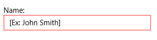

# Data Validation

All editors have the data validation support, it can be done by inheriting the model class from the Syncfusion.UI.Xaml.Controls.Data.IDataValidation.

N>  The Model should also inherit the INotifyPropertychanged Interface.

The following code sample shows the model class:



public class DataValidationHelper : INotifyPropertyChanged, IDataValidation

{

    private string name;

    public string Name

    {

        get { return name; }

        set

        {

            name = value;

            RaisePropertyChanged("Name");

            RaisePropertyChanged("Error");

        }

    }

    public string Error

    {

        get

        {

            if (String.IsNullOrEmpty(Name))

            {

                return "Name field required.";

            }

        }
         return "";

    }

    public string this[string columnname]

    {

        get

        {

            switch (columnname)

            {

                case "Name":

                    if (String.IsNullOrEmpty(Name))

                    {

                        return "Name field required.";

                    }

                    break;

            }

            return "";

        }

    }

    public event PropertyChangedEventHandler PropertyChanged;

    public void RaisePropertyChanged(string propertyname)

    {

        if (PropertyChanged != null)

        {

            PropertyChanged(this, new PropertyChangedEventArgs(propertyname));

        }

    }



### NotifyOnDataErrors 

Gets or Sets the bool value which determine the enable or disable the DataValidation with the control.

### PropertyPath

Gets or sets the name of the property which bound to the SfTextBoxExt Value property.



<Page xmlns:data="using:Syncfusion.UI.Xaml.Controls.Data" xmlns:Input="using:Syncfusion.UI.Xaml.Controls.Input">

    <Grid Background="{StaticResource ApplicationPageBackgroundThemeBrush}">

        <StackPanel Margin="5" Orientation="Vertical">

            <TextBlock Text="Name:" />

            <sync:SfTextBoxExt x:Name="NameBox"

                                Width="250"

                                Text="{Binding Name,Mode=TwoWay}"

                                data:DataValidation.NotifyOnDataErrors="True"

                                data:DataValidation.PropertyPath="Name" />

        </StackPanel>

    </Grid>

</Page>



N>  The following additional properties have the status of DataValidation:
 HasError: Gets whether the element has data error or not.
 ErrorMessage: Gets or sets the name of the property which bound to the SfTextBoxExt Value property.

