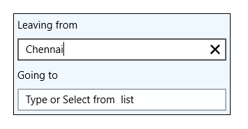

# Overview

SfTextBoxExt is an extended version of TextBox control. Most of the functionality of SfTextBoxExt is inherited from the [TextBox](http://msdn.microsoft.com/en-us/library/windows/apps/windows.ui.xaml.controls.textbox) class.

### Key Features

* Auto Complete mode – The control provides suggestions to end users based on a predefined collection while typing.
* Watermark – The control will prompt the user with some information, when it is not in focus and contains an empty string.
