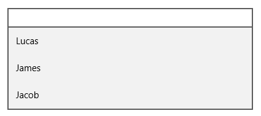

# Viewing Suggestions on Control Focus

You can turn on the ShowSuggestionsOnFocus property to view suggestions for auto completion when the SfTextBoxExt control is in focus. The following code example and screen shot illustrate this.



<editors:SfTextBoxExt HorizontalAlignment="Center" VerticalAlignment="Center" Width="400" SearchItemPath="Name" ShowSuggestionsOnFocus="True" AutoCompleteMode="Suggest" AutoCompleteSource="{Binding Employees}"/>



