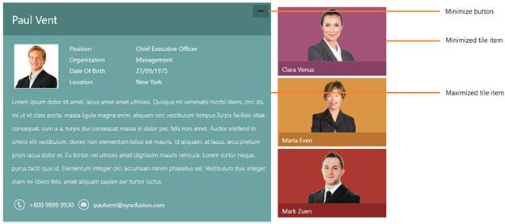

# Overview

`SfTileView` acts as a container that holds a set of tile view items that can contain any content. Items can be maximized, minimized, dragged to reorder and arranged in matrix position to achieve best layout.

## Features

* Tile view items are easily customizable
* Drag and drop support to reorder items 
* Orientation support for entire control and minimized items

## Visual structure

1.WinRT

2.Windows phone

