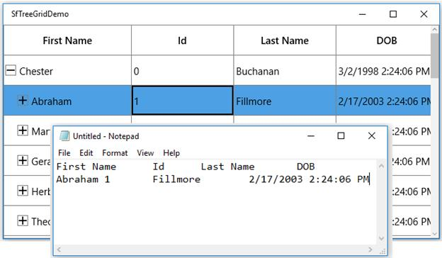
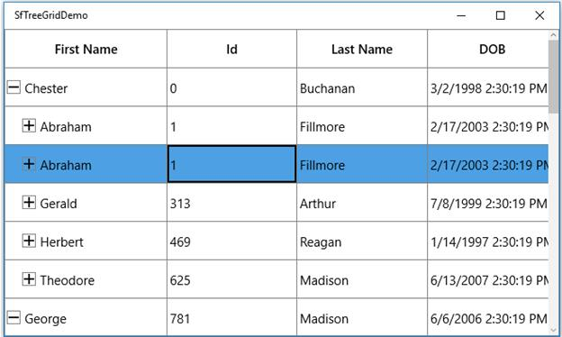
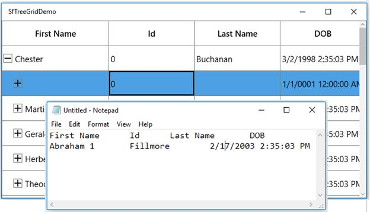
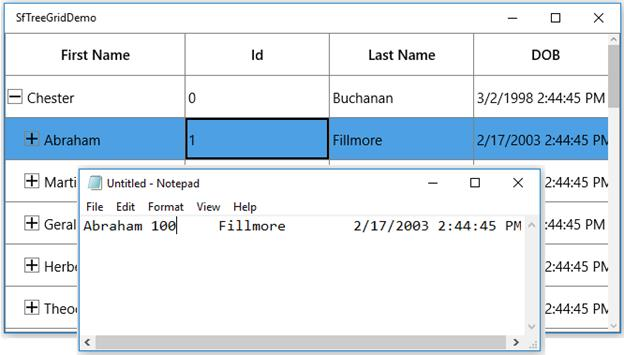
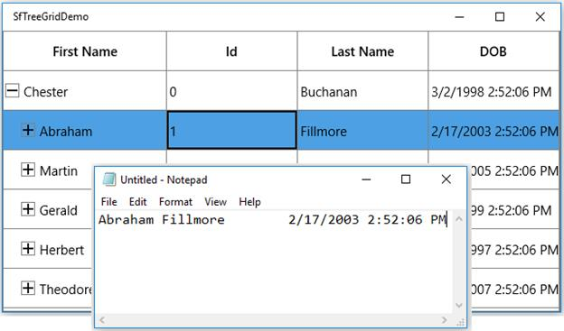
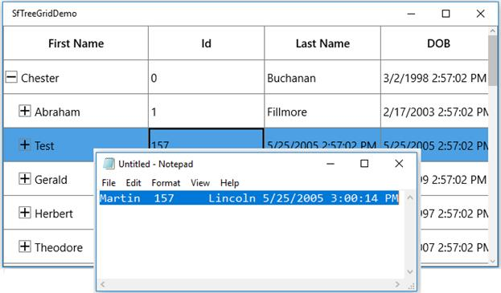
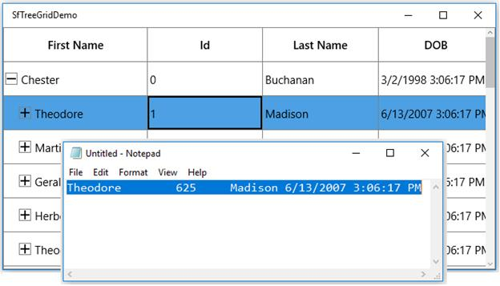

# Clipboard operations

SfTreeGrid provides support for the clipboard operations such as cut, copy and paste the data within control and between other applications such as Notepad, Excel. 
Clipboard operations of copy and paste is enabled by default. You can copy selected nodes/cells from treegrid by pressing `Ctrl+C` and also can paste the content from [Clipboard](https://msdn.microsoft.com/en-us/library/system.windows.clipboard.aspx) to treegrid by pressing `Ctrl+V`.

## Copy

Copy operation works based on [GridCopyOption](https://help.syncfusion.com/cr/cref_files/uwp/Syncfusion.SfGrid.UWP~Syncfusion.UI.Xaml.Grid.SfGridBase~GridCopyOption.html) property.

GridCopyOption provides the following options,

[None ](https://help.syncfusion.com/cr/cref_files/uwp/Syncfusion.SfGrid.UWP~Syncfusion.UI.Xaml.Grid.GridCopyOption.html) – Disables copy in treegrid.

[CopyData ](https://help.syncfusion.com/cr/cref_files/uwp/Syncfusion.SfGrid.UWP~Syncfusion.UI.Xaml.Grid.GridCopyOption.html) – Enabled copy in treegrid.

[IncludeHeaders ](https://help.syncfusion.com/cr/cref_files/uwp/Syncfusion.SfGrid.UWP~Syncfusion.UI.Xaml.Grid.GridCopyOption.html) – Column header also copied along with data.

[IncludeFormat ](https://help.syncfusion.com/cr/cref_files/uwp/Syncfusion.SfGrid.UWP~Syncfusion.UI.Xaml.Grid.GridCopyOption.html) – Copies the display text with format instead of actual value.

[IncludeHiddenColumn ](https://help.syncfusion.com/cr/cref_files/uwp/Syncfusion.SfGrid.UWP~Syncfusion.UI.Xaml.Grid.GridCopyOption.html) – Hidden column also copied to clipboard.

You should use IncludeHeaders, IncludeFormat, IncludeHiddenColumn options along with CopyData option.



<syncfusion:SfTreeGrid Name="treeGrid"
                                       AutoExpandMode="RootNodesExpanded"
                                       AutoGenerateColumns="False" 
                                       GridCopyOption="CopyData,IncludeHeaders" 
                                       ChildPropertyName="Children"
                                       ColumnSizer="Star"
                                       ExpanderColumn="FirstName"
                                       ItemsSource="{Binding PersonDetails}"
                                       NavigationMode="Row">




this.treeGrid.GridCopyOption = GridCopyOption.CopyData | GridCopyOption.IncludeHeaders;




## Paste

Paste operation works based on [GridPasteOption](https://help.syncfusion.com/cr/cref_files/uwp/Syncfusion.SfGrid.UWP~Syncfusion.UI.Xaml.Grid.SfGridBase~GridPasteOption.html) property.

GridPasteOption provides the following options,

[None](https://help.syncfusion.com/cr/cref_files/uwp/Syncfusion.SfGrid.UWP~Syncfusion.UI.Xaml.Grid.GridPasteOption.html) – Disable paste in treegrid.

[PasteData](https://help.syncfusion.com/cr/cref_files/uwp/Syncfusion.SfGrid.UWP~Syncfusion.UI.Xaml.Grid.GridPasteOption.html) – Enabled paste in treegrid and when an incompatible value is pasted into a record/cell, the pasting operation is skipped for that particular record/cell.

[ExcludeFirstLine](https://help.syncfusion.com/cr/cref_files/uwp/Syncfusion.SfGrid.UWP~Syncfusion.UI.Xaml.Grid.GridPasteOption.html) – This can be used when pasting data copied with `IncludeHeaders` copy option.

[IncludeHiddenColumn](https://help.syncfusion.com/cr/cref_files/uwp/Syncfusion.SfGrid.UWP~Syncfusion.UI.Xaml.Grid.GridPasteOption.html) – Paste the values in hidden columns also.

You should use ExcludeFirstLine, IncludeHiddenColumn options along with PasteData option.



<syncfusion:SfTreeGrid Name="treeGrid"
                                       AutoExpandMode="RootNodesExpanded"
                                       AutoGenerateColumns="False" 
                                       NavigationMode="Cell"
                                       ChildPropertyName="Children"
                                       ColumnSizer="Star" 
                                       GridCopyOption="CopyData,IncludeHeaders"
                                       GridPasteOption="PasteData,ExcludeFirstLine" 
                                       ExpanderColumn="FirstName"
                                       ItemsSource="{Binding PersonDetails}"
                                       >



this.treeGrid.GridCopyOption = GridCopyOption.CopyData | GridCopyOption.IncludeHeaders;

this.treeGrid.GridPasteOption = GridPasteOption.PasteData | GridPasteOption.ExcludeFirstLine;




## Cut

Cut operation works based on [GridCopyOption](https://help.syncfusion.com/cr/cref_files/uwp/Syncfusion.SfGrid.UWP~Syncfusion.UI.Xaml.Grid.SfGridBase~GridCopyOption.html) property.

GridCopyOption provides the following options,

[None](https://help.syncfusion.com/cr/cref_files/uwp/Syncfusion.SfGrid.UWP~Syncfusion.UI.Xaml.Grid.GridCopyOption.html) – Disables cut in treegrid.

[CutData](https://help.syncfusion.com/cr/cref_files/uwp/Syncfusion.SfGrid.UWP~Syncfusion.UI.Xaml.Grid.GridCopyOption.html) – Enabled cut in treegrid.

[IncludeHeaders](https://help.syncfusion.com/cr/cref_files/uwp/Syncfusion.SfGrid.UWP~Syncfusion.UI.Xaml.Grid.GridCopyOption.html) – Column header also copied along with data.

[IncludeFormat](https://help.syncfusion.com/cr/cref_files/uwp/Syncfusion.SfGrid.UWP~Syncfusion.UI.Xaml.Grid.GridCopyOption.html) – Cut the display text with format instead of actual value.

[IncludeHiddenColumn](https://help.syncfusion.com/cr/cref_files/uwp/Syncfusion.SfGrid.UWP~Syncfusion.UI.Xaml.Grid.GridCopyOption.html) – Hidden column also cut to clipboard.

You should use IncludeHeaders, IncludeFormat, IncludeHiddenColumn options along with CutData option.



<syncfusion:SfTreeGrid Name="treeGrid"
                                       GridCopyOption="CutData,IncludeHeaders"                                                                                
                                       ChildPropertyName="Children"
                                       ColumnSizer="Star"
                                       ExpanderColumn="FirstName"
                                       ItemsSource="{Binding PersonDetails}"
                                       NavigationMode="Row">



this.treeGrid.GridCopyOption = GridCopyOption.CutData | GridCopyOption.IncludeHeaders;



## Events

###CopyContent

[CopyContent](https://help.syncfusion.com/cr/cref_files/uwp/Syncfusion.SfGrid.UWP~Syncfusion.UI.Xaml.TreeGrid.SfTreeGrid~CopyContent_EV.html) event occurs when copy/cut the cells in treegrid. [GridCopyPasteEventArgs](https://help.syncfusion.com/cr/cref_files/uwp/Syncfusion.SfGrid.UWP~Syncfusion.UI.Xaml.Grid.GridCopyPasteEventArgs.html) provides information for `CopyContent` event. You can cancel copy operation by handling this event.



this.treeGrid.CopyContent += TreeGrid_CopyContent;

private void TreeGrid_CopyContent(object sender, GridCopyPasteEventArgs e)
{
    if (((e.OriginalSender as SfTreeGrid).SelectedItem as PersonInfo).Id == 1094)
        e.Handled = true;
}




### PasteContent

[PasteContent](https://help.syncfusion.com/cr/cref_files/uwp/Syncfusion.SfGrid.UWP~Syncfusion.UI.Xaml.TreeGrid.SfTreeGrid~PasteContent_EV.html) event occurs when paste the clipboard value into treegrid. [GridCopyPasteEventArgs](https://help.syncfusion.com/cr/cref_files/uwp/Syncfusion.SfGrid.UWP~Syncfusion.UI.Xaml.Grid.GridCopyPasteEventArgs.html) provides information for PasteContent event. You can cancel paste operation by handling this event.



this.treeGrid.PasteContent += TreeGrid_PasteContent;

private void TreeGrid_PasteContent(object sender, GridCopyPasteEventArgs e)
{
    if (((e.OriginalSender as SfTreeGrid).SelectedItem as PersonInfo).Id == 1094)
        e.Handled = true;
}




### CopyCellContent

[CopyGridCellContent](https://help.syncfusion.com/cr/cref_files/uwp/Syncfusion.SfGrid.UWP~Syncfusion.UI.Xaml.TreeGrid.SfTreeGrid~CopyCellContent_EV.html) event occurs when cell being copy/cut. [TreeGridCopyPasteCellEventArgs](https://help.syncfusion.com/cr/cref_files/uwp/Syncfusion.SfGrid.UWP~Syncfusion.UI.Xaml.TreeGrid.TreeGridCopyPasteCellEventArgs.html) provides information for CopyGridCellContent event, which has following members,

[ClipBoardValue](https://help.syncfusion.com/cr/cref_files/uwp/Syncfusion.SfGrid.UWP~Syncfusion.UI.Xaml.TreeGrid.TreeGridCopyPasteCellEventArgs~ClipBoardValue.html)- Returns cell value.

[Column](https://help.syncfusion.com/cr/cref_files/uwp/Syncfusion.SfGrid.UWP~Syncfusion.UI.Xaml.TreeGrid.TreeGridCopyPasteCellEventArgs~Column.html) – Returns corresponding GridColumn of a cell.

[RowData](https://help.syncfusion.com/cr/cref_files/uwp/Syncfusion.SfGrid.UWP~Syncfusion.UI.Xaml.TreeGrid.TreeGridCopyPasteCellEventArgs~RowData.html) – Returns corresponding RowData of a cell.

[OriginalSender](https://help.syncfusion.com/cr/cref_files/uwp/Syncfusion.SfGrid.UWP~Syncfusion.UI.Xaml.Grid.GridCancelEventArgs~OriginalSender.html) – Returns the SfTreeGrid.

You can change the text copied to clipboard by changing the ClipBoardValue.



this.treeGrid.CopyCellContent += TreeGrid_CopyCellContent;

private void TreeGrid_CopyCellContent(object sender, TreeGridCopyPasteCellEventArgs e)
{
            
}




The below code example changes the clipboard value as 100 instead of cell value 1094 in treegrid.

<table>
<tr>
<td>


private void TreeGrid_CopyCellContent(object sender, TreeGridCopyPasteCellEventArgs e)
{
    if (e.Column.MappingName == "Id" && (e.RowData as PersonInfo).Id == 1)
        e.ClipBoardValue = 100;
}


<table>
<tr>
<td>
private void TreeGrid_CopyCellContent(object sender, TreeGridCopyPasteCellEventArgs e)
{
    if (e.Column.MappingName == "Id" && (e.RowData as PersonInfo).Id == 1)
        e.ClipBoardValue = 100;
}
</td>
</tr>
</table>
</td>
</tr>
<tr>
<td>

</td>
</tr>
</table>

The below code example handled the copy operation when MappingName of a Column is Id.



private void TreeGrid_CopyCellContent(object sender, TreeGridCopyPasteCellEventArgs e)
{
    if (e.Column.MappingName == "Id")
        e.Handled = true;
}




### PasteCellContent

[PasteGridCellContent](https://help.syncfusion.com/cr/cref_files/uwp/Syncfusion.SfGrid.UWP~Syncfusion.UI.Xaml.TreeGrid.SfTreeGrid~PasteCellContent_EV.html) event occurs when cell being paste. [TreeGridCopyPasteCellEventArgs](https://help.syncfusion.com/cr/cref_files/uwp/Syncfusion.SfGrid.UWP~Syncfusion.UI.Xaml.TreeGrid.TreeGridCopyPasteCellEventArgs.html# "") provides information for `PasteGridCellContent` event, which has following members.

[ClipBoardValue ](https://help.syncfusion.com/cr/cref_files/uwp/Syncfusion.SfGrid.UWP~Syncfusion.UI.Xaml.TreeGrid.TreeGridCopyPasteCellEventArgs~ClipBoardValue.html) - Returns clipboard value of a particular cell.

[Column ](https://help.syncfusion.com/cr/cref_files/uwp/Syncfusion.SfGrid.UWP~Syncfusion.UI.Xaml.TreeGrid.TreeGridCopyPasteCellEventArgs~Column.html) – Returns corresponding GridColumn of a cell.

[RowData ](https://help.syncfusion.com/cr/cref_files/uwp/Syncfusion.SfGrid.UWP~Syncfusion.UI.Xaml.TreeGrid.TreeGridCopyPasteCellEventArgs~RowData.html) – Returns corresponding RowData of a cell.

[OriginalSender ](https://help.syncfusion.com/cr/cref_files/uwp/Syncfusion.SfGrid.UWP~Syncfusion.UI.Xaml.Grid.GridCancelEventArgs~OriginalSender.html) – Returns the SfTeeGrid.

You can change the text paste to treegrid by changing the ClipBoardValue.



this.treeGrid.PasteCellContent += TreeGrid_PasteCellContent;

private void TreeGrid_PasteCellContent(object sender, TreeGridCopyPasteCellEventArgs e)
{
            
}




The below code example changes the clipboard value as Test instead of clipboard value Martin.



private void TreeGrid_PasteCellContent(object sender, TreeGridCopyPasteCellEventArgs e)
{
    if (e.Column.MappingName == "FirstName" && (e.RowData as PersonInfo).FirstName == "Martin")
        e.ClipBoardValue = "Test";
}




The below code example handled the paste operation when MappingName of column is Id.



private void TreeGrid_PasteCellContent(object sender, TreeGridCopyPasteCellEventArgs e)
{
    if (e.Column.MappingName == "Id")
        e.Handled = true;
}




## Programmatically handle the clipboard operations

### Programmatically copy the node

Copy the selected nodes in treegrid by using [Copy ](https://help.syncfusion.com/cr/cref_files/uwp/Syncfusion.SfGrid.UWP~Syncfusion.UI.Xaml.TreeGrid.TreeGridCutCopyPaste~Copy.html) method in [TreeGridCutCopyPaste](https://help.syncfusion.com/cr/uwp/Syncfusion.SfGrid.UWP~Syncfusion.UI.Xaml.TreeGrid.TreeGridCutCopyPaste.html) of treegrid.




this.treeGrid.TreeGridCopyPaste.Copy();




Copy a record by selecting the record using [MoveCurrentCell](https://help.syncfusion.com/cr/cref_files/uwp/Syncfusion.SfGrid.UWP~Syncfusion.UI.Xaml.TreeGrid.TreeGridRowSelectionController~MoveCurrentCell.html) method and [Copy](https://help.syncfusion.com/cr/cref_files/uwp/Syncfusion.SfGrid.UWP~Syncfusion.UI.Xaml.TreeGrid.TreeGridCutCopyPaste~Copy.html) method in [TreeGridCopyPaste](https://help.syncfusion.com/cr/uwp/Syncfusion.SfGrid.UWP~Syncfusion.UI.Xaml.TreeGrid.TreeGridCutCopyPaste.html) of treegrid.



RowColumnIndex rowColumnIndex = new RowColumnIndex();
rowColumnIndex.RowIndex = 2;
rowColumnIndex.ColumnIndex = 2;
this.treeGrid.SelectionController.MoveCurrentCell(rowColumnIndex);
this.treeGrid.TreeGridCopyPaste.Copy();




Copy the multiple records by selecting group of records using SelectRows method and [Copy](https://help.syncfusion.com/cr/cref_files/uwp/Syncfusion.SfGrid.UWP~Syncfusion.UI.Xaml.TreeGrid.TreeGridCutCopyPaste~Copy.html) method in [TreeGridCutCopyPaste](https://help.syncfusion.com/cr/uwp/Syncfusion.SfGrid.UWP~Syncfusion.UI.Xaml.TreeGrid.TreeGridCutCopyPaste.html) of treegrid.



this.treeGrid.SelectionController.SelectRows(2, 10);
this.treeGrid.TreeGridCopyPaste.Copy();




### Programmatically paste to treegrid

Paste the clipboard value into treegrid by using [Paste](https://help.syncfusion.com/cr/cref_files/uwp/Syncfusion.SfGrid.UWP~Syncfusion.UI.Xaml.TreeGrid.TreeGridCutCopyPaste~Paste.html) method in [TreeGridCutCopyPaste](https://help.syncfusion.com/cr/uwp/Syncfusion.SfGrid.UWP~Syncfusion.UI.Xaml.TreeGrid.TreeGridCutCopyPaste.html) of treegrid.



this.treeGrid.TreeGridCopyPaste.Paste();




Paste the clipboard value into selected record by selecting the record using MoveCurrentCell method and `Paste` method in [TreeGridCutCopyPaste](https://help.syncfusion.com/cr/uwp/Syncfusion.SfGrid.UWP~Syncfusion.UI.Xaml.TreeGrid.TreeGridCutCopyPaste.html) of treegrid.



RowColumnIndex rowColumnIndex = new RowColumnIndex();
rowColumnIndex.RowIndex = 1;
rowColumnIndex.ColumnIndex = 1;
this.treeGrid.SelectionController.MoveCurrentCell(rowColumnIndex);
this.treeGrid.TreeGridCopyPaste.Paste();




### Programmatically cut from treegrid

Cut the selected records/cells in treegrid by using [Cut](https://help.syncfusion.com/cr/cref_files/uwp/Syncfusion.SfGrid.UWP~Syncfusion.UI.Xaml.TreeGrid.TreeGridCutCopyPaste~Cut.html) method in [TreeGridCutCopyPaste](https://help.syncfusion.com/cr/uwp/Syncfusion.SfGrid.UWP~Syncfusion.UI.Xaml.TreeGrid.TreeGridCutCopyPaste.html) of treegrid.



this.treeGrid.TreeGridCopyPaste.Cut();



Cut the entire record in treegrid by selecting whole treegrid using [SelectAll](https://help.syncfusion.com/cr/cref_files/uwp/Syncfusion.SfGrid.UWP~Syncfusion.UI.Xaml.TreeGrid.TreeGridRowSelectionController~SelectAll.html) method and `Cut` method in [TreeGridCutCopyPaste](https://help.syncfusion.com/cr/uwp/Syncfusion.SfGrid.UWP~Syncfusion.UI.Xaml.TreeGrid.TreeGridCutCopyPaste.html) of treegrid.



this.treeGrid.SelectionController.SelectAll();
this.treeGrid.TreeGridCopyPaste.Cut();



## Customizing copy paste behavior

The treegrid process the clipboard operations in [TreeGridCutCopyPaste](https://help.syncfusion.com/cr/uwp/Syncfusion.SfGrid.UWP~Syncfusion.UI.Xaml.TreeGrid.TreeGridCutCopyPaste.html) class. You can customize the default copy paste behaviors by overriding TreeGridCutCopyPaste class and set it to `SfTreeGrid.TreeGridCopyPaste`.



public class CustomCopyPaste : TreeGridCutCopyPaste
{
    public CustomCopyPaste(SfTreeGrid sfTreeGrid) : base(sfTreeGrid)
    {
    }
}



public MainWindow()
{
    InitializeComponent();
    this.treeGrid.TreeGridCopyPaste = new CustomCopyPaste(this.treeGrid);
}




### Paste a record into selected rows

By default, you can able to copy one row and paste it into another row in treegrid. The below code shows how to copy one row and paste it into all selected rows by overriding the [PasteRow](https://help.syncfusion.com/cr/cref_files/uwp/Syncfusion.SfGrid.UWP~Syncfusion.UI.Xaml.TreeGrid.TreeGridCutCopyPaste~PasteRow.html) method in the [TreeGridCutCopyPaste](https://help.syncfusion.com/cr/uwp/Syncfusion.SfGrid.UWP~Syncfusion.UI.Xaml.TreeGrid.TreeGridCutCopyPaste.html) class.



public class CustomCopyPaste : TreeGridCutCopyPaste
{
    public CustomCopyPaste(SfTreeGrid sfTreeGrid) : base(sfTreeGrid)
    {
    }

    protected override void PasteRow(object clipboardContent, object selectedRecords)
    {
        var text = Clipboard.GetText();
        string[] clipBoardText = Regex.Split(text, @"\r\n");

        //Get the clipBoardText and check if the clipBoardText is more than one row

        //means call the base.

        if (clipBoardText.Count() > 1)
        {
            base.PasteRow(clipboardContent, selectedRecords);
            return;
        }

        var selectedRecord = this.TreeGrid.SelectedItems;

        for (int i = 0; i < selectedRecord.Count; i++)
        {
            //Get the selected records for paste the copied row.
            selectedRecords = selectedRecord[i];

            //Call the PasteRow method with clipboardContent and selectedRecords
            base.PasteRow(clipboardContent, selectedRecords);
        }
    }
}




### Select pasted records

By default, after pasting the clipboard value to treegrid, the selection is maintaining in previously selected records as it is. The below code shows select the pasted records after the Paste operation, by overriding the  [PasteRow](https://help.syncfusion.com/cr/cref_files/uwp/Syncfusion.SfGrid.UWP~Syncfusion.UI.Xaml.TreeGrid.TreeGridCutCopyPaste~PasteRow.html) method in [TreeGridCutCopyPaste](https://help.syncfusion.com/cr/uwp/Syncfusion.SfGrid.UWP~Syncfusion.UI.Xaml.TreeGrid.TreeGridCutCopyPaste.html) class.



public class CustomCopyPaste : TreeGridCutCopyPaste
{
    public CustomCopyPaste(SfTreeGrid sfTreeGrid) : base(sfTreeGrid)
    {

    }
    protected override void PasteRow(object clipboardContent, object selectedRecords)
    {
        base.PasteRow(clipboardContent, selectedRecords);

        //Added the selected record to list
        this.TreeGrid.SelectedItems.Add(selectedRecords);
    }
}




### Create new records while pasting

By default, while paste the clipboard value to treegrid, it changes the values of the already existing records. The below code example shows how to add the copied records as new rows in treegrid by overriding the [PasteRows](https://help.syncfusion.com/cr/cref_files/uwp/Syncfusion.SfGrid.UWP~Syncfusion.UI.Xaml.TreeGrid.TreeGridCutCopyPaste~PasteRows.html) method in [TreeGridCutCopyPaste](https://help.syncfusion.com/cr/uwp/Syncfusion.SfGrid.UWP~Syncfusion.UI.Xaml.TreeGrid.TreeGridCutCopyPaste.html) class.



public class CustomCopyPaste : TreeGridCutCopyPaste
{
    public CustomCopyPaste(SfTreeGrid sfTreeGrid) : base(sfTreeGrid)
    {

    }

    protected override void PasteRows(object clipBoardRows)
    {
        var copiedRecord = (string[])clipBoardRows;
        int copiedRecordsCount = copiedRecord.Count();

        //Based on the clipboard count added the new record for paste

        if (copiedRecordsCount > 0)
        {
            //Get the viewModel for adding the record
            var record = this.TreeGrid.DataContext as ViewModel;

            for (int i = 0; i < copiedRecordsCount; i++)
            {
                //Create the new instance for Model, for adding the new record
                PersonInfo entity = new PersonInfo();

                for (int j = 0; j < this.TreeGrid.Columns.Count; j++)
                {
                    string[] values = Regex.Split(copiedRecord[i], @"\t");

                    //Adding the new record by using PasteToCell method by passing the 

                    //created data, particular column, and clipboard value
                    this.PasteCell(entity, this.TreeGrid.Columns[j], values[j]);
                }

                //Added the pasted record in collection
                record.PersonDetails.Add(entity);
            }
        }
    }
}




### How to paste the data by custom column order

The data can be pasted only from the first column, by default. Now, you can paste the copied data anywhere in the grid by deriving a new class from [TreeGridCutCopyPaste](https://help.syncfusion.com/cr/uwp/Syncfusion.SfGrid.UWP~Syncfusion.UI.Xaml.TreeGrid.TreeGridCutCopyPaste.html) and overriding the [PasteRow ](https://help.syncfusion.com/cr/cref_files/uwp/Syncfusion.SfGrid.UWP~Syncfusion.UI.Xaml.TreeGrid.TreeGridCutCopyPaste~PasteRow.html)virtual method.



public class CustomCopyPaste : TreeGridCutCopyPaste
{
    public CustomCopyPaste(SfTreeGrid sfTreeGrid) : base(sfTreeGrid)
    {

    }

    protected override void PasteRow(object clipboardContent, object selectedRecords)
    {
        //Splits the row into number of cells by using \t.
        clipboardContent = Regex.Split(clipboardContent.ToString(), @"\t");
        var copyValue = (string[])clipboardContent;
           
            int columnIndex = 0;
            //Gets the currentCell column index.
            var index = this.TreeGrid.SelectionController.CurrentCellManager.CurrentCell.ColumnIndex;
            foreach (var column in TreeGrid.Columns)
            {
                if (index >= TreeGrid.Columns.Count)
                    return;
                if (copyValue.Count() <= this.TreeGrid.Columns.IndexOf(column))
                    break;
                // Calls the PasteToCell method and passes the copied data and pastes the column index.
                PasteCell(selectedRecords, this.TreeGrid.Columns[index], copyValue[columnIndex]);
                index++;
                columnIndex++;
            }
        }
}



