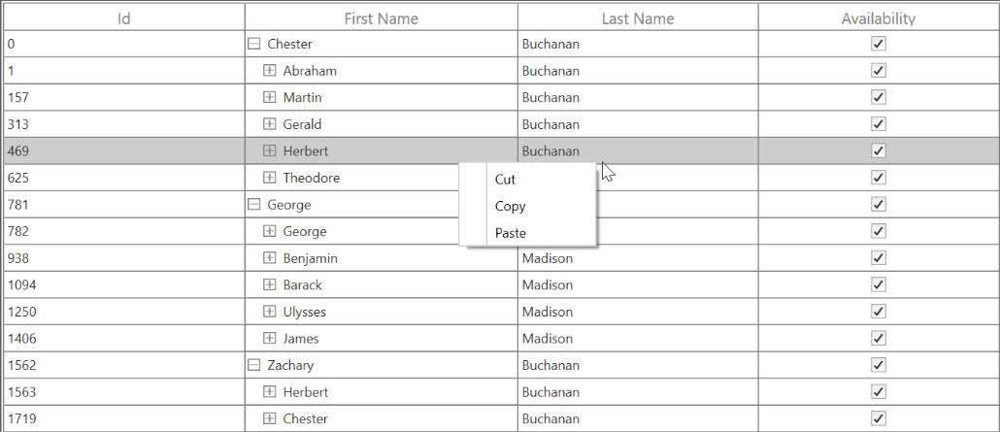
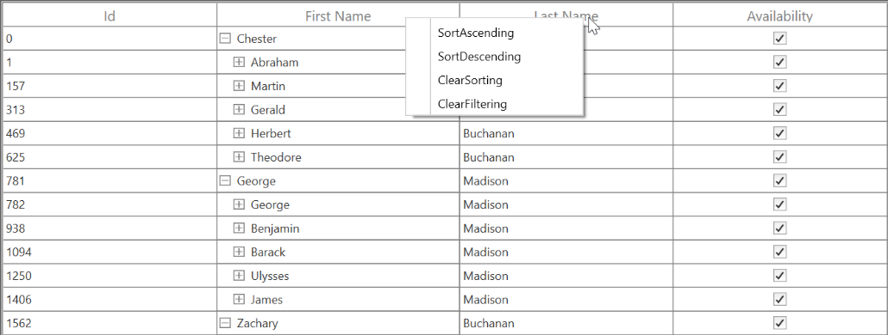
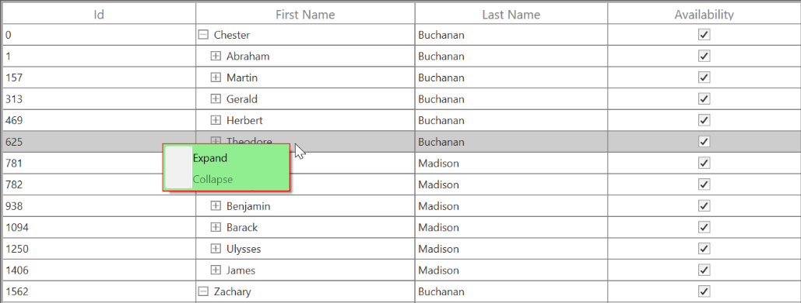
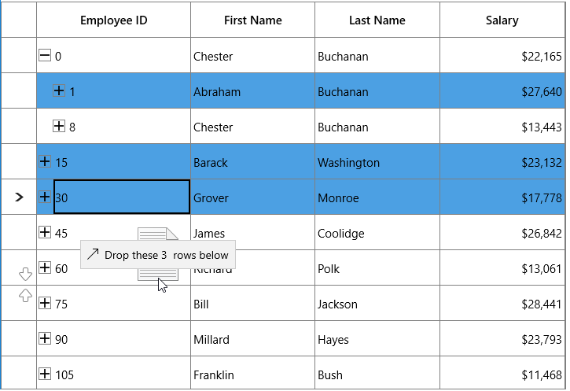

# Interactive Features

## Context Menu

SfTreeGrid provides an entirely customizable menu to expose the functionality on user interface. You can create context menus for different rows in an efficient manner.

The below code example shows the context menu with command bindings.




<ContextMenu Style="{x:Null}">
    <MenuItem Command="{Binding Copy, Source={StaticResource viewModel}}"
          CommandParameter="{Binding}" Header="Copy">
    </MenuItem>
</ContextMenu>




public class BaseCommand : ICommand
{

    #region Fields
    readonly Action<object> _execute;
    readonly Predicate<object> _canExecute;
    #endregion

    #region Constructors
    /// 

    /// Creates a new command that can always execute.
    /// 

    /// <param name="execute">The execution logic.</param>

    public BaseCommand(Action<object> execute)
        : this(execute, null)
    {
    }

    /// 

    /// Creates a new command.
    /// 

    /// <param name="execute">The execution logic.</param>
    /// <param name="canExecute">The execution status logic.</param>

    public BaseCommand(Action<object> execute, Predicate<object> canExecute)
    {

        if (execute == null)
        throw new ArgumentNullException("execute");
        _execute = execute;
        _canExecute = canExecute;
    }
    #endregion
    
    #region ICommand Members

    public bool CanExecute(object parameter)
    {
        return _canExecute == null ? true : _canExecute(parameter);
    }
    
    public event EventHandler CanExecuteChanged
    {
add { CommandManager.RequerySuggested += value; }
        remove { CommandManager.RequerySuggested -= value; }    }
    }

    public void Execute(object parameter)
    {
        _execute(parameter);
    }
    
    #endregion
}

public class EmployeeInfoViewModel : INotifyPropertyChanged
{

    public EmployeeInfoViewModel()
    {
        CopyCommand = new ContextMenuDemo.BaseCommand(ShowMessage);
    }
    
    private ICommand copyCommand

    public ICommand CopyCommand
    {
        get
        {
            return copyCommand;
        }
        set
        {
            copyCommand = value;
        }
    }
    
    public void ShowMessage(object obj)
    {

        if (obj is GridRecordContextMenuInfo)
        {
            var grid = (obj as GridRecordContextMenuInfo).DataGrid;
            grid.GridCopyPaste.Copy();
        }
    }
}




### ContextMenu based on rows

You can set different context menu for SfTreeGrid based on rows. 

#### ContextMenu for Nodes

  You can set the context menu for the data rows by using [SfTreeGrid.RecordContextMenu](https://help.syncfusion.com/cr/cref_files/wpf/Syncfusion.SfGrid.WPF~Syncfusion.UI.Xaml.Grid.SfGridBase~RecordContextMenu.html) property.
  



<syncfusion:SfTreeGrid.RecordContextMenu>
  <ContextMenu>
     <MenuItem x:Name="Cut" Header="Cut" />
     <MenuItem x:Name="Copy" Header="Copy"  />
     <MenuItem x:Name="Paste" Header="Paste" />
     <MenuItem x:Name="Delete" Header="Delete" />
  </ContextMenu>
</syncfusion:SfTreeGrid.RecordContextMenu>




this.treeGrid.RecordContextMenu = new ContextMenu();
this.treeGrid.RecordContextMenu.Items.Add(new MenuItem() { Header = "Cut" });
this.treeGrid.RecordContextMenu.Items.Add(new MenuItem() { Header = "Copy" });
this.treeGrid.RecordContextMenu.Items.Add(new MenuItem() { Header = "Paste" });




While binding the menu item using CommandBinding you can get the command parameter as TreeGridNodeContextMenuInfo which contains the node of the corresponding row.




<syncfusion:SfTreeGrid.RecordContextMenu>
<MenuItem Command="{Binding Copy, Source={StaticResource viewModel}}"              CommandParameter="{Binding}"
              Header="Copy">
    </MenuItem>
</syncfusion:SfTreeGrid.RecordContextMenu>




private static void OnCopyClicked(object obj)
        {
            var contextMenuInfo = obj as TreeGridNodeContextMenuInfo;
            if (contextMenuInfo == null)
                return;
            var grid = contextMenuInfo.TreeGrid;
            grid.GridCopyOption = GridCopyOption.CopyData;
            grid.TreeGridCopyPaste.Copy();
        }




#### ContextMenu for Header

You can set the context menu for the header by using [SfTreeGrid.HeaderContextMenu](https://help.syncfusion.com/cr/cref_files/wpf/Syncfusion.SfGrid.WPF~Syncfusion.UI.Xaml.Grid.SfGridBase~HeaderContextMenu.html) property.




<syncfusion:SfTreeGrid.HeaderContextMenu>
    <ContextMenu>
        <MenuItem x:Name=" SortAscending " Header="SortAscending" />
        <MenuItem x:Name=" SortDescending " Header="SortDescending" />
        <MenuItem x:Name=" ClearSorting " Header="ClearSorting" />
        <MenuItem x:Name=" ClearFiltering " Header="ClearFiltering" />
    </ContextMenu>
</syncfusion:SfTreeGrid.HeaderContextMenu>




this.treeGrid.HeaderContextMenu = new ContextMenu();
this.treeGrid.HeaderContextMenu.Items.Add(new MenuItem() { Header = "SortAscending" });
this.treeGrid.HeaderContextMenu.Items.Add(new MenuItem() { Header = "SortDescending" });
this.treeGrid.HeaderContextMenu.Items.Add(new MenuItem() { Header = "ClearSorting" });
this.treeGrid.HeaderContextMenu.Items.Add(new MenuItem() { Header = "ClearFiltering " });




While binding the menu item using CommandBinding you can get the parameter as TreeGridColumnContextMenuInfo which contains the particular GridColumn.




<syncfusion:SfTreeGrid.HeaderContextMenu>
    <MenuItem Command="{Binding Source={x:Static <MenuItem Command="{Binding SortAscending, Source={StaticResource viewModel}}"
              Header="Sort Ascending">
    </MenuItem>
</syncfusion:SfTreeGrid.HeaderContextMenu>




  private static void OnSortAscendingClicked(object obj)
        {
            var contextMenuInfo = obj as TreeGridColumnContextMenuInfo;
            if (contextMenuInfo == null)
                return;
            var grid = contextMenuInfo.TreeGrid;
            var column = contextMenuInfo.Column;
            grid.SortColumnDescriptions.Clear();
            grid.SortColumnDescriptions.Add(new SortColumnDescription() { ColumnName = column.MappingName, SortDirection = ListSortDirection.Ascending });
        }




### ContextMenu for Expander

You can set the context menu for the header by using [SfTreeGrid.ExpanderContextMenu](https://help.syncfusion.com/cr/cref_files/wpf/Syncfusion.SfGrid.WPF~Syncfusion.UI.Xaml.TreeGrid.SfTreeGrid~ExpanderContextMenu.html) property.




<syncfusion:SfTreeGrid.ExpanderContextMenu>
    <ContextMenu>
        <MenuItem x:Name=" Expand " Header="SortAscending" />
        <MenuItem x:Name=" Collapse" Header="Collapse" />
    </ContextMenu>
</syncfusion:SfTreeGrid.ExpanderContextMenu>




this.treeGrid.ExpanderContextMenu = new ContextMenu();
this.treeGrid.ExpanderContextMenu.Items.Add(new MenuItem() { Header = " Expand" });
this.treeGrid.ExpanderContextMenu.Items.Add(new MenuItem() { Header = "Collapse" });




While binding the menu item using CommandBinding you can get the parameter as TreeGridNodeContextMenuInfo which contains the expander node.




<syncfusion:SfTreeGrid.HeaderContextMenu>
<MenuItem Command="{Binding Expand, Source={StaticResource viewModel}}"    
                                  CommandParameter="{Binding}"                                
 Header="Expand" />    
</syncfusion:SfTreeGrid.HeaderContextMenu>




  private static void OnExpandClicked(object obj)
        {
            var contextMenuInfo = obj as TreeGridNodeContextMenuInfo;
            if (contextMenuInfo == null)
                return;
            var grid = contextMenuInfo.TreeGrid;
            grid.ExpandNode(contextMenuInfo.TreeNode);
        }




### Events

  [TreeGridContextMenuOpening](https://help.syncfusion.com/cr/cref_files/wpf/Syncfusion.SfGrid.WPF~Syncfusion.UI.Xaml.TreeGrid.SfTreeGrid~TreeGridContextMenuOpening_EV.html) event occurs while opening the context menu in SfTreeGrid. TreeGridContextMenuEventArgs has the following members which provides the information about TreeGridContextMenuOpening event.
  
[ContextMenu](https://help.syncfusion.com/cr/cref_files/wpf/Syncfusion.SfGrid.WPF~Syncfusion.UI.Xaml.TreeGrid.TreeGridContextMenuEventArgs~ContextMenu.html) – Gets the corresponding context menu. 
[ContextMenuInfo](https://help.syncfusion.com/cr/cref_files/wpf/Syncfusion.SfGrid.WPF~Syncfusion.UI.Xaml.TreeGrid.TreeGridContextMenuEventArgs~ContextMenuInfo.html) – Returns the context menu info based on the row which opens the context menu.
[ContextMenuType](https://help.syncfusion.com/cr/cref_files/wpf/Syncfusion.SfGrid.WPF~Syncfusion.UI.Xaml.TreeGrid.TreeGridContextMenuEventArgs~ContextMenuType.html) –  Returns the type of context menu.
[RowColumnIndex](https://help.syncfusion.com/cr/cref_files/wpf/Syncfusion.SfGrid.WPF~Syncfusion.UI.Xaml.TreeGrid.TreeGridContextMenuEventArgs~RowColumnIndex.html) – RowColumnIndex of the context menu which is currently going to open. RowColumnIndex is updated only for the RecordContextMenu and remains left empty.
[Handled](https://help.syncfusion.com/cr/cref_files/wpf/Syncfusion.SfGrid.WPF~Syncfusion.UI.Xaml.Grid.GridHandledEventArgs~Handled.html) - Indicates whether the TreeGridContextMenuOpening event is handled or not.

### Customizing ContextMenus

#### Change the menu item when ContextMenu opening

You can use the TreeGridContextMenuOpening event to change the menu item when the context menu opening. 




<syncfusion:SfTreeGrid.RecordContextMenu>
    <ContextMenu>
<MenuItem Command="{Binding Cut, Source={StaticResource viewModel}}"   
               CommandParameter="{Binding}"
                  Header="Cut">
        </MenuItem>
<MenuItem Command="{Binding Copy, Source={StaticResource viewModel}}"  
                CommandParameter="{Binding}"
                  Header="Copy">
        </MenuItem>
<MenuItem Command="{Binding Paste, Source={StaticResource viewModel}}" 
                 CommandParameter="{Binding}"
        Header="Paste">
        </MenuItem>
    </ContextMenu>
</syncfusion:SfTreeGrid.RecordContextMenu>




this.treeGrid.TreeGridContextMenuOpening += treeGrid_ TreeGridContextMenuOpening;

void dataGrid_ TreeGridContextMenuOpening (object sender, TreeGridContextMenuEventArgs e)
{
    e.ContextMenu.Items.Clear();

    if(e.ContextMenuType == ContextMenuType.RecordCell)
    {
        e.ContextMenu.Items.Add(new MenuItem() { Header="Record"});
        e.ContextMenu.Items.Add(new MenuItem() { Header = "Data" });
    }
}




####  Changing background to ContextMenu

You can change the appearance of the context menu by customizing the style with TargetType as ContextMenu.




<ContextMenu>
    <MenuItem x:Name="Cut" Header="Expand />
    <MenuItem x:Name="Copy" Header="Collapse" />
</ContextMenu>




###  Drag and Drop Rows

You can allow end-users to drag and drop the rows in SfTreeGrid and between two SfTreeGrid by setting [SfTreeGrid.AllowDraggingRows](https://help.syncfusion.com/cr/cref_files/uwp/Syncfusion.SfGrid.UWP~Syncfusion.UI.Xaml.TreeGrid.SfTreeGrid~AllowDraggingRows.html) to `true`.It is also possible to drag and drop to and from any other control.



<syncfusion:SfTreeGrid Name="treeGrid" 
                       AllowDraggingRows="True"
                       ChildPropertyName="Children"
                       ItemsSource="{Binding PersonDetails}" />


treeGrid.AllowDraggingRows = true;



While dropping, the dragged node(s) can be added above or below or as a child node based on its drop position. For example, if you drop at the bottom of node, it will be added below the node and if you are dropping over the node, the it will be added as child of that node.

### Auto expanding the node on drag over

When drag over the tree node, if drop position is “Drop as child”, then you can auto expand the corresponding tree node by setting  [TreeGridRowDragDropController.CanAutoExpand](https://help.syncfusion.com/cr/cref_files/uwp/Syncfusion.SfGrid.UWP~Syncfusion.UI.Xaml.TreeGrid.TreeGridRowDragDropController~CanAutoExpand.html) as `true`. It is also possible to control the delay in expanding the node when drag over using [TreeGridRowDragDropController.AutoExpandDelay](https://help.syncfusion.com/cr/cref_files/uwp/Syncfusion.SfGrid.UWP~Syncfusion.UI.Xaml.TreeGrid.TreeGridRowDragDropController~AutoExpandDelay.html) property.  Its default value in 3 sec.



treeGrid.RowDragDropController.CanAutoExpand = true;
treeGrid.RowDragDropController.AutoExpandDelay = new TimeSpan(0, 0, 2);



N> When drop position is “Drop as child”, drag indicators will not be shown.

### Dragging multiple nodes

SfTreeGrid allows user to drag multiple selected nodes. You can enable multiple selection by setting  [SfTreeGrid.SelectionMode](https://help.syncfusion.com/cr/cref_files/uwp/Syncfusion.SfGrid.UWP~Syncfusion.UI.Xaml.Grid.SfGridBase~SelectionMode.html) as `Multiple` or `Extended`.  

### Drag and Drop between TreeGrids

SfTreeGrid provides build built in support for drag and drop nodes between SfTreeGrid’s.

### Disabling drag and drop between TreeGrid

If [SfTreeGrid.AllowDraggingRows](https://help.syncfusion.com/cr/cref_files/uwp/Syncfusion.SfGrid.UWP~Syncfusion.UI.Xaml.TreeGrid.SfTreeGrid~AllowDraggingRows.html) is set to `true`, you can drag and drop nodes between TreeGrids and within TreeGrid. If you want to disable drag and drop from one TreeGrid to another TreeGrid, you need to override target TreeGrid’s [GetDropPosition](https://help.syncfusion.com/cr/cref_files/uwp/Syncfusion.SfGrid.UWP~Syncfusion.UI.Xaml.TreeGrid.TreeGridRowDragDropController~GetDropPosition.html) method in [TreeGridRowDragDropController](https://help.syncfusion.com/cr/cref_files/uwp/Syncfusion.SfGrid.UWP~Syncfusion.UI.Xaml.TreeGrid.TreeGridRowDragDropController.html) class.



public class TreeGridRowDragDropControllerExt : TreeGridRowDragDropController
{

    public TreeGridRowDragDropControllerExt(SfTreeGrid treeGrid) : base(treeGrid)
    {
    }

    protected override DropPosition GetDropPosition(DragEventArgs args, RowColumnIndex rowColumnIndex)
    {
        SfTreeGrid sourceTreeGrid = null;

        if (args.DataView.Properties.ContainsKey("SourceTreeGrid"))
            sourceTreeGrid = args.DataView.Properties["SourceTreeGrid"] as SfTreeGrid;

        // Disable drop operation if source tree grid is different.

        if (sourceTreeGrid != TreeGrid)
            return DropPosition.None;
        return base.GetDropPosition(args, rowColumnIndex);
    }
}
treeGrid.RowDragDropController = new TreeGridRowDragDropControllerExt(treeGrid);



If source tree grid and target tree grid are different, drop operation is disabled.

### Customizing Row drag and drop

SfTreeGrid processes row drag and drop operations in [TreeGridRowDragDropController](https://help.syncfusion.com/cr/cref_files/uwp/Syncfusion.SfGrid.UWP~Syncfusion.UI.Xaml.TreeGrid.TreeGridRowDragDropController.html) class. You can customize the row drag and drop operations by overriding `TreeGridRowDragDropController` and set it to[SfTreeGrid.RowDragDropController](https://help.syncfusion.com/cr/cref_files/uwp/Syncfusion.SfGrid.UWP~Syncfusion.UI.Xaml.TreeGrid.SfTreeGrid~RowDragDropController.html).

#### Disable dragging of certain nodes

If you want to restrict the dragging of specific node, you need to override [ProcessOnDragStarting](https://help.syncfusion.com/cr/cref_files/uwp/Syncfusion.SfGrid.UWP~Syncfusion.UI.Xaml.TreeGrid.TreeGridRowDragDropController~ProcessOnDragStarting.html) method in [TreeGridRowDragDropController](https://help.syncfusion.com/cr/cref_files/uwp/Syncfusion.SfGrid.UWP~Syncfusion.UI.Xaml.TreeGrid.TreeGridRowDragDropController.html) class.

Here, drag operation is disabled for root nodes.



public class TreeGridRowDragDropControllerExt : TreeGridRowDragDropController
{

    public TreeGridRowDragDropControllerExt(SfTreeGrid treeGrid) : base(treeGrid)
    {
    }

    protected override void ProcessOnDragStarting(DragStartingEventArgs args, RowColumnIndex rowColumnIndex)
    {
        base.ProcessOnDragStarting(args, rowColumnIndex);

        // Skip dragging of root nodes.

        if (args.Data.Properties.ContainsKey("Nodes"))
        {
            var nodes = args.Data.Properties["Nodes"] as ObservableCollection<TreeNode>;
            var node = nodes.FirstOrDefault(n => n.Level == 0);

            if (node != null)
                args.Cancel = true;
        }
    }         
}



#### Disable drop over specific node

If you want to restrict the drop over specific node, you need to override [GetDropPosition](https://help.syncfusion.com/cr/cref_files/uwp/Syncfusion.SfGrid.UWP~Syncfusion.UI.Xaml.TreeGrid.TreeGridRowDragDropController~GetDropPosition.html) method in [TreeGridRowDragDropController](https://help.syncfusion.com/cr/cref_files/uwp/Syncfusion.SfGrid.UWP~Syncfusion.UI.Xaml.TreeGrid.TreeGridRowDragDropController.html) class.

Here, drop operation is disabled on leaf nodes.



public class TreeGridRowDragDropControllerExt : TreeGridRowDragDropController
{

    public TreeGridRowDragDropControllerExt(SfTreeGrid treeGrid) : base(treeGrid)
    {
    }

    protected override DropPosition GetDropPosition(DragEventArgs args, RowColumnIndex rowColumnIndex)
    {
        var nodeIndex = TreeGrid.ResolveToNodeIndex(rowColumnIndex.RowIndex);
        var node = TreeGrid.View.GetNodeAt(nodeIndex);

        // Disable drop on leaf nodes.

        if (!node.HasChildNodes)
            return DropPosition.None;
        return base.GetDropPosition(args, rowColumnIndex);
    }
}

treeGrid.RowDragDropController = new TreeGridRowDragDropControllerExt(treeGrid);



#### Customizing Drag UI Text

You can customize the drag UI text by overriding the [ProcessOnDragOver](https://help.syncfusion.com/cr/cref_files/uwp/Syncfusion.SfGrid.UWP~Syncfusion.UI.Xaml.TreeGrid.TreeGridRowDragDropController~ProcessOnDragOver.html) method in [TreeGridRowDragDropController](https://help.syncfusion.com/cr/cref_files/uwp/Syncfusion.SfGrid.UWP~Syncfusion.UI.Xaml.TreeGrid.TreeGridRowDragDropController.html) class.

 Here, drag UI text is localized based on German language.



public class TreeGridRowDragDropControllerExt : TreeGridRowDragDropController
{

    public TreeGridRowDragDropControllerExt(SfTreeGrid treeGrid) : base(treeGrid)
    {
    }

    protected override void ProcessOnDragOver(DragEventArgs args, RowColumnIndex rowColumnIndex)
    {
        base.ProcessOnDragOver(args, rowColumnIndex);
        var dropPosition = GetDropPosition(args, rowColumnIndex);
        
        if (dropPosition == DropPosition.DropAbove)
            args.DragUIOverride.Caption = "rube fallen";
    }
}
treeGrid.RowDragDropController = new TreeGridRowDragDropControllerExt(treeGrid);



### Customizing dragging nodes

While dragging, all selected nodes will be added to dragging nodes collection. If you want to customize the dragging nodes collection, you need to override [ProcessOnDragOver](https://help.syncfusion.com/cr/cref_files/uwp/Syncfusion.SfGrid.UWP~Syncfusion.UI.Xaml.TreeGrid.TreeGridRowDragDropController~ProcessOnDragOver.html) method in [TreeGridRowDragDropController](https://help.syncfusion.com/cr/cref_files/uwp/Syncfusion.SfGrid.UWP~Syncfusion.UI.Xaml.TreeGrid.TreeGridRowDragDropController.html) class.



public class TreeGridRowDragDropControllerExt : TreeGridRowDragDropController
{

    public TreeGridRowDragDropControllerExt(SfTreeGrid treeGrid) : base(treeGrid)
    {
    }

    protected override void ProcessOnDragStarting(DragStartingEventArgs args, RowColumnIndex rowColumnIndex)
    {
        var nodes = new ObservableCollection<TreeNode>();
        var node = this.TreeGrid.GetNodeAtRowIndex(rowColumnIndex.RowIndex);

        if (node == null)
            return;
        nodes.Add(node);
        args.Data.Properties.Add("Nodes", nodes);
        args.Data.Properties.Add("SourceTreeGrid", TreeGrid);
        args.Data.SetText(StandardDataFormats.Text);
        args.DragUI.SetContentFromDataPackage();
    }
}
treeGrid.RowDragDropController = new TreeGridRowDragDropControllerExt(treeGrid);



Here, even though multiple nodes are selected, only dragged node will be added to dragging nodes collection.

### Drag and Drop between ListView and TreeGrid

You can drag the item from ListView and drop into TreeGrid. For this, you need to override [GetDropPosition](https://help.syncfusion.com/cr/cref_files/uwp/Syncfusion.SfGrid.UWP~Syncfusion.UI.Xaml.TreeGrid.TreeGridRowDragDropController~GetDropPosition.html),  [ProcessOnDragOver](https://help.syncfusion.com/cr/cref_files/uwp/Syncfusion.SfGrid.UWP~Syncfusion.UI.Xaml.TreeGrid.TreeGridRowDragDropController~ProcessOnDragOver.html), [ProcessOnDrop](https://help.syncfusion.com/cr/cref_files/uwp/Syncfusion.SfGrid.UWP~Syncfusion.UI.Xaml.TreeGrid.TreeGridRowDragDropController~ProcessOnDrop.html) methods in [TreeGridRowDragDropController](https://help.syncfusion.com/cr/cref_files/uwp/Syncfusion.SfGrid.UWP~Syncfusion.UI.Xaml.TreeGrid.TreeGridRowDragDropController.html) class.

In ListView, you need to use DragItemsStarting event and add dragged item.



listView.CanDragItems = true;          
listView.DragItemsStarting += ListView_DragItemsStarting;
listView.DragItemsCompleted += ListView_DragItemsCompleted;

private void ListView_DragItemsStarting(object sender, DragItemsStartingEventArgs e)
{
    e.Data.Properties.Add("DraggedItem", listView.SelectedItem);
    e.Data.SetText(StandardDataFormats.Text);
}

private void ListView_DragItemsCompleted(ListViewBase sender, DragItemsCompletedEventArgs args)
{

    foreach (var item in args.Items)
    {
        (listView.ItemsSource as ObservableCollection<PersonInfo>).Remove(item as PersonInfo);
    }
}





public class TreeGridRowDragDropControllerExt : TreeGridRowDragDropController
{

    public TreeGridRowDragDropControllerExt(SfTreeGrid treeGrid) : base(treeGrid)
    {
    }

    protected override void ProcessOnDrop(DragEventArgs args, RowColumnIndex rowColumnIndex)
    {
        this.TreeGrid.AutoScroller.AutoScrolling = AutoScrollOrientation.None;
        var dropPosition = GetDropPosition(args, rowColumnIndex);

        if (dropPosition != DropPosition.None && rowColumnIndex.RowIndex != -1)
        {
            var draggedItem = GetDraggedItem(args);

            if (this.TreeGrid.View is TreeGridNestedView)
            {
                var treeNode = this.TreeGrid.GetNodeAtRowIndex(rowColumnIndex.RowIndex);

                if (treeNode == null)
                    return;
                var data = treeNode.Item;
                TreeGrid.SelectionController.SuspendUpdates();
                var itemIndex = -1;

                TreeNode parentNode = null;

                if (dropPosition == DropPosition.DropBelow || dropPosition == DropPosition.DropAbove)
                    parentNode = treeNode.ParentNode;

                else if (dropPosition == DropPosition.DropAsChild)
                {

                    if (!treeNode.IsExpanded)
                        TreeGrid.ExpandNode(treeNode);
                    parentNode = treeNode;
                }
                IList sourceCollection = null;

                if (dropPosition == DropPosition.DropBelow || dropPosition == DropPosition.DropAbove)
                {

                    if (treeNode.ParentNode != null)
                    {
                        var collection = TreeGrid.View.GetPropertyAccessProvider().GetValue(treeNode.ParentNode.Item, TreeGrid.ChildPropertyName) as IEnumerable;
                        sourceCollection = GetSourceListCollection(collection);
                    }

                    else
                    {
                        sourceCollection = GetSourceListCollection(TreeGrid.View.SourceCollection);
                    }
                    itemIndex = sourceCollection.IndexOf(data);

                    if (dropPosition == DropPosition.DropBelow)
                    {
                        itemIndex += 1;
                    }
                }

                else if (dropPosition == DropPosition.DropAsChild)
                {
                    var collection = TreeGrid.View.GetPropertyAccessProvider().GetValue(data, TreeGrid.ChildPropertyName) as IEnumerable;
                    sourceCollection = GetSourceListCollection(collection);
                    
                    if (sourceCollection == null)
                    {
                        var list = data.GetType().GetProperty(TreeGrid.ChildPropertyName).PropertyType.CreateNew() as IList;

                        if (list != null)
                        {
                            TreeGrid.View.GetPropertyAccessProvider().SetValue(treeNode.Item, TreeGrid.ChildPropertyName, list);
                            sourceCollection = list;
                        }
                    }
                    itemIndex = sourceCollection.Count;
                }
                sourceCollection.Insert(itemIndex, draggedItem);
                TreeGrid.SelectionController.ResumeUpdates();
                (TreeGrid.SelectionController as TreeGridRowSelectionController).RefreshSelection();
            }
        }
        CloseDragIndicators();

    }
  
    protected override DropPosition GetDropPosition(DragEventArgs args, RowColumnIndex rowColumnIndex)
    {
        bool canDrop = true;
        var p = args.GetPosition(this.TreeGrid);
        var treeNode = this.TreeGrid.GetNodeAtRowIndex(rowColumnIndex.RowIndex);
        ScrollAxisRegion columnRegion = ScrollAxisRegion.Body;
        var treeGridPanel = TreeGrid.GetTreePanel();
  
        if (treeGridPanel.FrozenColumns > 0)
            columnRegion = ScrollAxisRegion.Header;
        var rowRect = treeGridPanel.RangeToRect(ScrollAxisRegion.Body, columnRegion, rowColumnIndex, true, false);
        var node = treeNode;

        if (!canDrop)
            return DropPosition.None;
  
        else if (p.Y > rowRect.Y + 15 && p.Y < rowRect.Y + 35)
        {
            return DropPosition.DropAsChild;
        }
  
        else if (p.Y < rowRect.Y + 15)
        {
            return DropPosition.DropAbove;
        }
  
        else if (p.Y > rowRect.Y + 35)
        {
            return DropPosition.DropBelow;
        }
  
        else
            return DropPosition.Default;
    }

    protected override void ProcessOnDragOver(DragEventArgs args, RowColumnIndex rowColumnIndex)
    {
        autoExpandNode = null;
        var node = this.TreeGrid.GetNodeAtRowIndex(rowColumnIndex.RowIndex);
        var draggedItem = GetDraggedItem(args);
        var dropPosition = GetDropPosition(args, rowColumnIndex);

        if (draggedItem == null)
            return;

        if (dropPosition == DropPosition.None || dropPosition == DropPosition.Default)
        {
            CloseDragIndicators();
            args.AcceptedOperation = DataPackageOperation.None;
            args.DragUIOverride.Caption = "Can't drop here";
            return;
        }

        else if (dropPosition == DropPosition.DropAbove)
        {
            args.DragUIOverride.Caption = "Drop above";
        }

        else if (dropPosition == DropPosition.DropAsChild)
        {
            args.DragUIOverride.Caption = "Drop as child";
        }

        else
        {
            args.DragUIOverride.Caption = "Drop below";
        }
        args.AcceptedOperation = DataPackageOperation.Move;
        ShowDragIndicators(dropPosition, rowColumnIndex);
        args.Handled = true;
    }

    private object GetDraggedItem(DragEventArgs dragEventArgs)
    {

        if (dragEventArgs.DataView.Properties.ContainsKey("DraggedItem"))
            return dragEventArgs.DataView.Properties["DraggedItem"];

        else
            return null;
    }

    internal IList GetSourceListCollection(IEnumerable collection = null)
    {
        IList list = null;

        if (collection == null)
            collection = TreeGrid.View.SourceCollection;

        if ((collection as IList) != null)
        {
            list = collection as IList;
        }
        return list;
    }
}



After dropping in tree grid, dragged item is added to TreeGrid based on the dropped position.
You can download the sample from [here](http://www.syncfusion.com/downloads/support/directtrac/general/ze/DragAndDrop_ListViewAndTreeGrid796052425).
