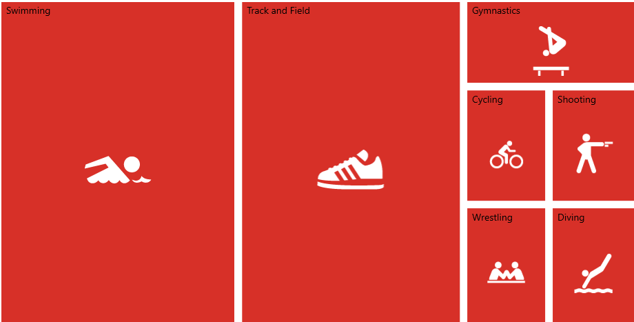

# Customizing Leaf Nodes

You can customize leaf nodes by assigning data template to LeafTemplate of SfTreeMap. 

Code Sample:



     <Grid Background="{StaticResource ApplicationPageBackgroundThemeBrush}"> 
     <Grid.DataContext> 
     <local:OlymicMedalsViewModel/>
     </Grid.DataContext> 
     <syncfusion:SfTreeMap ItemsSource="{Binding OlympicMedalsDetails}" Margin="50" WeightValuePath="TotalMedals" ColorValuePath="GoldMedals">
     <syncfusion:SfTreeMap.LeafTemplate> 
     <DataTemplate> 
     <Border BorderBrush="Transparent" BorderThickness="3" Background="#D73028">
     <Image Source="{Binding Data.GameImgSource}" HorizontalAlignment="Center" VerticalAlignment="Center" Margin="0,25,0,0" Stretch="None"/>
     </Border>
     </DataTemplate>
     </syncfusion:SfTreeMap.LeafTemplate> 
     <syncfusion:SfTreeMap.Levels>
     <syncfusion:TreeMapFlatLevel GroupPath="GameName" ShowLabels="True">
     <syncfusion:TreeMapFlatLevel.LabelTemplate> 
     <DataTemplate>       
     <TextBlock Padding="10 5 0 0" Text="{Binding Label}" FontSize="20" HorizontalAlignment="Left" VerticalAlignment="Top"/> 
     </DataTemplate>         
     </syncfusion:TreeMapFlatLevel.LabelTemplate> 
     </syncfusion:TreeMapFlatLevel>  
     </syncfusion:SfTreeMap.Levels> 
     </syncfusion:SfTreeMap>
     </Grid>



       
       public class OlymicMedalsViewModel
    {
		public ObservableCollection<OlympicMedals> OlympicMedalsDetails
		{ get; set; }
        public OlymicMedalsViewModel()
        {        
			this.OlympicMedalsDetails = new ObservableCollection<OlympicMedals>();
			this.OlympicMedalsDetails.Add(new OlympicMedals { Country = "US", GameName = "Swimming", GoldMedals = 16, SilverMedals = 9, BronzeMedals = 6, TotalMedals = 31, GameImgSource = new BitmapImage(new Uri("ms-appx:/Assets/Swimming.png")) });
            this.OlympicMedalsDetails.Add(new OlympicMedals { Country = "US", GameName = "Track and Field", GoldMedals = 9, SilverMedals = 13, BronzeMedals = 7, TotalMedals = 29, GameImgSource = new BitmapImage(new Uri("ms-appx:/Assets/TrackAndField.png")) });
            this.OlympicMedalsDetails.Add(new OlympicMedals { Country = "US", GameName = "Gymnastics", GoldMedals = 3, SilverMedals = 1, BronzeMedals = 2, TotalMedals = 6, GameImgSource = new BitmapImage(new Uri("ms-appx:/Assets/Gymnastics.png")) });
            this.OlympicMedalsDetails.Add(new OlympicMedals { Country = "US", GameName = "Cycling", GoldMedals = 1, SilverMedals = 2, BronzeMedals = 1, TotalMedals = 4, GameImgSource = new BitmapImage(new Uri("ms-appx:/Assets/Cycling.png")) });   
			this.OlympicMedalsDetails.Add(new OlympicMedals { Country = "US", GameName = "Shooting", GoldMedals = 3, SilverMedals = 0, BronzeMedals = 1, TotalMedals = 4, GameImgSource = new BitmapImage(new Uri("ms-appx:/Assets/Shooting.png")) }); 
			this.OlympicMedalsDetails.Add(new OlympicMedals { Country = "US", GameName = "Wrestling", GoldMedals = 2, SilverMedals = 0, BronzeMedals = 2, TotalMedals = 4, GameImgSource = new BitmapImage(new Uri("ms-appx:/Assets/Wrestling.png")) }); 
			this.OlympicMedalsDetails.Add(new OlympicMedals { Country = "US", GameName = "Diving", GoldMedals = 1, SilverMedals = 1, BronzeMedals = 2, TotalMedals = 4, GameImgSource = new BitmapImage(new Uri("ms-appx:/Assets/Diving.png")) });
		}  
	} 
	public class OlympicMedals
    {
		public string Country { get; set; }
        public string GameName { get; set; } 
		public double GoldMedals { get; set; }
        public double SilverMedals { get; set; }
        public double BronzeMedals { get; set; }
        public double TotalMedals { get; set; }
        public ImageSource GameImgSource { get; set; }
	}



