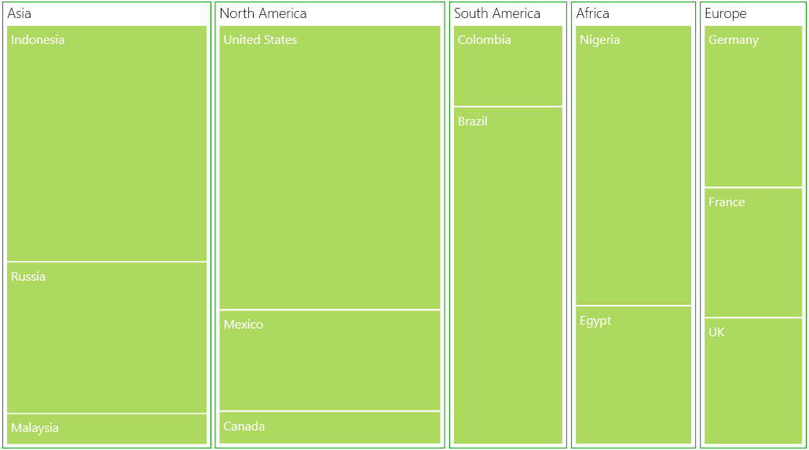

# Features

## WeightValuePath

WeightValuePath of SfTreeMap is a path to a field on the source object, which serve as the "weight" of the object. 

Code Sample:



    <Grid Background="{StaticResource ApplicationPageBackgroundThemeBrush}">

        <Grid.DataContext>

            <local:PopulationViewModel/>

        </Grid.DataContext>

        <syncfusion:SfTreeMap ItemsSource="{Binding PopulationDetails}" 

                              WeightValuePath="Population”/>

    </Grid>



N>  The specified field must be available in each and every sub class (object) defined in hierarchical (nested) data collection.

## ColorValuePath

ColorValuePath ofSfTreeMap is a path to a field on the source object, which serves as the "color" of the object. 

Code Sample:



    <Grid Background="{StaticResource ApplicationPageBackgroundThemeBrush}">

        <Grid.DataContext>

            <local:PopulationViewModel/>

        </Grid.DataContext>

        <syncfusion:SfTreeMap ItemsSource="{Binding PopulationDetails}" 

                              ColorValuePath="Growth"/>

    </Grid>



N>  The specified field must be available in each and every sub class (object) defined in hierarchical (nested) data collection.

## LeafLabelPath

LeafLabelPath of SfTreeMap is a path to a field on the source object, which serves as the "label" of the object.

Code Sample:



    <Grid Background="{StaticResource ApplicationPageBackgroundThemeBrush}">

        <Grid.DataContext>

            <local:PopulationViewModel/>

        </Grid.DataContext>

        <syncfusion:SfTreeMap ItemsSource="{Binding PopulationDetails}" 

                              LeafLabelPath="Country”/>

    </Grid>
	


N>  The specified field must be available in each and every sub class (object) defined in hierarchical (nested) data collection.

## TreeMap Levels

The levels of TreeMap can be categorized into two types such as,

* TreeMapFlatLevel
* TreeMapHierarchicalLevel

### TreeMapFlatLevel

TreeMapFlatLevel is used to define levels for flat data collection. 

ItemsSource:

The ItemsSource set for SfTreeMap must be a flat collection of data. The following code shows how to bind a flat collection as ItemsSource to a TreeMap.

Code Sample:



    <Grid Background="{StaticResource ApplicationPageBackgroundThemeBrush}">

        <Grid.DataContext>

            <local:PopulationViewModel/>

        </Grid.DataContext>

        <syncfusion:SfTreeMap ItemsSource="{Binding PopulationDetails}"

                              WeightValuePath="Population"

                              ColorValuePath="Growth"/>

            </Grid>





    public class PopulationViewModel

    {

        public PopulationViewModel()

        {

            this.PopulationDetails = new

                                    ObservableCollection<PopulationDetail>();

           PopulationDetails.Add(new PopulationDetail() { Continent = "Asia", Country = "Indonesia", Growth = 3, Population = 237641326 });

           PopulationDetails.Add(new PopulationDetail() { Continent = "Asia", Country = "Russia", Growth = 2, Population = 152518015 });

           PopulationDetails.Add(new PopulationDetail() { Continent = "North America", Country = "United States", Growth = 4, Population = 315645000 });

           PopulationDetails.Add(new PopulationDetail() { Continent = "North America", Country = "Mexico", Growth = 2, Population = 112336538 });

           PopulationDetails.Add(new PopulationDetail() { Continent = "Africa", Country = "Nigeria", Growth = 2, Population = 170901000 });            

           PopulationDetails.Add(new PopulationDetail() { Continent = "Africa", Country = "Egypt", Growth = 1, Population = 83661000 });

           PopulationDetails.Add(new PopulationDetail() { Continent = "Europe", Country = "Germany", Growth = 1, Population = 81993000 });

           PopulationDetails.Add(new PopulationDetail() { Continent = "Europe", Country = "France", Growth = 1, Population = 65605000 });

           PopulationDetails.Add(new PopulationDetail() { Continent = "Europe", Country = "UK", Growth = 1, Population = 63181775 });

        }

        public ObservableCollection<PopulationDetail> PopulationDetails

        {

            get;

            set;

        }

        public class PopulationDetail

        {

            public string Continent { get; set; }

            public string Country { get; set; }

            public double Growth { get; set; }

            public double Population { get; set; }

        }        

    }



#### GroupPath:

You must specify the GroupPath for each and every flat level of TreeMap. It is a path to a field on the source object, which serves as the “Group” for the levels specified. Based upon the GroupPath, the data is grouped in the TreeMap. If GroupPath is not specified, then the items are not grouped, and it is shown in the order, in which they are specified in the ItemsSource.

Code Sample:



    <Grid Background="{StaticResource ApplicationPageBackgroundThemeBrush}">

    <Grid.DataContext>

        <local:PopulationViewModel/>

    </Grid.DataContext>

    <syncfusion:SfTreeMap ItemsSource="{Binding PopulationDetails}"

                          WeightValuePath="Population"                              

                          ColorValuePath="Growth">

        <syncfusion:SfTreeMap.Levels>

            <syncfusion:TreeMapFlatLevel GroupPath="Continent">

            </syncfusion:TreeMapFlatLevel>

            <syncfusion:TreeMapFlatLevel GroupPath="Country">

            </syncfusion:TreeMapFlatLevel>

        </syncfusion:SfTreeMap.Levels>

    </syncfusion:SfTreeMap>

    </Grid>



#### GroupGap:

You can specify GroupGap for separating the items of every flat level and it is used to differentiate the levels mentioned for TreeMap.

Code Sample:



    <Grid Background="{StaticResource ApplicationPageBackgroundThemeBrush}">

    <Grid.DataContext>

        <local:PopulationViewModel/>

    </Grid.DataContext>

    <syncfusion:SfTreeMap ItemsSource="{Binding PopulationDetails}"

                          WeightValuePath="Population"                              

                          ColorValuePath="Growth">

        <syncfusion:SfTreeMap.Levels>

           <syncfusion:TreeMapFlatLevel GroupPath="Continent" GroupGap="10"/>

           <syncfusion:TreeMapFlatLevel GroupPath="Country" GroupGap="5"/>

        </syncfusion:SfTreeMap.Levels>

    </syncfusion:SfTreeMap>

    </Grid>



### TreeMapHierarchicalLevel:

TreeMapHierarchicalLevel is used to define levels for hierarchical data collection which contains tree-structured data. 

ItemsSource:

The ItemsSource set for TreeMap must be a nested data collection. The following code shows how to bind a hierarchical data collection as ItemsSource for TreeMap.

Code Sample:



    <Grid Background="{StaticResource ApplicationPageBackgroundThemeBrush}">

        <Grid.Resources>

            <local:CountrySalesCollection x:Key="countrySalesCollection"/>

        </Grid.Resources>

        <syncfusion:SfTreeMap ItemsSource="{Binding Source={StaticResource 

                                                    countrySalesCollection}}"

                              WeightValuePath="Sales"                              

                              ColorValuePath="Expense">

            <syncfusion:SfTreeMap.Levels>

                <syncfusion:TreeMapHierarchicalLevel/>

            </syncfusion:SfTreeMap.Levels>

        </syncfusion:SfTreeMap>

    </Grid>




    public class CountrySalesCollection : ObservableCollection<CountrySale>

    {

        public CountrySalesCollection()

        {

            this.Add(new CountrySale() { Name = "United States", Sales = 98456, Expense = 87000 });

            this.Add(new CountrySale() { Name = "Canada", Sales = 43523, Expense = 40000 });

            this.Add(new CountrySale() { Name = "Mexico", Sales = 45634, Expense = 46000 });

            this[0].RegionalSalesCollection.Add(new RegionSale() { Country = "United States", Name = "New York", Sales = 2353, Expense = 2000 });

            this[0].RegionalSalesCollection.Add(new RegionSale() { Country = "United States", Name = "Los Angeles", Sales = 3453, Expense = 3000 });

            this[0].RegionalSalesCollection.Add(new RegionSale() { Country = "United States", Name = "San Francisco", Sales = 8456, Expense = 8000 });

            this[0].RegionalSalesCollection.Add(new RegionSale() { Country = "United States", Name = "Chicago", Sales = 6785, Expense = 7000 });

            this[0].RegionalSalesCollection.Add(new RegionSale() { Country = "United States", Name = "Miami", Sales = 7045, Expense = 6000 });            

            this[1].RegionalSalesCollection.Add(new RegionSale() { Country = "Canada", Name = "Toronto", Sales = 7045, Expense = 7000 });

            this[1].RegionalSalesCollection.Add(new RegionSale() { Country = "Canada", Name = "Vancouver", Sales = 4352, Expense = 4000 });

            this[1].RegionalSalesCollection.Add(new RegionSale() { Country = "Canada", Name = "Winnipeg", Sales = 7843, Expense = 7500 });

            this[2].RegionalSalesCollection.Add(new RegionSale() { Country = "Mexico", Name = "Mexico City", Sales = 7843, Expense = 6500 });

            this[2].RegionalSalesCollection.Add(new RegionSale() { Country = "Mexico", Name = "Cancun", Sales = 6683, Expense = 6000 });        }

    }

    public class CountrySale : INotifyPropertyChanged

    {

        public string Name { get; set; }

        private double _sales = 0;

        public double Sales

        {

            get { return _sales; }

            set

            {

                if (_sales != value)

                {

                    _sales = value;

                    this.OnPropertyChanged(new  

                         PropertyChangedEventArgs("Sales"));

                }

            }

        }

        private double _expense = 0;

        public double Expense

        {

            get { return _expense; }

            set

            {

                if (_expense != value)

                {

                    _expense = value;

                    this.OnPropertyChanged(new  

                         PropertyChangedEventArgs("Expense"));

                }

            }

        }

        public ObservableCollection<RegionSale> RegionalSalesCollection 

        { get; set; }

        public CountrySale()

        {

            this.RegionalSalesCollection = new ObservableCollection<RegionSale>();

        }

        #region INotifyPropertyChanged Members

        public event PropertyChangedEventHandler PropertyChanged;

        protected void OnPropertyChanged(PropertyChangedEventArgs e)

        {

            if (this.PropertyChanged != null)

                this.PropertyChanged.Invoke(this, e);

        }

        #endregion

    }

    public class RegionSale : INotifyPropertyChanged

    {

        public string Name { get; set; }

        public string Country { get; set; }

        private double _sales = 0;

        public double Sales

        {

            get { return _sales; }

            set

            {

                if (_sales != value)

                {

                    _sales = value;

                    this.OnPropertyChanged(new  

                         PropertyChangedEventArgs("Sales"));

                }

            }

        }

        private double _expense = 0;

        public double Expense

        {

            get { return _expense; }

            set

            {

                if (_expense != value)

                {

                    _expense = value;

                    this.OnPropertyChanged(new  

                         PropertyChangedEventArgs("Expense"));

                }

            }

        }

        #region INotifyPropertyChanged Members

        public event PropertyChangedEventHandler PropertyChanged;

        protected void OnPropertyChanged(PropertyChangedEventArgs e)

        {

            if (this.PropertyChanged != null)

                this.PropertyChanged.Invoke(this, e);

        }

        #endregion

    }



#### ChildPath:

You must specify ChildPath for each and every hierarchical level of TreeMap. It is a path to a field on the source object, which serves as the “Child” for the level specified. Based upon the ChildPath, the treemap contains child items.

Code Sample:



    <Grid Background="{StaticResource ApplicationPageBackgroundThemeBrush}">

        <Grid.Resources>

            <local:CountrySalesCollection x:Key="countrySalesCollection"/>

        </Grid.Resources>

        <syncfusion:SfTreeMap ItemsSource="{Binding Source={StaticResource 

                                                    countrySalesCollection}}"

                              WeightValuePath="Sales"                              

                              ColorValuePath="Expense">

            <syncfusion:SfTreeMap.Levels>

                <syncfusion:TreeMapHierarchicalLevel

                              ChildPath="RegionalSalesCollection">

                     </syncfusion:TreeMapHierarchicalLevel>

            </syncfusion:SfTreeMap.Levels>

        </syncfusion:SfTreeMap>

    </Grid>



N>  The specified field must be a collection of sub class (object) specified in the nested data collection.

#### ChildGap:

You can specify ChildGap for separating the child items of every level and it is used to differentiate the levels mentioned for TreeMap.

Code Sample:



    <Grid Background="{StaticResource ApplicationPageBackgroundThemeBrush}">

        <Grid.Resources>

            <local:CountrySalesCollection x:Key="countrySalesCollection"/>

        </Grid.Resources>

        <syncfusion:SfTreeMap ItemsSource="{Binding Source={StaticResource 

                                                    countrySalesCollection}}"

                              WeightValuePath="Sales"                              

                              ColorValuePath="Expense">

            <syncfusion:SfTreeMap.Levels>

                <syncfusion:TreeMapHierarchicalLevel ChildGap="10"

                              ChildPath="RegionalSalesCollection">

                     </syncfusion:TreeMapHierarchicalLevel>

            </syncfusion:SfTreeMap.Levels>

        </syncfusion:SfTreeMap>

    </Grid>



## TreeMap Layout

The ItemsLayoutMode for SfTreeMap specifies the layout mode of the tree map items. This layout is applied for all the tree map levels. There are four different TreeMap layouts such as,

### Squarified Layout

In this layout the data is visualized in the form of square-like rectangles with best aspect ratio.

The following code illustrates how to set a squarified in Treemap.

Code Sample:



    <Grid Background="{StaticResource ApplicationPageBackgroundThemeBrush}">

        <Grid.DataContext>

            <local:PopulationViewModel/>

        </Grid.DataContext>

        <syncfusion:SfTreeMap ItemsSource="{Binding PopulationDetails}"

                              ItemsLayoutMode="Squarified"

                              WeightValuePath="Population"                              

                              ColorValuePath="Growth">

            <syncfusion:SfTreeMap.Levels>

                <syncfusion:TreeMapFlatLevel GroupPath="Continent" 

                                             GroupGap="10"/>

                <syncfusion:TreeMapFlatLevel GroupPath="Country" 

                                             GroupGap="5"

                                             ShowLabels="True"/>

            </syncfusion:SfTreeMap.Levels>

        </syncfusion:SfTreeMap>

    </Grid>  



The following screen shot illustrates a squarified layout.

_Figure_ _1_: squarified layout_

### SliceAndDiceAuto Layout:

In this layout the data is visualized in the form of long-thin rectangles with high aspect ratio, which can be displayed either vertically or horizontally.

The following code illustrates how to set a slice and dice layout in Treemap.

Code Sample:



    <Grid Background="{StaticResource ApplicationPageBackgroundThemeBrush}">

        <Grid.DataContext>

            <local:PopulationViewModel/>

        </Grid.DataContext>

        <syncfusion:SfTreeMap ItemsSource="{Binding PopulationDetails}"

                              ItemsLayoutMode=" SliceAndDiceAuto"

                              WeightValuePath="Population"                              

                              ColorValuePath="Growth">

            <syncfusion:SfTreeMap.Levels>

                <syncfusion:TreeMapFlatLevel GroupPath="Continent" 

                                             GroupGap="10"/>

                <syncfusion:TreeMapFlatLevel GroupPath="Country" 

                                             GroupGap="5"

                                             ShowLabels="True"/>

            </syncfusion:SfTreeMap.Levels>

        </syncfusion:SfTreeMap>

    </Grid> 


	
The following screen shot illustrates a slice-and-dice layout.

_Figure_ _2_: slice-and-dice layout_

### SliceAndDiceHorizontal Layout:

The following code illustrates how to set a slice and dice layout horizontally in Treemap.

Code Sample:



    <Grid Background="{StaticResource ApplicationPageBackgroundThemeBrush}">

        <Grid.DataContext>

            <local:PopulationViewModel/>

        </Grid.DataContext>

        <syncfusion:SfTreeMap ItemsSource="{Binding PopulationDetails}"

                              ItemsLayoutMode=" SliceAndDiceHorizontal"

                              WeightValuePath="Population"                              

                              ColorValuePath="Growth">

            <syncfusion:SfTreeMap.Levels>

                <syncfusion:TreeMapFlatLevel GroupPath="Continent" 

                                             GroupGap="10"/>

                <syncfusion:TreeMapFlatLevel GroupPath="Country" 

                                             GroupGap="5"

                                             ShowLabels="True"/>

            </syncfusion:SfTreeMap.Levels>

        </syncfusion:SfTreeMap>

    </Grid>    



The following screen shot shows a Slice-and-dice treemap in horizontal layout.

Figure 3: Slice-and-dice treemap in horizontal layout

#### SliceAndDiceVertical Layout:

The following code illustrates how to set a slice and dice layout vertically in Treemap.

Code Sample:



    <Grid Background="{StaticResource ApplicationPageBackgroundThemeBrush}">

        <Grid.DataContext>

            <local:PopulationViewModel/>

        </Grid.DataContext>

        <syncfusion:SfTreeMap ItemsSource="{Binding PopulationDetails}"

                              ItemsLayoutMode=" SliceAndDiceVertical"

                              WeightValuePath="Population"                              

                              ColorValuePath="Growth">

            <syncfusion:SfTreeMap.Levels>

                <syncfusion:TreeMapFlatLevel GroupPath="Continent" 

                                             GroupGap="10"/>

                <syncfusion:TreeMapFlatLevel GroupPath="Country" 

                                             GroupGap="5"

                                             ShowLabels="True"/>

            </syncfusion:SfTreeMap.Levels>

        </syncfusion:SfTreeMap>

    </Grid>  



The following screen shot shows a Slice-and-dice treemap in vertical layout.

_Figure_ _4_: Slice-and-dice treemap in vertical layout

### ColorMapping

ColorMapping is categorized into four different types such as,

* UniColorMapping
* RangeBrushColorMapping
* DesaturationColorMapping
* PaletteColorMapping

TreeMap ColorMapping:

The leaf nodes of TreeMap can be colored by setting LeafColorMapping of TreeMap.

Code Sample:



    <syncfusion:SfTreeMap ItemsSource="{Binding PopulationDetails}" 

                       WeightValuePath="Population"                              

                       ColorValuePath="Growth">

    <syncfusion:SfTreeMap.LeafColorMapping>

        <syncfusion:UniColorMapping Color="Crimson"/>

    </syncfusion:SfTreeMap.LeafColorMapping>

    <syncfusion:SfTreeMap.Levels>

        <syncfusion:TreeMapFlatLevel GroupPath="Continent" GroupGap="10"/>

    </syncfusion:SfTreeMap.Levels>

     </syncfusion:SfTreeMap>



#### TreeMapLevel ColorMapping:

The headers of TreeMap level can also be colored using ColorMapping property of TreeMapLevel. 

Code Sample:



    <syncfusion:SfTreeMap ItemsSource="{Binding PopulationDetails}" 

                       WeightValuePath="Population"                              

                       ColorValuePath="Growth">

    <syncfusion:SfTreeMap.LeafColorMapping>

        <syncfusion:UniColorMapping Color="Orange"/>

    </syncfusion:SfTreeMap.LeafColorMapping>

    <syncfusion:SfTreeMap.Levels>

        <syncfusion:TreeMapFlatLevel GroupPath="Continent" GroupGap="10" HeaderHeight="20">

            <syncfusion:TreeMapFlatLevel.ColorMapping>

                <syncfusion:UniColorMapping Color="YellowGreen"/>

            </syncfusion:TreeMapFlatLevel.ColorMapping>

        </syncfusion:TreeMapFlatLevel>

        <syncfusion:TreeMapFlatLevel GroupPath="Country" GroupGap="5" HeaderHeight="15">

            <syncfusion:TreeMapFlatLevel.ColorMapping>

                <syncfusion:UniColorMapping Color="Crimson"/>

            </syncfusion:TreeMapFlatLevel.ColorMapping>

        </syncfusion:TreeMapFlatLevel>

    </syncfusion:SfTreeMap.Levels>

     </syncfusion:SfTreeMap>  



### UniColorMapping

TreeMap leaf nodes can be colored with the help of Color property specified using UniColorMapping.

Code Sample:



    <Grid Background="{StaticResource ApplicationPageBackgroundThemeBrush}">

        <Grid.DataContext>

            <local:PopulationViewModel/>

        </Grid.DataContext>

        <syncfusion:SfTreeMap ItemsSource="{Binding PopulationDetails}"                              

                              WeightValuePath="Population"                              

                              ColorValuePath="Growth">

            <syncfusion:SfTreeMap.LeafColorMapping>

                <syncfusion:UniColorMapping Color="Crimson"/>

            </syncfusion:SfTreeMap.LeafColorMapping>

            <syncfusion:SfTreeMap.Levels>

                <syncfusion:TreeMapFlatLevel GroupPath="Continent" 

                                             GroupGap="10"/>

                <syncfusion:TreeMapFlatLevel GroupPath="Country" 

                                             GroupGap="5"

                                             ShowLabels="True"/>

            </syncfusion:SfTreeMap.Levels>

        </syncfusion:SfTreeMap>

    </Grid>



_Figure_ _5_: Leaf Nodes colored by using UniColorMapping_

### RangeBrushColorMapping

The leaf nodes of TreeMap can be colored based upon the range (i.e., From and To) and Brush specified using RangeBrush collection of RangeBrushColorMapping.

Code Sample:



    <syncfusion:SfTreeMap ItemsSource="{Binding PopulationDetails}" 

                      WeightValuePath="Population" ColorValuePath="Growth">

    <syncfusion:SfTreeMap.LeafColorMapping>

        <syncfusion:RangeBrushColorMapping>

            <syncfusion:RangeBrushColorMapping.Brushes>

                <syncfusion:RangeBrush From="0" To="1" Color="#A4C400"/>

                <syncfusion:RangeBrush From="1" To="2" Color="#AA00FF"/>

                <syncfusion:RangeBrush From="2" To="3" Color="#F0A30A"/>

                <syncfusion:RangeBrush From="3" To="4" Color="#1BA1E2"/>

            </syncfusion:RangeBrushColorMapping.Brushes>

        </syncfusion:RangeBrushColorMapping>

    </syncfusion:SfTreeMap.LeafColorMapping>

    <syncfusion:SfTreeMap.Levels>

        <syncfusion:TreeMapFlatLevel GroupPath="Continent" GroupGap="10"/>

        <syncfusion:TreeMapFlatLevel GroupPath="Country" GroupGap="5"

                                     ShowLabels="True"/>

    </syncfusion:SfTreeMap.Levels>

     </syncfusion:SfTreeMap>



_Figure_ _6_: Leaf nodes colored by using RangeBrushColorMapping_

### DesaturationColorMapping

The leaf nodes of TreeMap can be colored based upon the Color specified using DesaturationColorMapping. The RangeMinimum and RangeMaximum must be specified to determine the opacity for each leaf node. The opacity of leaf nodes are in the range of From and To mentioned in DesaturationColorMapping.

Code Sample:



     <syncfusion:SfTreeMap ItemsSource="{Binding PopulationDetails}"   

                      WeightValuePath="Population" ColorValuePath="Growth">

    <syncfusion:SfTreeMap.LeafColorMapping>

        <syncfusion:DesaturationColorMapping From="1" To="0.5" 

                                             RangeMinimum="0" RangeMaximum="4" Color="DeepSkyBlue">

        </syncfusion:DesaturationColorMapping>

    </syncfusion:SfTreeMap.LeafColorMapping>

    <syncfusion:SfTreeMap.Levels>

        <syncfusion:TreeMapFlatLevel GroupPath="Continent" GroupGap="10"/>

        <syncfusion:TreeMapFlatLevel GroupPath="Country" GroupGap="5"

                                     ShowLabels="True"/>

    </syncfusion:SfTreeMap.Levels>
    
    </syncfusion:SfTreeMap>



_Figure_ _7_: Leaf nodes colored by using DesaturationColorMapping_

_

### PaletteColorMapping

The leaf nodes are colored by using the brushes mentioned in Colors collection of PaletteColorMapping.

Code Sample:



     <syncfusion:SfTreeMap ItemsSource="{Binding PopulationDetails}"                              

                      WeightValuePath="Population" ColorValuePath="Growth">

    <syncfusion:SfTreeMap.LeafColorMapping>

        <syncfusion:PaletteColorMapping>

            <syncfusion:PaletteColorMapping.Colors>

                <SolidColorBrush Color="Red"/><SolidColorBrush Color="Blue"/>

                <SolidColorBrush Color="Green"/><SolidColorBrush Color="Yellow"/><SolidColorBrush Color="Orange"/><SolidColorBrush Color="Orchid"/><SolidColorBrush Color="Brown"/><SolidColorBrush Color="BlueViolet"/><SolidColorBrush Color="OrangeRed"/>

                <SolidColorBrush Color="Magenta"/>

                <SolidColorBrush Color="Olive"/>

                <SolidColorBrush Color="Crimson"/>

                <SolidColorBrush Color="DeepSkyBlue"/>

            </syncfusion:PaletteColorMapping.Colors>

        </syncfusion:PaletteColorMapping>

    </syncfusion:SfTreeMap.LeafColorMapping>

    <syncfusion:SfTreeMap.Levels>

        <syncfusion:TreeMapFlatLevel GroupPath="Continent" GroupGap="10"/>

        <syncfusion:TreeMapFlatLevel GroupPath="Country" GroupGap="5"

                                     ShowLabels="True"/>

    </syncfusion:SfTreeMap.Levels>

     </syncfusion:SfTreeMap>



_Figure_ _8_: Leaf nodes colored by using PaletteColorMapping_

## TreeMap Legend

TreeMap legend is used to easily demonstrate about the color value of leaf nodes. But this legend could be appropriate only for the treemap having leaf nodes colored by using RangeBrushColorMapping. The labels of the legend item can be customized by specifying LegendLabel of RangeBrush mentioned in the Brushes of RangeBrushColorMapping.

The icon of legend item can be set by LegendIconStyle of TreeMapLegend. Custom legend icon can be set by assigning DataTemplate to LegendIconTemplate with LegendIconStyle as “Custom”. The width and height of the legend icon can be modified by setting LegendIconWidth and LegendIconHeight of TreeMapLegend.

The legend can be positioned to Left, Right, Top or Bottom of TreeMap with the help of LegendPosition property.

Code Sample:



     <syncfusion:SfTreeMap ItemsSource="{Binding PopulationDetails}" 

                      WeightValuePath="Population" ColorValuePath="Growth"

                      Margin="10" Name="TreeMap">

    <syncfusion:SfTreeMap.Legend>

        <syncfusion:TreeMapLegend Margin="0 5" LegendItemMargin="0 0 20 10" LegendItemElementMargin="0 0 10 0" BorderThickness="0,0,0,2" BorderBrush="#CCCCCC" HorizontalAlignment="Left" LegendIconStyle="Rectangle" LegendIconHeight="18" LegendIconWidth="18" FontSize="25" Width="{Binding ActualWidth, ElementName=TreeMap}">

            <syncfusion:TreeMapLegend.Header>

               <TextBlock Text="Population Growth FY2012" FontSize="35"                                   Margin="0,0,0,10”/>

            </syncfusion:TreeMapLegend.Header>

        </syncfusion:TreeMapLegend>

    </syncfusion:SfTreeMap.Legend>

    <syncfusion:SfTreeMap.LeafColorMapping>

        <syncfusion:RangeBrushColorMapping>

            <syncfusion:RangeBrushColorMapping.Brushes>

                <syncfusion:RangeBrush Color="#77D8D8" From="0" To="1" LegendLabel="1 % Growth"/>

                <syncfusion:RangeBrush Color="#AED960" From="1" To="2" LegendLabel="2 % Growth"/>

                <syncfusion:RangeBrush Color="#FFAF51" From="2" To="3" LegendLabel="3 % Growth"/>

                <syncfusion:RangeBrush Color="#F3D240" From="3" To="4" LegendLabel="4 % Growth"/>

            </syncfusion:RangeBrushColorMapping.Brushes>

        </syncfusion:RangeBrushColorMapping>

    </syncfusion:SfTreeMap.LeafColorMapping>

    <syncfusion:SfTreeMap.Levels>

        <syncfusion:TreeMapFlatLevel GroupPath="Continent" GroupGap="10"/>

        <syncfusion:TreeMapFlatLevel GroupPath="Country" GroupGap="5"

                                     ShowLabels="True"/>

    </syncfusion:SfTreeMap.Levels>

     </syncfusion:SfTreeMap>



_Figure_ _9_: TreeMap with Legend_

## Headers and Labels

### Headers

To show headers in TreeMap, you can set the HeaderHeight property of TreeMapLevel. For customizing default Header appearance, you can specify the HeaderTemplate.

TreeMap with Flat Collection:

If HeaderTemplate is specified for TreeMapLevel, then the header can be bound by referring Header object to the data template.

Code Sample:



     <Grid Background="{StaticResource ApplicationPageBackgroundThemeBrush}">

    <Grid.DataContext>

        <local:PopulationViewModel/>

    </Grid.DataContext>

    <syncfusion:SfTreeMap ItemsSource="{Binding PopulationDetails}" 

                        WeightValuePath="Population" ColorValuePath="Growth">

        <syncfusion:SfTreeMap.Levels>

            <syncfusion:TreeMapFlatLevel GroupPath="Continent" GroupGap="10" HeaderHeight="50"/>

            <syncfusion:TreeMapFlatLevel GroupPath="Country" GroupGap="5"/>

        </syncfusion:SfTreeMap.Levels>

    </syncfusion:SfTreeMap>

    </Grid>



_Figure_ _10_: TreeMap with Headers_

TreeMap with Hierarchical Collection:

For TreeMap with Hierarchical Collection, HeaderPath must be specified. The header can be bound by referring Data.<FieldName> to the data template where FieldName refers to the field of object specified in the particular treemap level.

Code Sample:

 

    <Grid Background="{StaticResource ApplicationPageBackgroundThemeBrush}">

    <Grid.Resources>

        <local:CountrySalesCollection x:Key="countrySalesCollection"/>

    </Grid.Resources>

    <syncfusion:SfTreeMap ItemsSource="{Binding Source={StaticResource countrySalesCollection}}" WeightValuePath="Sales" ColorValuePath="Expense">

        <syncfusion:SfTreeMap.Levels>

            <syncfusion:TreeMapHierarchicalLevel ChildPath="RegionalSalesCollection" ChildGap="10" HeaderHeight="25" HeaderPath="Name">

            </syncfusion:TreeMapHierarchicalLevel>

        </syncfusion:SfTreeMap.Levels>

    </syncfusion:SfTreeMap>

    </Grid>



### Labels

To show labels in TreeMap, ShowLabels of TreeMapLevel should be enabled to True. For customizing default label appearance, you can specify LabelTemplate.

TreeMap with Flat Collection:

If LabelTemplate is specified for TreeMapLevel, then the label can be bound by referring Label object to the data template.

Code Sample:



    <Grid Background="{StaticResource ApplicationPageBackgroundThemeBrush}">

    <Grid.DataContext>

        <local:PopulationViewModel/>

    </Grid.DataContext>

    <syncfusion:SfTreeMap ItemsSource="{Binding PopulationDetails}"

                          WeightValuePath="Population" 

                          ColorValuePath="Growth">

        <syncfusion:SfTreeMap.Levels>

            <syncfusion:TreeMapFlatLevel GroupPath="Continent" GroupGap="10" ShowLabels="True"/>

        </syncfusion:SfTreeMap.Levels>

    </syncfusion:SfTreeMap>

    </Grid>



_Figure_ _11_: TreeMap with Labels

TreeMap with Hierarchical Collection:

For TreeMap with Hierarchical Collection, LabelPath must be specified. The label can be bound by referring Data. <FieldName> to the data template where FieldName refers to the field of object specified in the particular treemap level.

Code Sample:



     <Grid Background="{StaticResource ApplicationPageBackgroundThemeBrush}">

    <Grid.Resources>

        <local:CountrySalesCollection x:Key="countrySalesCollection"/>

    </Grid.Resources>

    <syncfusion:SfTreeMap ItemsSource="{Binding Source={StaticResource countrySalesCollection}}"

                      WeightValuePath="Sales" ColorValuePath="Expense">

        <syncfusion:SfTreeMap.Levels>

            <syncfusion:TreeMapHierarchicalLevel ChildPath="RegionalSalesCollection" ChildGap="10" ShowLabels="True" LabelPath="Name">

            </syncfusion:TreeMapHierarchicalLevel>

        </syncfusion:SfTreeMap.Levels>

    </syncfusion:SfTreeMap>

    </Grid>



### ToolTip Support

You can enable ToolTip for TreeMap by setting ShowToolTip to “True”. For modifying default appearance of ToolTip, ToolTipTemplate can be specified.

Code Sample:



     <syncfusion:SfTreeMap ItemsSource="{Binding PopulationDetails}" 

                      WeightValuePath="Population" ColorValuePath="Growth"

                      ShowToolTip="True">

    <syncfusion:SfTreeMap.ToolTipTemplate>

        <DataTemplate>

            <Grid Height="200" Width="420" Margin="0,-420,0,0">

                <Path Data="M0,0 L360,0 L360,200 L20,200 L-20,220 L0,160 L0,0 z" Fill="#666666" Stroke="Wheat" Opacity="0.9" Stretch="Fill"/>

                <StackPanel>

                  <Grid Background="{Binding MappedColor}" Margin="40 10 20 0" Height="40">

                  <TextBlock Text="{Binding Data.Continent}" Foreground= "White" FontWeight="SemiBold" FontSize="30" TextAlignment="Center"/>

                  </Grid>

                  <StackPanel Margin="40 20">

                  <StackPanel Orientation="Horizontal">

                  <TextBlock Text="Country" Width="140" FontSize="25"/>

                  <TextBlock Text="-" Width="20" FontSize="25"/>

                  <TextBlock Text="{Binding Data.Country}" FontSize="25"/>

                  </StackPanel>

                  <StackPanel Orientation="Horizontal">

                  <TextBlock Text="Population" Width="140" FontSize="25"/>

                  <TextBlock Text="-" Width="20" FontSize="25"/>

                  <TextBlock Text="{Binding Data.Population}" FontSize="25"/>

                  </StackPanel>

                  </StackPanel>

                </StackPanel>

            </Grid>

        </DataTemplate>

    </syncfusion:SfTreeMap.ToolTipTemplate>

    <syncfusion:SfTreeMap.LeafColorMapping>

        <syncfusion:RangeBrushColorMapping>

            <syncfusion:RangeBrushColorMapping.Brushes>

                <syncfusion:RangeBrush From="0" To="1" Color="#1BA1E2"/>

                <syncfusion:RangeBrush From="1" To="2" Color="#F09609"/>

                <syncfusion:RangeBrush From="2" To="3" Color="#E671B8"/>

                <syncfusion:RangeBrush From="3" To="4" Color="#339933"/>

            </syncfusion:RangeBrushColorMapping.Brushes>

        </syncfusion:RangeBrushColorMapping>

    </syncfusion:SfTreeMap.LeafColorMapping>

    <syncfusion:SfTreeMap.Levels>

        <syncfusion:TreeMapFlatLevel GroupPath="Continent" GroupGap="10"/>

        <syncfusion:TreeMapFlatLevel GroupPath="Country" GroupGap="5" ShowLabels="True"/>

    </syncfusion:SfTreeMap.Levels>

    </syncfusion:SfTreeMap>



The following screen shot shows a tree map with a tool tip.

_Figure_ _12_: ToolTip on TreeMap

## Highlighting Support

While selecting a leaf node, you can highlight it by setting HighlightOnSelection property of SfTreeMap to “True”. The border of highlight on selection can be customized by HighlightBorderBrush and HighlightBorderThickness properties of SfTreeMap.

Code Sample:



      <syncfusion:SfTreeMap ItemsSource="{Binding PopulationDetails}"

                      WeightValuePath="Population" ColorValuePath="Growth"

                      HighlightOnSelection="True" 

                      HighlightBorderBrush="Yellow" 

                      HighlightBorderThickness="5">

    <syncfusion:SfTreeMap.Levels>

        <syncfusion:TreeMapFlatLevel GroupPath="Continent" GroupGap="10"/>

    </syncfusion:SfTreeMap.Levels>

     </syncfusion:SfTreeMap>



## Customizing Leaf Nodes

You can customize leaf nodes by assigning data template to LeafTemplate of SfTreeMap. 

Code Sample:



    <Grid Background="{StaticResource ApplicationPageBackgroundThemeBrush}"> 
    <Grid.DataContext> 
    <local:OlymicMedalsViewModel/>
    </Grid.DataContext> 
    <syncfusion:SfTreeMap ItemsSource="{Binding OlympicMedalsDetails}" Margin="50" WeightValuePath="TotalMedals" ColorValuePath="GoldMedals">
    <syncfusion:SfTreeMap.LeafTemplate> 
    <DataTemplate> 
    <Border BorderBrush="Transparent" BorderThickness="3" Background="#D73028">
    <Image Source="{Binding Data.GameImgSource}" HorizontalAlignment="Center" VerticalAlignment="Center" Margin="0,25,0,0" Stretch="None"/>
    </Border>
    </DataTemplate>
    </syncfusion:SfTreeMap.LeafTemplate> 
    <syncfusion:SfTreeMap.Levels>
    <syncfusion:TreeMapFlatLevel GroupPath="GameName" ShowLabels="True">
    <syncfusion:TreeMapFlatLevel.LabelTemplate> 
    <DataTemplate>       
    <TextBlock Padding="10 5 0 0" Text="{Binding Label}" FontSize="20" HorizontalAlignment="Left" VerticalAlignment="Top"/> 
    </DataTemplate>         
    </syncfusion:TreeMapFlatLevel.LabelTemplate> 
    </syncfusion:TreeMapFlatLevel>  
    </syncfusion:SfTreeMap.Levels> 
    </syncfusion:SfTreeMap>
    </Grid>




    public class OlymicMedalsViewModel
    {
		public ObservableCollection<OlympicMedals> OlympicMedalsDetails
		{ get; set; }
        public OlymicMedalsViewModel()
        {        
			this.OlympicMedalsDetails = new ObservableCollection<OlympicMedals>();
			this.OlympicMedalsDetails.Add(new OlympicMedals { Country = "US", GameName = "Swimming", GoldMedals = 16, SilverMedals = 9, BronzeMedals = 6, TotalMedals = 31, GameImgSource = new BitmapImage(new Uri("ms-appx:/Assets/Swimming.png")) });
            this.OlympicMedalsDetails.Add(new OlympicMedals { Country = "US", GameName = "Track and Field", GoldMedals = 9, SilverMedals = 13, BronzeMedals = 7, TotalMedals = 29, GameImgSource = new BitmapImage(new Uri("ms-appx:/Assets/TrackAndField.png")) });
            this.OlympicMedalsDetails.Add(new OlympicMedals { Country = "US", GameName = "Gymnastics", GoldMedals = 3, SilverMedals = 1, BronzeMedals = 2, TotalMedals = 6, GameImgSource = new BitmapImage(new Uri("ms-appx:/Assets/Gymnastics.png")) });
            this.OlympicMedalsDetails.Add(new OlympicMedals { Country = "US", GameName = "Cycling", GoldMedals = 1, SilverMedals = 2, BronzeMedals = 1, TotalMedals = 4, GameImgSource = new BitmapImage(new Uri("ms-appx:/Assets/Cycling.png")) });   
			this.OlympicMedalsDetails.Add(new OlympicMedals { Country = "US", GameName = "Shooting", GoldMedals = 3, SilverMedals = 0, BronzeMedals = 1, TotalMedals = 4, GameImgSource = new BitmapImage(new Uri("ms-appx:/Assets/Shooting.png")) }); 
			this.OlympicMedalsDetails.Add(new OlympicMedals { Country = "US", GameName = "Wrestling", GoldMedals = 2, SilverMedals = 0, BronzeMedals = 2, TotalMedals = 4, GameImgSource = new BitmapImage(new Uri("ms-appx:/Assets/Wrestling.png")) }); 
			this.OlympicMedalsDetails.Add(new OlympicMedals { Country = "US", GameName = "Diving", GoldMedals = 1, SilverMedals = 1, BronzeMedals = 2, TotalMedals = 4, GameImgSource = new BitmapImage(new Uri("ms-appx:/Assets/Diving.png")) });
		}  
	} 
	public class OlympicMedals
    {
		public string Country { get; set; }
        public string GameName { get; set; } 
		public double GoldMedals { get; set; }
        public double SilverMedals { get; set; }
        public double BronzeMedals { get; set; }
        public double TotalMedals { get; set; }
        public ImageSource GameImgSource { get; set; }
	}



## Drill Down Support

Treemap enables drill down to expose the hierarchy by clicking on a treemap node and allows drill up by clicking on drill down header. At a time, only one level of the hierarchy can be seen in the treemap.

### Enabling Drill Down

Treemap items can be drilled down by enabling the property EnableDrillDown to ‘_true’_. The hierarchy of treemap levels can be shown by clicking on treemap items. The previous level can be drilled up by clicking on drill down header. DrillDown header can be customized with the help of DrillDownHeaderTemplate property.

_Table_ _1_: Drill Down Properties_

<table>
<tr>
<th>
 Property </th><th>
 Type </th><th>
 Description </th></tr>
<tr>
<td>
EnableDrillDown</td><td>
Bool</td><td>
Gets or sets a value to indicate whether the drill down support should be enabled.</td></tr>
<tr>
<td>
DrillDownHeaderHeight</td><td>
Double</td><td>
Gets or sets a value for specifying the height for drill down header.</td></tr>
<tr>
<td>
DrillDownHeaderTemplate</td><td>
DataTemplate</td><td>
Gets or sets a template to customize drill down header.</td></tr>
<tr>
<td>
DrillDownSelectionStroke</td><td>
Brush</td><td>
Gets or sets a color for highlighting tree map item while drill down.</td></tr>
</table>

Code Sample:



    <Grid Background="{StaticResource ApplicationPageBackgroundThemeBrush}">

        <Grid.DataContext>

            <local:Continents/>

        </Grid.DataContext>

     <syncfusion:SfTreeMap x:Name="TreeMap" ItemsSource="{Binding}" 

                      EnableDrillDown="True"     

                      DrillDownSelectionStroke="#1A9DAF"

                      WeightValuePath="Population" ColorValuePath="Area"

                      LeafLabelPath="Name" BorderThickness="1">

    <syncfusion:SfTreeMap.DrillDownHeaderTemplate>

        <DataTemplate>

            <Border Background="#1A9DAF">

                <StackPanel Orientation="Horizontal" VerticalAlignment="Center" Margin="10 0">

                    <Path x:Name="path" Data="M197,153.5 L197,138 186.75,145.5 z" Height="16" Width="8" Fill="White" Stretch="Fill" />

                    <TextBlock Text="{Binding}" Margin="10 0" FontSize="15" 

                               FontWeight="Normal" FontFamily="Segoe UI" Foreground="White"/>

                </StackPanel>

            </Border>

        </DataTemplate>

    </syncfusion:SfTreeMap.DrillDownHeaderTemplate>

    <syncfusion:SfTreeMap.LeafColorMapping>

        <syncfusion:UniColorMapping Color="#CCDFE3"/>

    </syncfusion:SfTreeMap.LeafColorMapping>

    <syncfusion:SfTreeMap.Levels>

        <syncfusion:TreeMapFlatLevel GroupPath="Continent" ShowLabels="True"/>

        <syncfusion:TreeMapFlatLevel GroupPath="Country" ShowLabels="True"/>

    </syncfusion:SfTreeMap.Levels>

    </syncfusion:SfTreeMap>

    </Grid>





    public class Continents : ObservableCollection<SubDivision>

    {

        public Continents()

        {

            this.Add(new SubDivision() { Name = "Ontario", Continent = "North America", Country = "Canada", Population = 13210600, Area = 1076395, Density = 12 });

            this.Add(new SubDivision() { Name = "Mexico", Continent = "North America", Country = "Mexico", Population = 15174272, Area = 21355, Density = 711 });

            this.Add(new SubDivision() { Name = "California", Continent = "North America", Country = "United States", Population = 37253956, Area = 423970, Density = 88 });

            this.Add(new SubDivision() { Name = "Texas", Continent = "North America", Country = "United States", Population = 25145561, Area = 696241, Density = 36 });

            this.Add(new SubDivision() { Name = "New York", Continent = "North America", Country = "United States", Population = 19378102, Area = 141299, Density = 137 });

            this.Add(new SubDivision() { Name = "Florida", Continent = "North America", Country = "United States", Population = 18801310, Area = 170304, Density = 110 });

            this.Add(new SubDivision() { Name = "Illinois", Continent = "North America", Country = "United States", Population = 12830632, Area = 140998, Density = 91 });

            this.Add(new SubDivision() { Name = "Pennsylvania", Continent = "North America", Country = "United States", Population = 12702379, Area = 119283, Density = 106 });

            this.Add(new SubDivision() { Name = "Ohio", Continent = "North America", Country = "United States", Population = 11536504, Area = 116096, Density = 99 });

            this.Add(new SubDivision() { Name = "Buenos Aires", Continent = "South America", Country = "Argentina", Population = 15594428, Area = 307571, Density = 51 });

            this.Add(new SubDivision() { Name = "Sao Paulo", Continent = "South America", Country = "Brazil", Population = 43663672, Area = 248209, Density = 166 });

            this.Add(new SubDivision() { Name = "Minas Gerais", Continent = "South America", Country = "Brazil", Population = 20593366, Area = 586528, Density = 33 });

            this.Add(new SubDivision() { Name = "Rio de Janeiro", Continent = "South America", Country = "Brazil", Population = 16369178, Area = 43696, Density = 366 });

            this.Add(new SubDivision() { Name = "Bahia", Continent = "South America", Country = "Brazil", Population = 15044127, Area = 564692, Density = 25 });

            this.Add(new SubDivision() { Name = "Rio Grande do Sul", Continent = "South America", Country = "Brazil", Population = 11164050, Area = 281748, Density = 38 });

            this.Add(new SubDivision() { Name = "Parana", Continent = "South America", Country = "Brazil", Population = 10997462, Area = 199315, Density = 52 });

            this.Add(new SubDivision() { Name = "Dhaka", Continent = "Asia", Country = "Bangladesh", Population = 46729000, Area = 31120, Density = 1502 });

            this.Add(new SubDivision() { Name = "Chittagong", Continent = "Asia", Country = "Bangladesh", Population = 28079000, Area = 33771, Density = 831 });

            this.Add(new SubDivision() { Name = "Rajshahi", Continent = "Asia", Country = "Bangladesh", Population = 18329000, Area = 18197, Density = 1007 });

            this.Add(new SubDivision() { Name = "Rangpur", Continent = "Asia", Country = "Bangladesh", Population = 15665000, Area = 16317, Density = 960 });

            this.Add(new SubDivision() { Name = "Khulna", Continent = "Asia", Country = "Bangladesh", Population = 15563000, Area = 22272, Density = 699 });

            this.Add(new SubDivision() { Name = "Guangdong", Continent = "Asia", Country = "China", Population = 104303132, Area = 177900, Density = 618 });

            this.Add(new SubDivision() { Name = "Shandong", Continent = "Asia", Country = "China", Population = 95793065, Area = 156700, Density = 598 });

            this.Add(new SubDivision() { Name = "Henan", Continent = "Asia", Country = "China", Population = 94023567, Area = 167000, Density = 560 });

            this.Add(new SubDivision() { Name = "Sichuan", Continent = "Asia", Country = "China", Population = 80418200, Area = 485000, Density = 181 });

            this.Add(new SubDivision() { Name = "Jiangsu", Continent = "Asia", Country = "China", Population = 78659903, Area = 102600, Density = 743 });

            this.Add(new SubDivision() { Name = "Hebei", Continent = "Asia", Country = "China", Population = 71854202, Area = 187700, Density = 370 });

            this.Add(new SubDivision() { Name = "Hunan", Continent = "Asia", Country = "China", Population = 65683722, Area = 211800, Density = 323 });

            this.Add(new SubDivision() { Name = "Anhui", Continent = "Asia", Country = "China", Population = 59500510, Area = 139400, Density = 498 });

            this.Add(new SubDivision() { Name = "Hubei", Continent = "Asia", Country = "China", Population = 57237740, Area = 185900, Density = 332 });

            this.Add(new SubDivision() { Name = "Zhejiang", Continent = "Asia", Country = "China", Population = 54426891, Area = 101800, Density = 509 });

            this.Add(new SubDivision() { Name = "Guangxi", Continent = "Asia", Country = "China", Population = 46026629, Area = 236700, Density = 211 });

            this.Add(new SubDivision() { Name = "Yunnan", Continent = "Asia", Country = "China", Population = 45966239, Area = 394100, Density = 107 });

            this.Add(new SubDivision() { Name = "Jiangxi", Continent = "Asia", Country = "China", Population = 44567475, Area = 166900, Density = 257 });

            this.Add(new SubDivision() { Name = "Liaoning", Continent = "Asia", Country = "China", Population = 43746323, Area = 145900, Density = 295 });

            this.Add(new SubDivision() { Name = "Heilongjiang", Continent = "Asia", Country = "China", Population = 38312224, Area = 460000, Density = 83 });

            this.Add(new SubDivision() { Name = "Shaanxi", Continent = "Asia", Country = "China", Population = 37327378, Area = 205800, Density = 180 });

            this.Add(new SubDivision() { Name = "Fujian", Continent = "Asia", Country = "China", Population = 36894216, Area = 121400, Density = 283 });

            this.Add(new SubDivision() { Name = "Shanxi", Continent = "Asia", Country = "China", Population = 35712111, Area = 156800, Density = 214 });

            this.Add(new SubDivision() { Name = "Guizhou", Continent = "Asia", Country = "China", Population = 34746468, Area = 176100, Density = 214 });

            this.Add(new SubDivision() { Name = "Chongqing", Continent = "Asia", Country = "China", Population = 28846170, Area = 82300, Density = 393 });

            this.Add(new SubDivision() { Name = "Jilin", Continent = "Asia", Country = "China", Population = 27462297, Area = 187400, Density = 146 });

            this.Add(new SubDivision() { Name = "Gansu", Continent = "Asia", Country = "China", Population = 25575254, Area = 454000, Density = 58 });

            this.Add(new SubDivision() { Name = "Inner Mongolia", Continent = "Asia", Country = "China", Population = 24706321, Area = 1183000, Density = 21 });

            this.Add(new SubDivision() { Name = "Shanghai", Continent = "Asia", Country = "China", Population = 23019148, Area = 7037, Density = 2730 });

            this.Add(new SubDivision() { Name = "Xinjiang", Continent = "Asia", Country = "China", Population = 21813334, Area = 1660001, Density = 13 });

            this.Add(new SubDivision() { Name = "Beijing", Continent = "Asia", Country = "China", Population = 19612368, Area = 16801, Density = 1309 });

            this.Add(new SubDivision() { Name = "Tianjin", Continent = "Asia", Country = "China", Population = 12938224, Area = 11760, Density = 1044 });

            this.Add(new SubDivision() { Name = "Uttar Pradesh", Continent = "Asia", Country = "India", Population = 200581477, Area = 240928, Density = 828 });

            this.Add(new SubDivision() { Name = "Maharashtra", Continent = "Asia", Country = "India", Population = 112372972, Area = 307713, Density = 365 });

            this.Add(new SubDivision() { Name = "Bihar", Continent = "Asia", Country = "India", Population = 103804637, Area = 94163, Density = 1102 });

            this.Add(new SubDivision() { Name = "West Bengal", Continent = "Asia", Country = "India", Population = 91347736, Area = 88752, Density = 1029 });

            this.Add(new SubDivision() { Name = "Andhra Pradesh", Continent = "Asia", Country = "India", Population = 84665533, Area = 275045, Density = 308 });

            this.Add(new SubDivision() { Name = "Madhya Pradesh", Continent = "Asia", Country = "India", Population = 72597565, Area = 308245, Density = 236 });

            this.Add(new SubDivision() { Name = "Tamil Nadu", Continent = "Asia", Country = "India", Population = 72138958, Area = 130058, Density = 555 });

            this.Add(new SubDivision() { Name = "Rajasthan", Continent = "Asia", Country = "India", Population = 68621012, Area = 342239, Density = 201 });

            this.Add(new SubDivision() { Name = "Karnataka", Continent = "Asia", Country = "India", Population = 61130704, Area = 191791, Density = 319 });

            this.Add(new SubDivision() { Name = "Gujarat", Continent = "Asia", Country = "India", Population = 60383628, Area = 196024, Density = 308 });

            this.Add(new SubDivision() { Name = "Odisha", Continent = "Asia", Country = "India", Population = 41947358, Area = 155820, Density = 269 });

            this.Add(new SubDivision() { Name = "Kerala", Continent = "Asia", Country = "India", Population = 33387677, Area = 38863, Density = 859 });

            this.Add(new SubDivision() { Name = "Jharkhand", Continent = "Asia", Country = "India", Population = 32966238, Area = 74677, Density = 414 });

            this.Add(new SubDivision() { Name = "Assam", Continent = "Asia", Country = "India", Population = 31169272, Area = 78550, Density = 397 });

            this.Add(new SubDivision() { Name = "Punjab", Continent = "Asia", Country = "India", Population = 27704236, Area = 50362, Density = 550 });

            this.Add(new SubDivision() { Name = "Chattisgarh", Continent = "Asia", Country = "India", Population = 25540196, Area = 135194, Density = 189 });

            this.Add(new SubDivision() { Name = "Haryana", Continent = "Asia", Country = "India", Population = 25353081, Area = 44212, Density = 573 });

            this.Add(new SubDivision() { Name = "Delhi", Continent = "Asia", Country = "India", Population = 16753235, Area = 1483, Density = 11297 });

            this.Add(new SubDivision() { Name = "Jammu", Continent = "Asia", Country = "India", Population = 12548926, Area = 222236, Density = 56 });

            this.Add(new SubDivision() { Name = "Uttarakhand", Continent = "Asia", Country = "India", Population = 10116752, Area = 53483, Density = 189 });

            this.Add(new SubDivision() { Name = "West Java", Continent = "Asia", Country = "Indonesia", Population = 43021826, Area = 348161, Density = 1236 });

            this.Add(new SubDivision() { Name = "East Java", Continent = "Asia", Country = "Indonesia", Population = 37476011, Area = 47922, Density = 782 });

            this.Add(new SubDivision() { Name = "Central Java", Continent = "Asia", Country = "Indonesia", Population = 32380687, Area = 32548, Density = 995 });

            this.Add(new SubDivision() { Name = "North Sumatra", Continent = "Asia", Country = "Indonesia", Population = 12985075, Area = 71680, Density = 181 });

            this.Add(new SubDivision() { Name = "Banten", Continent = "Asia", Country = "Indonesia", Population = 10644030, Area = 9161, Density = 1162 });

            this.Add(new SubDivision() { Name = "Jakarta", Continent = "Asia", Country = "Indonesia", Population = 10187595, Area = 74028, Density = 15342 });

            this.Add(new SubDivision() { Name = "Tehran", Continent = "Asia", Country = "Iran", Population = 14795116, Area = 18814, Density = 786 });

            this.Add(new SubDivision() { Name = "Tokyo", Continent = "Asia", Country = "Japan", Population = 13010279, Area = 2187, Density = 5949 });

            this.Add(new SubDivision() { Name = "Punjab", Continent = "Asia", Country = "Pakistan", Population = 101000000, Area = 205344, Density = 490 });

            this.Add(new SubDivision() { Name = "Sindh", Continent = "Asia", Country = "Pakistan", Population = 34968800, Area = 140914, Density = 248 });

            this.Add(new SubDivision() { Name = "Khyber Pakhtunkhwa", Continent = "Asia", Country = "Pakistan", Population = 20468700, Area = 34084, Density = 601 });

            this.Add(new SubDivision() { Name = "Calarbarzon", Continent = "Asia", Country = "Philippines", Population = 12609803, Area = 16229, Density = 777 });

            this.Add(new SubDivision() { Name = "Metro", Continent = "Asia", Country = "Philippines", Population = 11553427, Area = 639, Density = 186415 });

            this.Add(new SubDivision() { Name = "Central Luzon", Continent = "Asia", Country = "Philippines", Population = 10137737, Area = 21740, Density = 4722 });

            this.Add(new SubDivision() { Name = "Moscow", Continent = "Asia", Country = "Russia", Population = 11503501, Area = 1081, Density = 9772 });

            this.Add(new SubDivision() { Name = "Gyeonggi", Continent = "Asia", Country = "South Korea", Population = 11571684, Area = 10131, Density = 1142 });

            this.Add(new SubDivision() { Name = "Seoul", Continent = "Asia", Country = "South Korea", Population = 10208302, Area = 605, Density = 16873 });

            this.Add(new SubDivision() { Name = "Tianjin", Continent = "Africa", Country = "Ethiopia", Population = 27158471, Area = 353632, Density = 77 });

            this.Add(new SubDivision() { Name = "Tianjin", Continent = "Africa", Country = "Ethiopia", Population = 24000200, Area = 156960, Density = 153 });

            this.Add(new SubDivision() { Name = "Tianjin", Continent = "Africa", Country = "Ethiopia", Population = 15042531, Area = 112343, Density = 234 });

            this.Add(new SubDivision() { Name = "Rift Valley", Continent = "Africa", Country = "Kenya", Population = 10006805, Area = 182413, Density = 55 });

            this.Add(new SubDivision() { Name = "Lagos", Continent = "Africa", Country = "Nigeria", Population = 10006805, Area = 182413, Density = 55 });

            this.Add(new SubDivision() { Name = "Kano", Continent = "Africa", Country = "Nigeria", Population = 10006805, Area = 182413, Density = 55 });

            this.Add(new SubDivision() { Name = "Gauteng", Continent = "Africa", Country = "South Africa", Population = 12728400, Area = 16548, Density = 632 });

            this.Add(new SubDivision() { Name = "KwaZulu-Natal", Continent = "Africa", Country = "South Africa", Population = 10456900, Area = 94361, Density = 109 });

            this.Add(new SubDivision() { Name = "Ile-de- France", Continent = "Europe", Country = "France", Population = 11694000, Area = 12012, Density = 974 });

            this.Add(new SubDivision() { Name = "Lombardy", Continent = "Europe", Country = "Italy", Population = 10006710, Area = 23861, Density = 414 });

            this.Add(new SubDivision() { Name = "North Rhine-Westphalia", Continent = "Europe", Country = "Germany", Population = 17872863, Area = 34084, Density = 524 });

            this.Add(new SubDivision() { Name = "Bavaria", Continent = "Europe", Country = "Germany", Population = 12510331, Area = 70549, Density = 177 });

            this.Add(new SubDivision() { Name = "NBaden-Wurttemberg", Continent = "Europe", Country = "Germany", Population = 10747479, Area = 35752, Density = 301 });

            this.Add(new SubDivision() { Name = "Istanbul", Continent = "Europe", Country = "Turkey", Population = 12915158, Area = 5196, Density = 2486 });

            this.Add(new SubDivision() { Name = "England", Continent = "Europe", Country = "United Kingdom", Population = 51446600, Area = 130395, Density = 395 });

            this.Add(new SubDivision() { Name = "New South Wales", Continent = "Oceania", Country = "Australia", Population = 7303700, Area = 809444, Density = 9 });

            this.Add(new SubDivision() { Name = "Victoria", Continent = "Oceania", Country = "Australia", Population = 5679600, Area = 237629, Density = 25 });

            this.Add(new SubDivision() { Name = "Queensland", Continent = "Oceania", Country = "Australia", Population = 4610900, Area = 1852642, Density = 3 });

        }

    }

    public class SubDivision

    {

        public string Name { get; set; }

        public string Continent { get; set; }

        public string Country { get; set; }

        public string State { get; set; }

        public int Population { get; set; }

        public int Area { get; set; }

        public int Density { get; set; }

    }



The following screen shot illustrates a tree map with drill down support.

_Figure_ _14_: TreeMap with drill-down support

