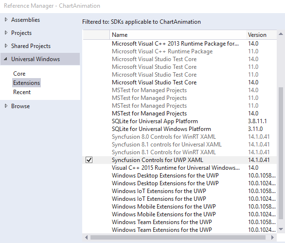
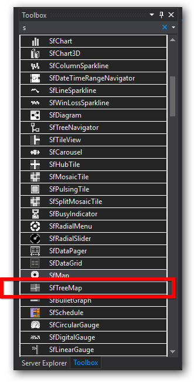

# Getting Started

TreeMap is a growing trend in data visualization. It displays hierarchical information in a series of clustered rectangles, which together represent a whole. The size of each box represents a quantity. TreeMapsalso can use color to represent any number of values, but it is often used to categorize the various boxes within the treemap.

### Creating TreeMap for Windows Store App

TreeMap is available in the following assembly and namespace.

Assembly: Syncfusion.SfTreeMap.UWP

Namespace: Syncfusion.UI.Xaml.TreeMap

### Adding assembly reference

1. Open the Add Reference window from your project.
2. Choose Windows > Extensions > SyncfusionControls for UWP XAML.

### Add SfTreeMap from Toolbox

Drag and drop the SfTreeMap control from the Toolbox to your application.

Now the SyncfusionControls for UWP XAML reference is added to the application references and the xmlns namespace code is generated in MainWindow.xaml as below.



    <Page
        xmlns="http://schemas.microsoft.com/winfx/2006/xaml/presentation"
        xmlns:x="http://schemas.microsoft.com/winfx/2006/xaml"
        xmlns:local="using:TestSample"
        xmlns:d="http://schemas.microsoft.com/expression/blend/2008"
        xmlns:mc="http://schemas.openxmlformats.org/markup-compatibility/2006"
        xmlns:TreeMap="using:Syncfusion.UI.Xaml.TreeMap"
        x:Class="TestSample.MainPage"
        mc:Ignorable="d">

        <Grid Background="{ThemeResource ApplicationPageBackgroundThemeBrush}">

            <TreeMap:SfTreeMap HorizontalAlignment="Left" Height="100" Margin="160,152,0,0" VerticalAlignment="Top" Width="100"/>

        </Grid>
    </Page>


Refer to the following code to add a TreeMap in an application:

### Code Sample:



    <Page x:Class="App.MainPage"

      xmlns="http://schemas.microsoft.com/winfx/2006/xaml/presentation"

      xmlns:x="http://schemas.microsoft.com/winfx/2006/xaml"

      xmlns:local="using:App"

      xmlns:syncfusion="using:Syncfusion.UI.Xaml.TreeMap"

      mc:Ignorable="d">

    <Grid Background="{StaticResource ApplicationPageBackgroundThemeBrush}">

        <syncfusion:SfTreeMap>

        </syncfusion:SfTreeMap>

    </Grid>

    </Page>



