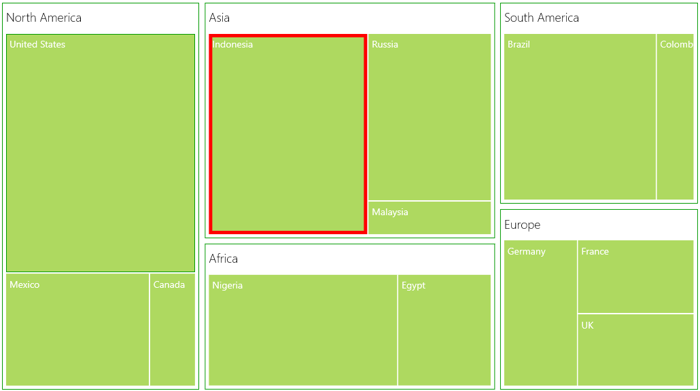

# Selection

While selecting a leaf node, you can highlight it by setting `HighlightOnSelection` property of SfTreeMap to “True”. The border of highlight on selection can be customized by HighlightBorderBrush and HighlightBorderThickness properties of SfTreeMap.

Code Sample:



    <syncfusion:SfTreeMap ItemsSource="{Binding PopulationDetails}"

                        WeightValuePath="Population" ColorValuePath="Growth"

                        HighlightOnSelection="True" 

                        HighlightBorderBrush="red" 

                        HighlightBorderThickness="5">

                <syncfusion:SfTreeMap.LeafItemSettings>
                    <syncfusion:LeafItemSettings>
                        <syncfusion:LeafItemSettings.LabelTemplate>
                            <DataTemplate>
                                <TextBlock Text="{Binding Data.Country}" Foreground="White" FontSize="14" FontWeight="Normal" HorizontalAlignment="Left" VerticalAlignment="Top" Margin="5,5,0,0"/>
                            </DataTemplate>

                        </syncfusion:LeafItemSettings.LabelTemplate>
                    </syncfusion:LeafItemSettings>
                </syncfusion:SfTreeMap.LeafItemSettings>

                <syncfusion:SfTreeMap.Levels>
                    <syncfusion:TreeMapFlatLevel GroupPath="Continent" GroupPadding="5" GroupBackground="Transparent" GroupBorderBrush="#009900" GroupBorderThickness="1" GroupGap="8" HeaderHeight="40">
                        <syncfusion:TreeMapFlatLevel.HeaderTemplate>
                            <DataTemplate>
                            
                                    <TextBlock Text="{Binding Header}" Margin="5,0,0,0" Foreground="black" FontSize="18" FontWeight="Light" HorizontalAlignment="Left" VerticalAlignment="Center"/>
                            
                            </DataTemplate>
                        </syncfusion:TreeMapFlatLevel.HeaderTemplate>
                    </syncfusion:TreeMapFlatLevel>

                </syncfusion:SfTreeMap.Levels>

            </syncfusion:SfTreeMap>



