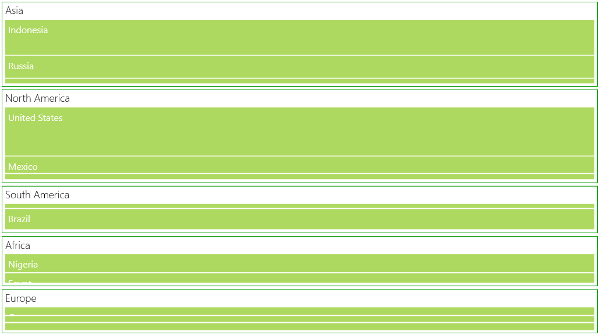

# TreeMap Layout

The ItemsLayoutMode for SfTreeMap specifies the layout mode of the tree map items. This layout is applied for all the tree map levels. There are four different TreeMap layouts such as,

## Squarified Layout

In this layout the data is visualized in the form of square-like rectangles with best aspect ratio.

The following code illustrates how to set a squarified in Treemap.

Code Sample:



    <Grid Background="{StaticResource ApplicationPageBackgroundThemeBrush}">

        <Grid.DataContext>

            <local:PopulationViewModel/>

        </Grid.DataContext>

        <syncfusion:SfTreeMap ItemsSource="{Binding PopulationDetails}"

                              ItemsLayoutMode="Squarified"

                              WeightValuePath="Population"                              

                              ColorValuePath="Growth">

            <syncfusion:SfTreeMap.Levels>

                <syncfusion:TreeMapFlatLevel GroupPath="Continent" 

                                             GroupGap="10"/>

                <syncfusion:TreeMapFlatLevel GroupPath="Country" 

                                             GroupGap="5"

                                             ShowLabels="True"/>

            </syncfusion:SfTreeMap.Levels>

        </syncfusion:SfTreeMap>

    </Grid>  



The following screen shot illustrates a squarified layout.

squarified layout
{:.caption}

## SliceAndDiceAuto Layout:

In this layout the data is visualized in the form of long-thin rectangles with high aspect ratio, which can be displayed either vertically or horizontally.

The following code illustrates how to set a slice and dice layout in Treemap.

Code Sample:



    <Grid Background="{StaticResource ApplicationPageBackgroundThemeBrush}">

        <Grid.DataContext>

            <local:PopulationViewModel/>

        </Grid.DataContext>

        <syncfusion:SfTreeMap ItemsSource="{Binding PopulationDetails}"

                              ItemsLayoutMode=" SliceAndDiceAuto"

                              WeightValuePath="Population"                              

                              ColorValuePath="Growth">

            <syncfusion:SfTreeMap.Levels>

                <syncfusion:TreeMapFlatLevel GroupPath="Continent" 

                                             GroupGap="10"/>

                <syncfusion:TreeMapFlatLevel GroupPath="Country" 

                                             GroupGap="5"

                                             ShowLabels="True"/>

            </syncfusion:SfTreeMap.Levels>

        </syncfusion:SfTreeMap>

    </Grid> 


	
The following screen shot illustrates a slice-and-dice layout.

slice-and-dice layout
{:.caption}

## SliceAndDiceHorizontal Layout:

The following code illustrates how to set a slice and dice layout horizontally in Treemap.

Code Sample:



    <Grid Background="{StaticResource ApplicationPageBackgroundThemeBrush}">

        <Grid.DataContext>

            <local:PopulationViewModel/>

        </Grid.DataContext>

        <syncfusion:SfTreeMap ItemsSource="{Binding PopulationDetails}"

                              ItemsLayoutMode=" SliceAndDiceHorizontal"

                              WeightValuePath="Population"                              

                              ColorValuePath="Growth">

            <syncfusion:SfTreeMap.Levels>

                <syncfusion:TreeMapFlatLevel GroupPath="Continent" 

                                             GroupGap="10"/>

                <syncfusion:TreeMapFlatLevel GroupPath="Country" 

                                             GroupGap="5"

                                             ShowLabels="True"/>

            </syncfusion:SfTreeMap.Levels>

        </syncfusion:SfTreeMap>

    </Grid>    



The following screen shot shows a Slice-and-dice treemap in horizontal layout.

Slice-and-dice treemap in horizontal layout
{:.caption}

## SliceAndDiceVertical Layout:

The following code illustrates how to set a slice and dice layout vertically in Treemap.

Code Sample:



    <Grid Background="{StaticResource ApplicationPageBackgroundThemeBrush}">

        <Grid.DataContext>

            <local:PopulationViewModel/>

        </Grid.DataContext>

        <syncfusion:SfTreeMap ItemsSource="{Binding PopulationDetails}"

                              ItemsLayoutMode=" SliceAndDiceVertical"

                              WeightValuePath="Population"                              

                              ColorValuePath="Growth">

            <syncfusion:SfTreeMap.Levels>

                <syncfusion:TreeMapFlatLevel GroupPath="Continent" 

                                             GroupGap="10"/>

                <syncfusion:TreeMapFlatLevel GroupPath="Country" 

                                             GroupGap="5"

                                             ShowLabels="True"/>

            </syncfusion:SfTreeMap.Levels>

        </syncfusion:SfTreeMap>

    </Grid>  



The following screen shot shows a Slice-and-dice treemap in vertical layout.

Slice-and-dice treemap in vertical layout
{:.caption}