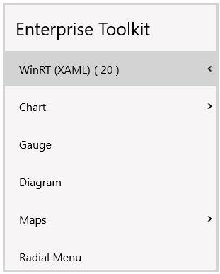
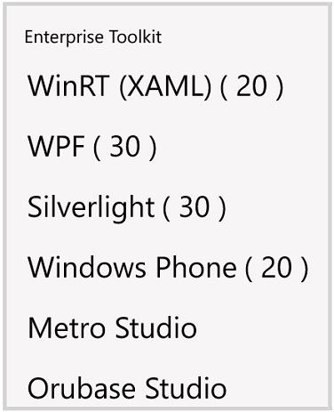
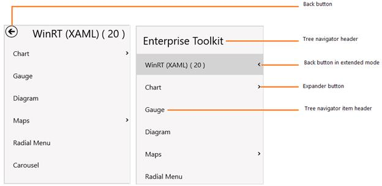

# Overview

`SfTreeNavigator` control gives a unique layout to arrange items in hierarchical tree structure without occupying much space. It displays the expanded item in a navigator.

## Features

* Items Source - Any business object collection can be bound to the control. 
* Hierarchical Data Template - Business objects displayed in the hierarchy can be customized with a single template.
* Navigation Mode support.

## Visual Structure

1.WinRT

2.Windows phone

