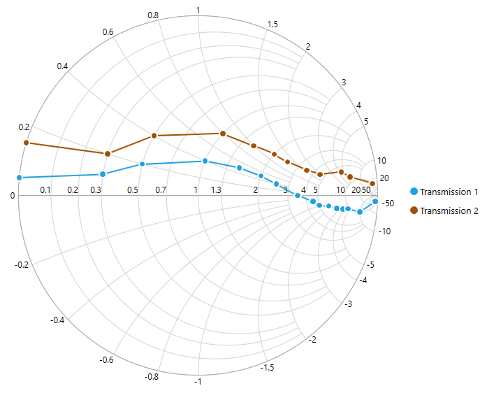

# UWP Smith Chart (SfSmithChart) Overview

Smith chart is one of the most useful data visualization tools for high frequency circuit applications. It contains two sets of circles to plot the parameters of transmission lines.

SfSmithChart provides a perfect way to visualize data with high level of user interactivity that focuses on development, productivity, and simplicity of use. 

    

## Key features

* Visualization of the impedance and admittance of a transmission line.
* Representation of data with line series and various types of markers.
* Data label support for better readability.
* Interactive tooltip support.
* Interactive legend.
* Customizable colors.
* Allows to map the data from the specified path by achieving [data binding]() concept. 

