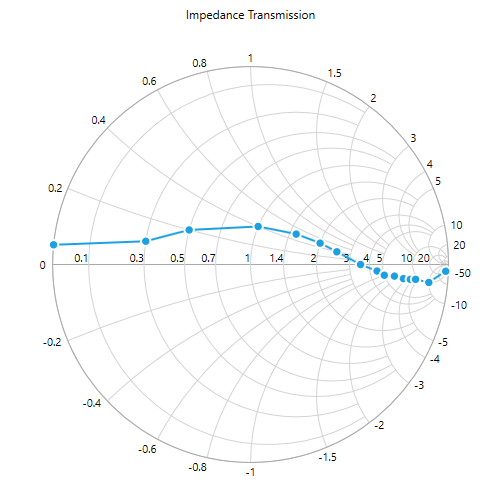
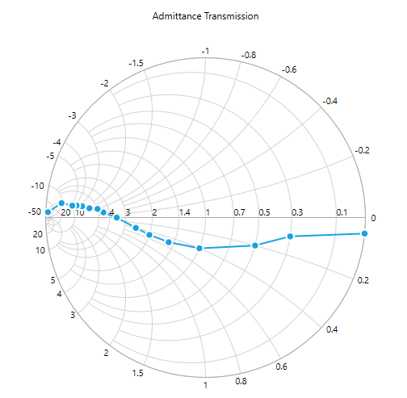

# Rendering Type in UWP Smith Chart (SfSmithChart)

SfSmithChart plots the transmission line in two different ways by using the [`RenderingType`](https://help.syncfusion.com/cr/uwp/Syncfusion.UI.Xaml.SmithChart.SfSmithChart.html#Syncfusion_UI_Xaml_SmithChart_SfSmithChart_RenderingType) property. The two ways are given below.

## Impedance

In the impedance Smith chart, normalized resistance circles and normalized reactance curves are drawn from right to left. Axis label ranges start from left to right.

Impedance is the default rendering type of SmithChart.





<syncfusion:SfSmithChart RenderingType="Impedance" />



 

SfSmithChart chart = new SfSmithChart();
chart.RenderingType = RenderingType.Impedance;


    


## Admittance

In the Admittance Smith chart, normalized resistance circles and normalized reactance curves are drawn from left to right. Axis label ranges start from right to left.





<syncfusion:SfSmithChart RenderingType="Admittance" />



 

SfSmithChart chart = new SfSmithChart();
chart.RenderingType = RenderingType.Admittance;


    


