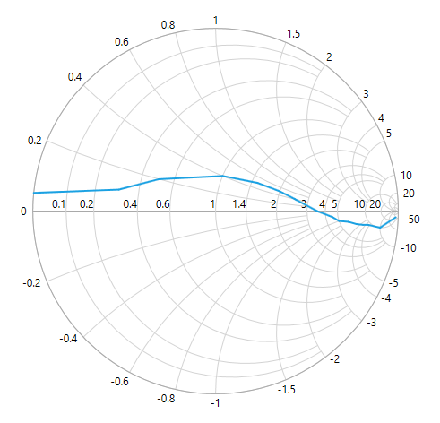
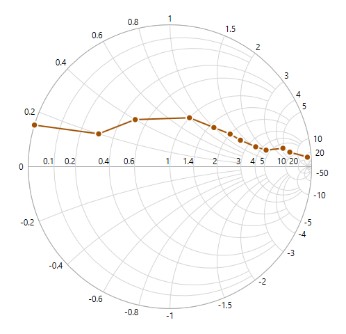

# Series in UWP Smith Chart (SfSmithChart)

Chart series is the visual representation of the given data.

The following APIs are used in line series:

* ResistancePath – A string property that represents the X values for the series.
* ReactancePath – A string property that represents the Y values for the series.
* Interior – Represents the brush for the series color.
* StrokeThickness – Represents the thickness of the series outline.
* Palette –  Represents the set of pre-defined or custom colors for the series.

The below code example explains how to create a simple `LineSeries` by using given data





<syncfusion:SfSmithChart x:Name="SmithChart">
     <syncfusion:LineSeries ResistancePath="Resistance" ReactancePath="Reactance" 
                                                      ItemsSource="{Binding Data}">
     </syncfusion:LineSeries>
 </syncfusion:SfSmithChart>



 

  //Create SfSmithChart instance
  SfSmithChart chart = new SfSmithChart();
  //Create line series
  LineSeries series = new LineSeries();
  series.ItemsSource = Data;
  series.ResistancePath = "Resistance";
  series.ReactancePath = "Reactance";
  series.Label = "TransmissionLine";
  //Adding series to SmithChart
  chart.Series.Add(series);
  this.Grid1.Children.Add(chart);


    


**Customizing LineSeries**

The line stroke and thickness can be customized by using *Interior* and *StrokeThickness* property of line series.





<syncfusion:SfSmithChart x:Name="SmithChart">
     <syncfusion:LineSeries Interior="Orange" StrokeThickness="3">
     </syncfusion:LineSeries>
 </syncfusion:SfSmithChart>



 

LineSeries series = new LineSeries();
//Customizing line color and thickness
series.StrokeThickness = 3;
series.Interior = new SolidColorBrush(Colors.Orange);
chart.Series.Add(series);


    


## Animation

SfSmithChart allows to animate the chart series on loading whenever the *ItemsSource* changes. Animation in the chart can be enabled by setting the *EnableAnimation* property as True and defining the corresponding animation speed with *AnimationDuration* property.





<syncfusion:SfSmithChart x:Name="SmithChart">
     <syncfusion:LineSeries EnableAnimation="True" AnimationDuration="0:0:3">
     </syncfusion:LineSeries>
 </syncfusion:SfSmithChart>



 

LineSeries series = new LineSeries();
series.EnableAnimation = true;
series.AnimationDuration = TimeSpan.FromSeconds(2);
chart.Series.Add(series);


    


## Series Visibility

To hide the series segment programmatically, set *IsSeriesVisible* property as False for the specific series.





<syncfusion:SfSmithChart x:Name="SmithChart">
   <syncfusion:LineSeries IsSeriesVisible="False" Label="Transmission-1" ShowMarker="True" ResistancePath="Resistance" ReactancePath="Reactance" ItemsSource="{Binding Data1}">                
   </syncfusion:LineSeries>
   <syncfusion:LineSeries Label="Transmission-2" ShowMarker="True" ResistancePath="Resistance" ReactancePath="Reactance" ItemsSource="{Binding Data2}">
   </syncfusion:LineSeries>
</syncfusion:SfSmithChart>



 

//Create line series1
LineSeries series1 = new LineSeries();
series1.Label = "Transmission-1";
//Hide the series visibility in Chart.
series1.IsSeriesVisible = false;
chart.Series.Add(series1);

//Create line series2
LineSeries series2 = new LineSeries();
series2.Label = "Transmission-2";
chart.Series.Add(series2);


    


