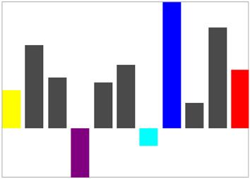

# Customize segment brush in UWP Sparkline (SfSparkline)

We can able to customize the first, last, negative, high and low point brushes of column sparkline as like markers in area and line sparkline.

* [`FirstPointBrush`](https://help.syncfusion.com/cr/uwp/Syncfusion.UI.Xaml.Charts.SegmentTemplateSelector.html#Syncfusion_UI_Xaml_Charts_SegmentTemplateSelector_FirstPointBrush) – Gets or sets the brush to paint the first point of the sparkline.
* [`LastPointBrush`](https://help.syncfusion.com/cr/uwp/Syncfusion.UI.Xaml.Charts.SegmentTemplateSelector.html#Syncfusion_UI_Xaml_Charts_SegmentTemplateSelector_LastPointBrush) – Gets or sets the brush to paint the last point of the sparkline.
* [`LowPointBrush`](https://help.syncfusion.com/cr/uwp/Syncfusion.UI.Xaml.Charts.SegmentTemplateSelector.html#Syncfusion_UI_Xaml_Charts_SegmentTemplateSelector_LowPointBrush) – Gets or sets the brush to paint the low point of the sparkline.
* [`HighPointBrush`](https://help.syncfusion.com/cr/uwp/Syncfusion.UI.Xaml.Charts.SegmentTemplateSelector.html#Syncfusion_UI_Xaml_Charts_SegmentTemplateSelector_HighPointBrush) – Gets or sets the brush to paint the high point of the sparkline.
* [`NegativePointBrush`](https://help.syncfusion.com/cr/uwp/Syncfusion.UI.Xaml.Charts.SegmentTemplateSelector.html#Syncfusion_UI_Xaml_Charts_SegmentTemplateSelector_NegativePointBrush) – Gets or sets the brush to paint the negative point of the sparkline.





<Syncfusion:SfColumnSparkline Interior="#4a4a4a" 

BorderBrush="DarkGray" BorderThickness="1"

ItemsSource="{Binding UsersList}" 

YBindingPath="NoOfUsers">

<Syncfusion:SfColumnSparkline.SegmentTemplateSelector>

<Syncfusion:SegmentTemplateSelector FirstPointBrush="Yellow" 

LastPointBrush="Red" NegativePointBrush="Cyan"

LowPointBrush="Purple" HighPointBrush="Blue"/>

</Syncfusion:SfColumnSparkline.SegmentTemplateSelector>

</Syncfusion:SfColumnSparkline >





SfColumnSparkline sparkline = new SfColumnSparkline()
{

    ItemsSource = new SparkViewModel().UsersList,

    YBindingPath = "NoOfUsers"

};

SegmentTemplateSelector selector = new SegmentTemplateSelector()
{

    FirstPointBrush = new SolidColorBrush(Colors.Yellow),

    LastPointBrush = new SolidColorBrush(Colors.Yellow),

    HighPointBrush = new SolidColorBrush(Colors.Red)

};

sparkline.SegmentTemplateSelector = selector;





