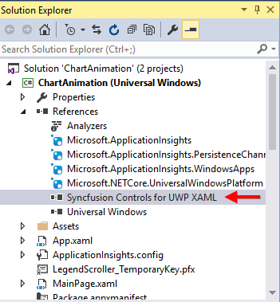

# Getting Started with UWP Sparkline (SfSparkline)

The following section helps you to build your application with SfChart.

## Create a simple sparkline from XAML

### Adding assembly reference

1. Open the Add Reference window from your project.
2. Choose Windows > Extensions > SyncfusionControls for UWP XAML.

Add the following namespace in your XAML window.





xmlns:syncfusion="using:Syncfusion.UI.Xaml.Charts"





using Syncfusion.UI.Xaml.Charts;




 
### Add Sparkline from Toolbox

Drag and drop the Sparkline controls from the Toolbox to your application.

Now the Syncfusion.SfChart.UWP reference is added to the application references and the xmlns namespace code is generated in MainWindow.xaml as below.

### Initialize the Sparkline

You need to initialize the sparkline represented by the following class of Syncfusion.UI.Xaml.Charts.SfChart,





<chart:SfLineSparkline >  

</chart:SfLineSparkline>





SfLineSparkline sparkline = new SfLineSparkline()




 
### Create a data source

Since the above step will produce only an empty sparkline, we need to add some data to the sparkline for plotting. In this step, let’s create a sample data source.
 


public class UserProfile

 {

   public DateTime TimeStamp { get; set; }

   public double NoOfUsers { get; set; }

 } 

public class UsersViewModel

 {

 public UsersViewModel()

  {

   this.UsersList = new ObservableCollection<UserProfile>();

   DateTime date = DateTime.Today;

   UsersList.Add(new UserProfile { TimeStamp = date.AddHours(0.5), NoOfUsers = 3000 });

   UsersList.Add(new UserProfile { TimeStamp = date.AddHours(0.5), NoOfUsers = 5000 });

   UsersList.Add(new UserProfile { TimeStamp = date.AddHours(0.5), NoOfUsers = -3000 });

   UsersList.Add(new UserProfile { TimeStamp = date.AddHours(0.5), NoOfUsers = -4000 });

   UsersList.Add(new UserProfile { TimeStamp = date.AddHours(0.5), NoOfUsers = 2000 });

   UsersList.Add(new UserProfile { TimeStamp = date.AddHours(0.5), NoOfUsers = 3000 });  }

 public ObservableCollection<UserProfile> UsersList

  {

    get; set;

  }

 }



### Applying data to Sparkline
 
We need to add the above UsersViewModel to the DataContext of the sparkline, bind the data source to the ItemsSource property of the SfLineSparkline, and then map the data using YBindingPath .





<Grid>

<Grid.DataContext>

<local:UsersViewModel/>

</Grid.DataContext>  
     
<chart:SfLineSparkline  Interior="#4a4a4a" BorderThickness="1" 
                        ItemsSource="{Binding UsersList}" BorderBrush="DarkGray"
                        YBindingPath="NoOfUsers" >                
</chart:SfLineSparkline> 
       
</Grid>





SfLineSparkline sparkline = new SfLineSparkline()
{

  ItemsSource = new SparkViewModel().UsersList,

  YBindingPath = "NoOfUsers",

  Interior = new SolidColorBrush(Color.FromRgb(0x4a,0x4a,0x4a)),

  BorderThickness = new Thickness(1,1,1,1)

};





## Create a simple sparkline from Code behind(C#/VB)

Some developers prefer code behind as the first approach for development, to create things dynamically. This section helps you create to sparkline from code behind.

### Add Assembly reference

1. Open the Add Reference window from your project.
2. Choose Windows > Extensions > SyncfusionControls for UWP XAML.
3. Add the following namespace in code behind





using Syncfusion.UI.Xaml.Charts;





Imports Syncfusion.UI.Xaml.Charts





### Initializing SparkLine

You need to create the instance for the Sparkline as below.





SfLineSparkline sfLineSparkline = new SfLineSparkline();





Dim sfLineSparkline As New SfLineSparkline()





### Create a data source

Since the above step will produce only an empty sparkline, we need to add some data to the sparkline for plotting. In this step, let’s create a sample data source.
 


public class UserProfile

 {

   public DateTime TimeStamp { get; set; }

   public double NoOfUsers { get; set; }

 } 

public class UsersViewModel

 {

 public UsersViewModel()

  {

   this.UsersList = new ObservableCollection<UserProfile>();

   DateTime date = DateTime.Today;

   UsersList.Add(new UserProfile { TimeStamp = date.AddHours(0.5), NoOfUsers = 3000 });

   UsersList.Add(new UserProfile { TimeStamp = date.AddHours(0.5), NoOfUsers = 5000 });

   UsersList.Add(new UserProfile { TimeStamp = date.AddHours(0.5), NoOfUsers = -3000 });

   UsersList.Add(new UserProfile { TimeStamp = date.AddHours(0.5), NoOfUsers = -4000 });

   UsersList.Add(new UserProfile { TimeStamp = date.AddHours(0.5), NoOfUsers = 2000 });

   UsersList.Add(new UserProfile { TimeStamp = date.AddHours(0.5), NoOfUsers = 3000 });  }

 public ObservableCollection<UserProfile> UsersList

  {

    get; set;

  }

 }



### Applying data to Sparkline 

After you have added the sparkline, you need to add ItemSource and YBindingPath APIs, to populate your data in the chart.

 

UsersViewModel viewModel = new UsersViewModel();
sfLineSparkline.ItemsSource = viewModel.UsersList;
sfLineSparkline.YBindingPath = "NoOfUsers";


 
The following code example gives the complete set of code for creating sparkline in code behind



//creating object for viewModel

UsersViewModel viewModel = new UsersViewModel();

//Assigning the data context for the sparkline.

this.DataContext = viewModel;

//Initializing the sparkline

SfLineSparkline sfLineSparkline = new SfLineSparkline();

//setting itemsource and binding path 

sfLineSparkline.ItemsSource = viewModel.UsersList;

sfLineSparkline.YBindingPath = "NoOfUsers";

//Sparkline can be customized by setting the below properties

Color color = (Color)ColorConverter.ConvertFromString("#4a4a4a");

sfLineSparkline.Interior = new SolidColorBrush(color);

sfLineSparkline.BorderBrush = new SolidColorBrush(Colors.DarkGray);

sfLineSparkline.BorderThickness = new Thickness(1);

//adding sparkline to grid

grid.Children.Add(sfLineSparkline);



