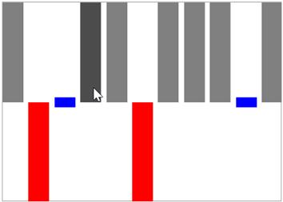

# Highlight segment in UWP Sparkline (SfSparkline)

This feature enable to highlight the column segments on mouse move and this is applicable for column and win-loss sparkline.





<Syncfusion:SfWinLossSparkline Interior="Gray" BorderBrush="DarkGray" 

BorderThickness="1" 

HighlightSegment="True" x:Name="sparkline"  

ItemsSource="{Binding Match}" YBindingPath="Result" >

</Syncfusion:SfWinLossSparkline>





SfWinLossSparkline sparkline = new SfWinLossSparkline()
{

    ItemsSource = new SparkViewModel().Match,

    YBindingPath = "Result",

    HighlightSegment = true,

    Interior = new SolidColorBrush(Colors.Gray),

    BorderBrush = new SolidColorBrush(Colors.DarkGray),

    BorderThickness = new Thickness(1, 1, 1, 1)

};





Following is the snapshot for highlight segment,

