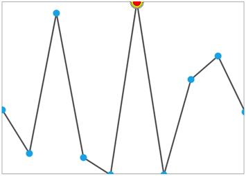

# Customize the marker for specific data point

We can customize the marker for a specific data point with a custom template for LineSparkline and AreaSparkline. In order to customize the marker, we need to inherit the [`MarkerTemplateSelector`](https://help.syncfusion.com/cr/uwp/Syncfusion.UI.Xaml.Charts.MarkerTemplateSelector.html) class and override the SelectTemplate method.



public class CustomMarkersTemplateSelector : MarkerTemplateSelector
{
    protected override DataTemplate SelectTemplate(double x, double y)
    {
        if (y == MaximumY)
        {
            DataTemplate markerTemplate = Application.Current.Resources["markerTemplate"] as DataTemplate;
            return markerTemplate;
        }
        else
            return base.SelectTemplate(x, y);
    }
}





<Syncfusion:SfLineSparkline BorderBrush="DarkGray"

BorderThickness="1" ItemsSource="{Binding UsersList}"

Interior="#4a4a4a" MarkerVisibility="Visible"

YBindingPath="NoOfUsers">

<Syncfusion:SfLineSparkline.MarkerTemplateSelector>

<local:CustomMarkersTemplateSelector MarkerHeight="10" MarkerWidth="10"/>

</Syncfusion:SfLineSparkline.MarkerTemplateSelector>

</Syncfusion:SfLineSparkline>



