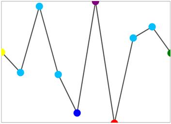
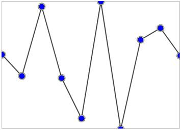

# Marker customization in UWP Sparkline (SfSparkline)

We can customize the markers by initializing the marker template selector class, and we can differentiate the first, last, high, low, negative points.

* [`FirstPointBrush`](https://help.syncfusion.com/cr/uwp/Syncfusion.UI.Xaml.Charts.SegmentTemplateSelector.html#Syncfusion_UI_Xaml_Charts_SegmentTemplateSelector_FirstPointBrush) – Gets or sets the brush to paint the first point of the sparkline.
* [`LastPointBrush`](https://help.syncfusion.com/cr/uwp/Syncfusion.UI.Xaml.Charts.SegmentTemplateSelector.html#Syncfusion_UI_Xaml_Charts_SegmentTemplateSelector_LastPointBrush) – Gets or sets the brush to paint the last point of the sparkline.
* [`LowPointBrush`](https://help.syncfusion.com/cr/uwp/Syncfusion.UI.Xaml.Charts.SegmentTemplateSelector.html#Syncfusion_UI_Xaml_Charts_SegmentTemplateSelector_LowPointBrush) – Gets or sets the brush to paint the low point of the sparkline.
* [`HighPointBrush`](https://help.syncfusion.com/cr/uwp/Syncfusion.UI.Xaml.Charts.SegmentTemplateSelector.html#Syncfusion_UI_Xaml_Charts_SegmentTemplateSelector_HighPointBrush) – Gets or sets the brush to paint the high point of the sparkline.
* [`NegativePointBrush`](https://help.syncfusion.com/cr/uwp/Syncfusion.UI.Xaml.Charts.SegmentTemplateSelector.html#Syncfusion_UI_Xaml_Charts_SegmentTemplateSelector_NegativePointBrush) – Gets or sets the brush to paint the negative point of the sparkline.
* [`MarkerHeight`](https://help.syncfusion.com/cr/uwp/Syncfusion.UI.Xaml.Charts.MarkerTemplateSelector.html#Syncfusion_UI_Xaml_Charts_MarkerTemplateSelector_MarkerHeight) – Gets or sets the height of the marker.
* [`MarkerWidth`](https://help.syncfusion.com/cr/uwp/Syncfusion.UI.Xaml.Charts.MarkerTemplateSelector.html#Syncfusion_UI_Xaml_Charts_MarkerTemplateSelector_MarkerWidth) – Gets or sets the width of the marker.
* [`MarkerBrush`](https://help.syncfusion.com/cr/uwp/Syncfusion.UI.Xaml.Charts.MarkerTemplateSelector.html#Syncfusion_UI_Xaml_Charts_MarkerTemplateSelector_MarkerBrush) – Gets or sets the brush to paint the markers of the sparkline.
* [`MarkerTemplate`](https://help.syncfusion.com/cr/uwp/Syncfusion.UI.Xaml.Charts.MarkerTemplateSelector.html#Syncfusion_UI_Xaml_Charts_MarkerTemplateSelector_MarkerTemplate) – Gets or sets the data template to sparkline marker.





<Syncfusion:SfLineSparkline  Interior="#4a4a4a" 
                                         
                             BorderBrush="DarkGray"
                                    
                             MarkerVisibility="Visible"   
                                         
                             BorderThickness="1" 
                                         
                             ItemsSource="{Binding UsersList}"    
                                         
                             YBindingPath="NoOfUsers">

<Syncfusion:SfLineSparkline.MarkerTemplateSelector>

<Syncfusion:MarkerTemplateSelector  FirstPointBrush="Yellow"

                                    LastPointBrush="Green"

                                    LowPointBrush="Red"

                                    MarkerHeight="15"

                                    MarkerWidth="15"

                                    MarkerBrush="DeepSkyBlue"

                                    NegativePointBrush="Blue"

                                    HighPointBrush="Purple">

</Syncfusion:MarkerTemplateSelector>

</Syncfusion:SfLineSparkline.MarkerTemplateSelector>

</Syncfusion:SfLineSparkline >





SfLineSparkline sparkline = new SfLineSparkline()
{

	ItemsSource = new SparkViewModel().Data,

	YBindingPath = "Day",

	MarkerVisibility = Visibility.Visible,

	Interior = new SolidColorBrush(Colors.Gray),

    BorderBrush = new SolidColorBrush(Colors.DarkGray),

    BorderThickness = new Thickness(1)

};

SegmentTemplateSelector selector = new SegmentTemplateSelector()
{

	FirstPointBrush = new SolidColorBrush(Colors.Yellow),

	LastPointBrush = new SolidColorBrush(Colors.Yellow),

	HighPointBrush = new SolidColorBrush(Colors.Red),

	MarkerHeight = 15,

    MarkerWidth = 15,

    MarkerBrush = new SolidColorBrush(Colors.DeepSkyBlue),

    NegativePointBrush = new SolidColorBrush(Colors.Blue),

    HighPointBrush = new SolidColorBrush(Colors.Purple),

};

sparkline.MarkerTemplateSelector = selector;





**Marker Template**

You can customize default appearance of the marker symbol by using the MarkerTemplate property in the sparkline.





<Grid.Resources>

    <DataTemplate x:Key="markerTemplate">

        <Grid>

            <Ellipse Height="15" Width="15" 
                                             
                     Fill="LightGoldenrodYellow"
                                             
                     Stroke="Black" StrokeDashArray="1,1" 
                                             
                     StrokeThickness="1" />

            <Ellipse Height="12" Width="12" Fill="Blue" Stroke="Black"   
                                             
                     StrokeDashArray="1,1" 
                                             
                     StrokeThickness="1"/>

        </Grid>

    </DataTemplate>
            
</Grid.Resources>

<Syncfusion:SfLineSparkline Interior="#4a4a4a"  

                            BorderBrush="DarkGray"
                                        
                            MarkerVisibility="Visible"   

                            BorderThickness="1"
                                        
                            ItemsSource="{Binding UsersList}"  

                            YBindingPath="NoOfUsers">

        <Syncfusion:SfLineSparkline.MarkerTemplateSelector>

                <Syncfusion:MarkerTemplateSelector MarkerTemplate="{StaticResource markerTemplate}"/>

         </Syncfusion:SfLineSparkline.MarkerTemplateSelector>

</Syncfusion:SfLineSparkline>





SfLineSparkline sparkline = new SfLineSparkline()
{

	ItemsSource = new SparkViewModel().Data,

	YBindingPath = "Day",

	MarkerVisibility = Visibility.Visible,

	Interior =new SolidColorBrush(Colors.Gray),

	BorderBrush = new SolidColorBrush(Colors.DarkGray),

	BorderThickness = new Thickness (1)

};

MarkerTemplateSelector selector = new MarkerTemplateSelector()
{

	MarkerTemplate = grid.Resources["markerTemplate"] as DataTemplate

};

sparkline.MarkerTemplateSelector = selector;





