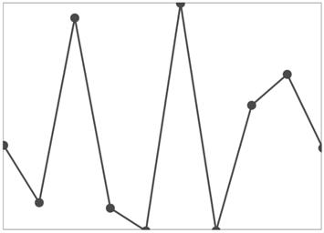

# Markers in UWP Sparkline (SfSparkline)

Markers are used to indicate the value point for line and area series, and we can customize with different template.It is applicable for LineSparkLine and AreaSparkLine

* [`MarkerVisibility`](https://help.syncfusion.com/cr/uwp/Syncfusion.UI.Xaml.Charts.MarkerBase.html#Syncfusion_UI_Xaml_Charts_MarkerBase_MarkerVisibility) – Gets or sets the visibility for marker.






<Syncfusion:SfLineSparkline  Interior="#4a4a4a"   

BorderBrush="DarkGray"  BorderThickness="1"    

MarkerVisibility="Visible" 

ItemsSource="{Binding UsersList}" 

YBindingPath="NoOfUsers">

</Syncfusion:SfLineSparkline >





SfLineSparkline sparkline = new SfLineSparkline()
{

    ItemsSource = new SparkViewModel().UsersList,

    YBindingPath = "NoOfUsers",

    MarkerVisibility = Visibility.Visible,

    Interior = new SolidColorBrush(Colors.Gray),

    BorderBrush = new SolidColorBrush(Colors.DarkGray),

    BorderThickness = new Thickness(1)

};







{{ codesnippet1 | UnOrderList_Indent_Level_1 }} 

