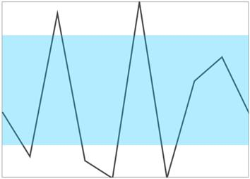

# Range Band in UWP Sparkline (SfSparkline)

Range band feature is used to highlight the particular mentioned range along Y axis.

* [`BandRangeStart`](https://help.syncfusion.com/cr/uwp/Syncfusion.UI.Xaml.Charts.SparklineBase.html#Syncfusion_UI_Xaml_Charts_SparklineBase_BandRangeStart) – Gets or sets the minimum range band value in Y axis.
* [`BandRangeEnd`](https://help.syncfusion.com/cr/uwp/Syncfusion.UI.Xaml.Charts.SparklineBase.html#Syncfusion_UI_Xaml_Charts_SparklineBase_BandRangeEnd) – Gets or sets the maximum range band value in Y axis.
* [`RangeBandBrush`](https://help.syncfusion.com/cr/uwp/Syncfusion.UI.Xaml.Charts.SparklineBase.html#Syncfusion_UI_Xaml_Charts_SparklineBase_RangeBandBrush) – Gets or sets the brush for range band.





<Syncfusion:SfLineSparkline

BorderBrush="DarkGray" BorderThickness="1" 

ItemsSource="{Binding UsersList}" BandRangeStart="3500"   

Interior="#4a4a4a"  BandRangeEnd="8500" 

RangeBandBrush="DeepSkyBlue" Stroke="Red"

YBindingPath="NoOfUsers">

</Syncfusion:SfLineSparkline >





SfLineSparkline sparkline = new SfLineSparkline()
{

	ItemsSource = new SparkViewModel().UsersList,

	YBindingPath = "NoOfUsers",

	BandRangeStart = 2000,

	BandRangeEnd = -1000,

	RangeBandBrush = new SolidColorBrush(Colors.Green)

};





