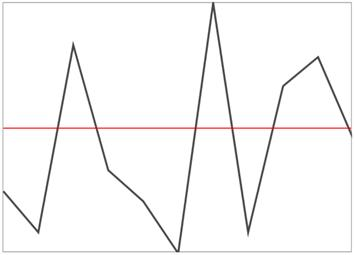

# ShowHide Axis in UWP Sparkline (SfSparkline)

ShowAxis is used to enable the axis and this feature is applicable for all the sparkline except WinLoss sparkline, also you can style the axis by AxisStyle property and position the axis by AxisOrigin property.

* [`ShowAxis`](https://help.syncfusion.com/cr/uwp/Syncfusion.UI.Xaml.Charts.MarkerBase.html#Syncfusion_UI_Xaml_Charts_MarkerBase_ShowAxis) – Gets or sets the bool value whether to show or hide the axis.
* [`AxisOrigin`](https://help.syncfusion.com/cr/uwp/Syncfusion.UI.Xaml.Charts.MarkerBase.html#Syncfusion_UI_Xaml_Charts_MarkerBase_AxisOrigin) - Gets or sets the double for axis origin.
* [`AxisStyle`](https://help.syncfusion.com/cr/uwp/Syncfusion.UI.Xaml.Charts.MarkerBase.html#Syncfusion_UI_Xaml_Charts_MarkerBase_AxisStyle) – Gets or sets the style for axis line.

**Show Axis**





<Syncfusion:SfLineSparkline  Interior="#4a4a4a"  

BorderBrush="DarkGray" BorderThickness="1"

ShowAxis="True" ItemsSource="{Binding UsersList}" 

YBindingPath="NoOfUsers">

</Syncfusion:SfLineSparkline >





SfLineSparkline sparkline = new SfLineSparkline()
{

    ItemsSource = new SparkViewModel().UsersList,

    YBindingPath = "NoOfUsers",

    ShowAxis = true,

    Interior = new SolidColorBrush(Color.FromRgb(0x4a, 0x4a, 0x4a)),

    BorderBrush = new SolidColorBrush(Colors.DarkGray),

    BorderThickness = new Thickness(1)

};





**Axis Origin**





<Syncfusion:SfLineSparkline Height="250" Width="350" Interior="#4a4a4a"  

BorderBrush="DarkGray" BorderThickness="1"

ShowAxis="True" 

AxisOrigin="2" ItemsSource="{Binding UsersList}" 

YBindingPath="NoOfUsers">

</Syncfusion:SfLineSparkline >





SfLineSparkline sparkline = new SfLineSparkline()
{

    ItemsSource = new SparkViewModel().UsersList,

    YBindingPath = "NoOfUsers",

    ShowAxis = true,

    AxisOrigin = 2,

    Interior = new SolidColorBrush(Color.FromRgb(0x4a, 0x4a, 0x4a)),

    BorderBrush = new SolidColorBrush(Colors.DarkGray),

    BorderThickness = new Thickness(1)

};





**Axis LineStyle**





<Grid.Resources>

    

</Grid.Resources>

<Syncfusion:SfLineSparkline Height="250" Width="350" Interior="#4a4a4a"   

BorderBrush="DarkGray"  BorderThickness="1"

ShowAxis="True" AxisStyle="{StaticResource lineStyle2}"   

AxisOrigin="1" ItemsSource="{Binding UsersList}"   

YBindingPath="NoOfUsers">

</Syncfusion:SfLineSparkline >





SfLineSparkline sparkline = new SfLineSparkline()
{

    ItemsSource = new SparkViewModel().UsersList,

    YBindingPath = "NoOfUsers",

    ShowAxis = true,

    AxisOrigin = 1,

    AxisStyle = grid.Resources["lineStyle2"] as Style,

    Interior = new SolidColorBrush(Color.FromRgb(0x4a, 0x4a, 0x4a)),

    BorderBrush = new SolidColorBrush(Colors.DarkGray),

    BorderThickness = new Thickness(1)

};





