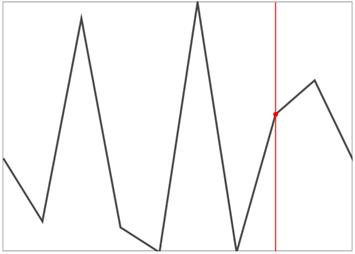
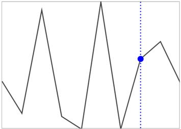

# Track ball in UWP Sparkline (SfSparkline)

This is used to indicate the value point on mouse move and this feature is applicable for line and area sparkline.

* [`ShowTrackBall`](https://help.syncfusion.com/cr/uwp/Syncfusion.UI.Xaml.Charts.MarkerBase.html#Syncfusion_UI_Xaml_Charts_MarkerBase_ShowTrackBall) – Gets or sets the bool value whether showing track ball.
* [`TrackBallStyle`](https://help.syncfusion.com/cr/uwp/Syncfusion.UI.Xaml.Charts.MarkerBase.html#Syncfusion_UI_Xaml_Charts_MarkerBase_TrackBallStyle) – Gets or sets the style for track ball.
* [`LineStyle`](https://help.syncfusion.com/cr/uwp/Syncfusion.UI.Xaml.Charts.MarkerBase.html#Syncfusion_UI_Xaml_Charts_MarkerBase_LineStyle) – Gets or sets the style for trackball line.

**Show TrackBall**



<Syncfusion:SfLineSparkline  Interior="#4a4a4a"   

BorderBrush="DarkGray" BorderThickness="1"

ItemsSource="{Binding UsersList}" ShowTrackBall="True" 

YBindingPath="NoOfUsers">

</Syncfusion:SfLineSparkline >



**Customizing TrackBall**





<Grid.Resources>

    

    

</Grid.Resources>

<Syncfusion:SfLineSparkline Height="250" Width="350" Interior="#4a4a4a"   

BorderBrush="DarkGray" BorderThickness="1"

ItemsSource="{Binding UsersList}" ShowTrackBall="True" 

TrackBallStyle="{StaticResource lineStyle1}" 

LineStyle="{StaticResource lineStyle2}"

YBindingPath="NoOfUsers">

</Syncfusion:SfLineSparkline >





SfLineSparkline sparkline = new SfLineSparkline()
{

    ItemsSource = new SparkViewModel().Data,

    YBindingPath = "Day",

    ShowTrackBall = true,

    Interior = new SolidColorBrush(Colors.Gray),

    BorderBrush = new SolidColorBrush(Colors.DarkGray),

    BorderThickness = new Thickness(1, 1, 1, 1),

    LineStyle = this.Resources["lineStyle1"] as Style,

    TrackBallStyle = this.Resources["lineStyle2"] as Style

};





