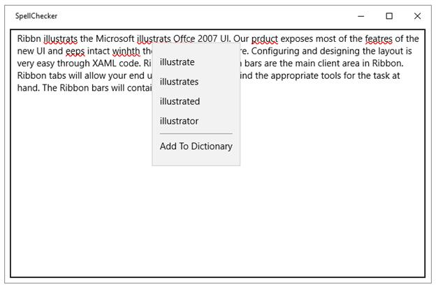

---
layout: post
title: Context Menu Suggestion in UWP Spell Checker control | Syncfusion®
description: Learn here all about Context Menu Suggestion support in Syncfusion® UWP Spell Checker (SfSpellChecker) control and more.
platform: UWP
control: SfSpellChecker
documentation: ug
--- 

# Context Menu Suggestion in UWP Spell Checker (SfSpellChecker)

`SfSpellChecker` offers Microsoft Office application like context menu suggestions and helps to correct spell errors by choosing correct option from the listed suggestions.

The following steps helps to add context menu suggestion in the TextBox control.

1) Create a UWP project in Visual Studio.

2) Create a class which inherits `IEditorProperties` interface of `SfSpellChecker` and Initialize all the methods and properties.





public class TextSpellEditor:IEditorProperties

{

TextBox textbox;

public TextSpellEditor(Control control)

{

ControlToCheck = control;

}

public Control ControlToCheck

{

get

{

return textbox;

}

set

{

textbox = value as TextBox;

}

}

public string SelectedText

{

get

{

return textbox.SelectedText;

}

set

{

textbox.SelectedText = value;

}

}

public string Text

{

get

{

return textbox.Text;

}

set

{

textbox.Text = value;

}

}

public void Select(int selectionStart, int selectionLength)

{

textbox.Select(selectionStart, selectionLength);

}

public bool HasMoreTextToCheck()

{

return false;

}

public void Focus()

{

textbox.Focus(Windows.UI.Xaml.FocusState.Pointer);

}

public void UpdateTextField()

{

throw new NotImplementedException();

}

}

}





3) Initiate `PerformSpellCheckUsingContextMenu` method by passing `IEditorProperties` interface argument.





TextSpellEditor TextEditor = new TextSpellEditor(Textboxx);

SpellEditor = TextEditor;  

SpellChecker.PerformSpellCheckUsingContextMenu(SpellEditor);





