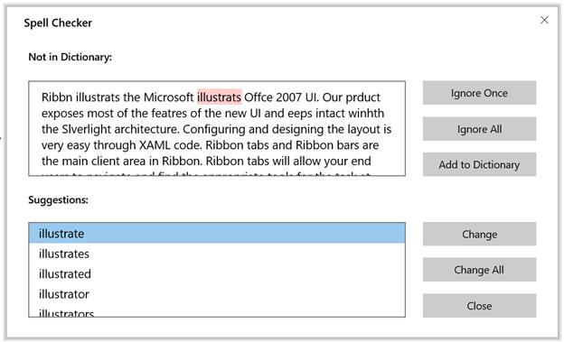

---
layout: post
title: Getting Started with UWP Spell Checker control | Syncfusion
description: Learn here about getting started with Syncfusion UWP Spell Checker (SfSpellChecker) control, its elements and more.
platform: UWP
control: SfSpellChecker
documentation: ug
--- 

# Getting Started with UWP Spell Checker (SfSpellChecker)

Spell checking operation can be done on Text editor controls through `SfSpellChecker` in UWP application by implementing `IEditorProperties` interface.

The following steps helps to add `SfSpellChecker`.

1 . Create a UWP project in Visual Studio and include `Syncfusion.SfSpellChecker.UWP` assembly.

2 . Create an instance of `SfSpellChecker` using “Syncfusion.UI.Xaml.Controls” namespace.





Syncfusion.UI.Xaml.Controls.SfSpellChecker spellChecker = new Syncfusion.UI.Xaml.Controls.SfSpellChecker();





3 . Create instance of Button and TextBox to input control for SpellCheck.





<Grid  Background="{ThemeResource ApplicationPageBackgroundThemeBrush}">

<TextBox x:Name="Textbox" TextWrapping="Wrap" VerticalContentAlignment="Top"
         Text="Ribbn illustrats the Microsoft illustrats Offce 2007 UI.
         Our prduct exposes most of the featres of the new UI and eeps intact
         winhth the Slverlight architecture. Configuring and designing
         the layout is very easy through XAML code.
         Ribbon tabs and Ribbon bars are the main client area in Ribbon.
         Ribbon tabs will allow your end users to navigate and find the
         appropriate tools for the task at hand. The Ribbon bars will
         contain the Ribbon tools." VerticalAlignment="Stretch" />
         
<Button HorizontalAlignment="Left"  Content="Spell Check" Click="Button_Click" >

</Button>

</Grid>





4 . Inherit `IEditorProperties` interface of `SfSpellChecker` and Initialize all the methods and properties in interface.





public class TextSpellEditor:IEditorProperties

{

TextBox textbox;

public TextSpellEditor(Control control)

{

ControlToSpellCheck = control;

}

public Control ControlToSpellCheck

{

get

{

return textbox;

}

set

{

textbox = value as TextBox;

}

}

public string SelectedText

{

get

{

return textbox.SelectedText;

}

set

{

textbox.SelectedText = value;

}

}

public string Text

{

get

{

return textbox.Text;

}

set

{

textbox.Text = value;

}

}

public void Select(int selectionStart, int selectionLength)

{

textbox.Select(selectionStart, selectionLength);

}

public bool HasMoreTextToCheck()

{

return false;

}

public void Focus()

{

textbox.Focus();

}

public void UpdateTextField()

{

throw new NotImplementedException();

}

}





5 . In Click event of button call SpellCheck method to TextBox.





private void Button_Click(object sender, RoutedEventArgs e)

{

SpellChecker.PerformSpellCheckUsingDialog(Editor);

}





6 . Selected word in suggestion list can be replaced click Replace button in the spell check dialog.

