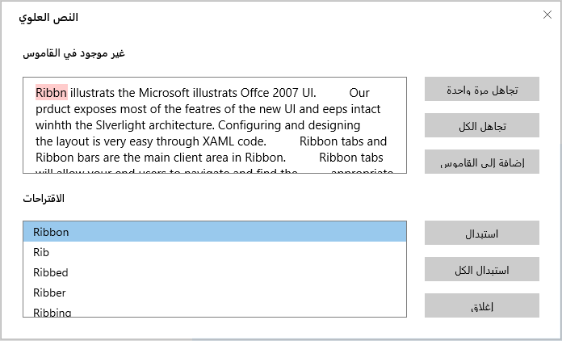

# Localization in UWP Spell Checker (SfSpellChecker)

Localization is the process of translating the application resources into different language for the specific cultures. You can localize the SfSpellChecker by adding resource file. Application culture can be changed by setting [ApplicationLanguages.PrimaryLanguageOverride](https://msdn.microsoft.com/de-de/library/windows/apps/windows.globalization.applicationlanguages.primarylanguageoverride.aspx) before `InitializeComponent()` method.
 
Below application culture changed to Arabic.





public MainPage()

{

    Windows.Globalization.ApplicationLanguages.PrimaryLanguageOverride = "ar-SA";

    this.InitializeComponent();
} 





To localize the SfSpellChecker based on [ApplicationLanguages.PrimaryLanguageOverride](https://msdn.microsoft.com/de-de/library/windows/apps/windows.globalization.applicationlanguages.primarylanguageoverride.aspx) using .resw files, follow the below steps.
 
1. Create a folder named **Resource** in the application.

2. Create a folder named **culture name** in the application. The culture name that indicates the name of language and country.

3. Right Click on project and select the “Add New Item” Dialog using Ctrl+Shift+A keys.

Create a resource .Resw file and name it as assembly name.Resources.resw (**Syncfusion.SfSpellChecker.UWP.Resources.resw**)
 

For example, you have to give name as **Syncfusion.SfSpellChecker.UWP.Resources.resw** for Arabic culture.

4. Add the Name/Value pair in Resource Designer of **Syncfusion.SfSpellChecker.UWP.Resources.resw** file and change its corresponding value to corresponding culture.
 

You can get the SfSpellChecker’s key from default resource  [Syncfusion.SfSpellChecker.UWP.Resources.resw]
(https://www.syncfusion.com/downloads/support/directtrac/general/ze/Syncfusion.SfSpellChecker.UWP.Resources-1005709407.zip).

