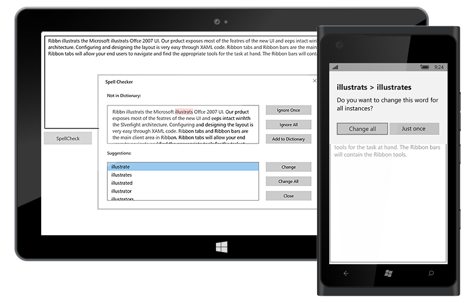

# UWP Spell Checker (SfSpellChecker) Overview

`SfSpellChecker` control provides a simple and intuitive interface to check for spelling errors in text editor controls. We can perform spell checking on text editor control and it will also provide suggestions for the misspelled words through dialog and context menu.

## Use Case Scenarios

You can use Spell Checker to correct spelling mistakes for any input text.

## Appearance of SpellChecker Dialog

`SfSpellChecker` contains built-in dialog for checking spelling error.

* The Input Text is the text given as input to the Spell Checker to check the spelling. The word which is spell-checked will be highlighted in red color.
* The Suggestions List is the list box which will show the suggestions for the currently spell-checked word.

## Features

* Supports Context Menu suggestion.
* Supports Custom Dictionary to provide suggestions.
* Provide built-in options to Ignore, Ignore All, Replace, Replace All for error words in spell checker dialog.
* Support to Ignore Email, URL, Numbers, Mixed and Upper case words from spell check.

