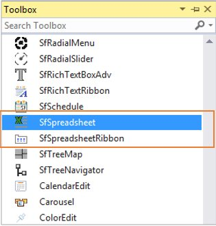
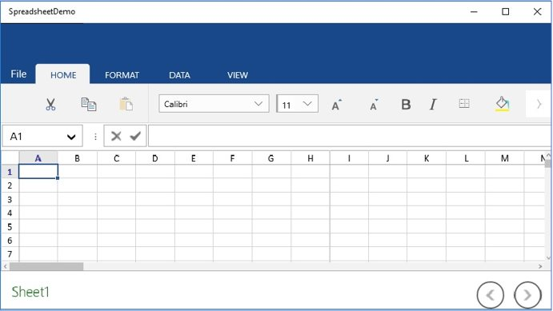
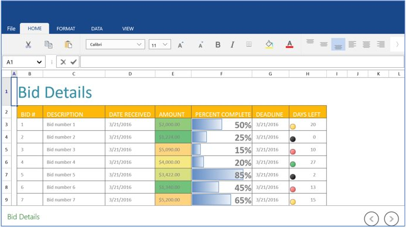

# Getting Started with UWP Spreadsheet (SfSpreadsheet)

This section helps you to get started with the SfSpreadsheet

## Assemblies Deployment

Below table describes, list of assemblies required to be added in project when the SfSpreadsheet control is used in your application.

<table>
<tr>
<th>
Assembly</th><th>
Description</th></tr>
<tr>
<td>
Syncfusion.SfCellGrid.UWP.dll</td><td>
Contains the base and fundamental classes which holds the underlying architecture for displaying cells with virtualized behavior and selection/interaction of cells.</td></tr>
<tr>
<td>
Syncfusion.SfGridCommon.UWP.dll</td><td>
Covers the classes which holds the properties of scroll viewer and disposable elements</td></tr>
<tr>
<td>
Syncfusion.SfSpreadsheet.UWP.dll</td><td>
Contains the classes that handles all the UI Operations of SfSpreadsheet such as importing of sheets, applying formulas/styles etc.</td></tr>
<tr>
<td>
Syncfusion.SfShared.UWP.dll</td><td>
Contains the classes which holds the properties and operations of the controls like SfUpDown, SfNavigator, Looping control etc</td></tr>
<tr>
<td>
Syncfusion.SfInput.UWP.dll</td><td>
Contains the classes which holds the controls like SfDropDownButton, SfTextBoxExt,SfMaskedEdit etc.</td></tr>
<tr>
<td>
Syncfusion.SfRibbon.UWP.dll</td><td>
Covers the classes which holds the Ribbon controls such as SfRibbon, SfRibbonMenu, SfRibbonGalleryItem etc.</td></tr>
<tr>
<td>
Syncfusion.SfTabControl.UWP.dll</td><td>
Covers the classes which holds the controls like SfTabControl, SfTabItem etc</td></tr>
<tr>
<td>
Syncfusion.XlsIO.UWP.dll</td><td>
Contains the base classes which is responsible for read and write in Excel files, Worksheet Manipulations, Formula calculations etc.</td></tr>
</table>
Below are the assemblies list that can be added when you want to enable certain features in SfSpreadsheet control. 

<table>
<tr>
<th>
Optional Assemblies</th><th>
Description</th></tr>
<tr>
<td>
Syncfusion.SfSpreadsheetHelper.UWP.dll</td><td>
Contains the classes which is responsible for importing charts and sparklines into SfSpreadsheet</td></tr>
<tr>
<td>
Syncfusion.ExcelChartToImageConverter.UWP.dll</td><td>
Contains the classes which is responsible for converting charts as image</td></tr>
<tr>
<td>
Syncfusion.SfChart.UWP.dll</td><td>
Contains the classes which is responsible for importing charts like Line charts, Pie charts, Sparklines etc.</td></tr>
</table>

## Create a Simple Application with SfSpreadsheet

SfSpreadsheet control can be added into the application either via designer or via coding. 

### Adding a Control via Designer

1.Create new UWP application in Visual Studio.

2.Open the Visual Studio **Tool** **box**. Navigate to “Syncfusion® Controls” tab, and find the  SfSpreadsheet/SfSpreadsheetRibbon toolbox items

3.Drag `SfSpreadsheet` and drop in to the Designer area from the Toolbox

_For_ _Spreadsheet:_




    <syncfusion:SfSpreadsheet  x:Name="spreadsheet"  />




4.Ribbon can be added to the application by dragging and dropping `SfSpreadsheetRibbon` to the Designer area.

5.To make an interaction between Ribbon items and SfSpreadsheet, need to bind the `SfSpreadsheet` as DataContext to the `SfSpreadsheetRibbon`.

_For_ _Ribbon:_




    <syncfusion:SfSpreadsheetRibbon DataContext="{Binding ElementName=spreadsheet}"  />




### Adding Control Via Coding

Spreadsheet is available in the following namespace “_Syncfusion_._UI_._Xaml_._Spreadsheet_” and it can be created programmatically either by using XAML or C# code.





<Page
    x:Class="SfSpreadsheetDemo.MainPage"

    xmlns="http://schemas.microsoft.com/winfx/2006/xaml/presentation"
    xmlns:x="http://schemas.microsoft.com/winfx/2006/xaml"
    xmlns:local="using:SfSpreadsheetDemo"
    xmlns:d="http://schemas.microsoft.com/expression/blend/2008"
    xmlns:mc="http://schemas.openxmlformats.org/markup-compatibility/2006"
    xmlns:tools="using:Syncfusion.UI.Xaml.Controls.Navigation"
    xmlns:syncfusion="using:Syncfusion.UI.Xaml.Spreadsheet"
    mc:Ignorable="d">

    <syncfusion:SfSpreadsheet x:Name="spreadsheet" FormulaBarVisibility="Visible" />
</Page>





SfSpreadsheet spreadsheet = new SfSpreadsheet();
this.grid.Children.Add(spreadsheet);





_You_ _can_ _get_ _the_ _following_ _output_ _when_ _execute_ _the_ _application._

N> To load the SfSpreadsheet in Windows Mobile, add the below code in MainPage.xaml file in DeviceFamily-Mobile folder.




<Page
    x:Class="SfSpreadsheetDemo.MainPage"
    xmlns="http://schemas.microsoft.com/winfx/2006/xaml/presentation"
    xmlns:x="http://schemas.microsoft.com/winfx/2006/xaml"
    xmlns:local="using:SfSpreadsheetDemo"
    xmlns:d="http://schemas.microsoft.com/expression/blend/2008"
    xmlns:mc="http://schemas.openxmlformats.org/markup-compatibility/2006"
    xmlns:tools="using:Syncfusion.UI.Xaml.Controls.Navigation"
    xmlns:syncfusion="using:Syncfusion.UI.Xaml.Spreadsheet"

    mc:Ignorable="d">

    <Grid Background="{ThemeResource ApplicationPageBackgroundThemeBrush}">
        <Syncfusion:SfSpreadsheetRibbon DataContext="{Binding ElementName=spreadsheet}">
            <Syncfusion:SfSpreadsheetRibbon.Content>
                <Syncfusion:SfSpreadsheet x:Name="spreadsheet"/>
            </Syncfusion:SfSpreadsheetRibbon.Content>
        </Syncfusion:SfSpreadsheetRibbon>
    </Grid>
</Page>




## Creating a new Excel Workbook

A new workbook can be created by using a `Create` method with specified number of worksheets. By default, a workbook will be created with single worksheet.




    spreadsheet.Create(2);




## Opening an existing Excel Workbook

The Excel Workbook can be opened in SfSpreadsheet using the `Open` method in various ways,




//Using Stream, 
spreadsheet.Open (Stream file)

//Using StorageFile,
spreadsheet.Open (StorageFile file)

//Using Workbook,
spreadsheet.Open(IWorkbook workbook)







Stream fileStream = typeof(MainPage).GetTypeInfo().Assembly.GetManifestResourceStream("SfSpreadsheetDemo.Assets.BidDetails.xlsx");
this.spreadsheet.Open(fileStream);




## Saving the Excel Workbook

The Excel workbook can be saved in SfSpreadsheet using `Save` method. If the workbook already exists in the system drive, it will be saved in the same location, otherwise Save Dialog box opens to save the workbook in user specified location.




    spreadsheet.Save();




You can also use `SaveAs` method directly to save the existing excel file with modifications.

The `SaveAs` method in SfSpreadsheet can be used in various ways,




//Using Storage File,
spreadsheet.SaveAs (StorageFile file);

//Using String,
spreadsheet.SaveAs (string file);

//For Dialog box,
spreadsheet.SaveAs();
      



## Displaying Charts and Sparklines

For importing charts and sparklines in SfSpreadsheet, add the following assembly as reference into the application.
 
Assembly: **Syncfusion.SfSpreadsheetHelper.UWP.dll**  

### Charts
 
Create an instance of `Syncfusion.UI.Xaml.SpreadsheetHelper.GraphicChartCellRenderer` and add that renderer into `GraphicCellRenderers` collection by using the helper method `AddGraphicChartCellRenderer` which is available under the namespace `Syncfusion.UI.Xaml.Spreadsheet.GraphicCells`. 




public MainWindow()
{
  InitializeComponent();
  
  //For importing charts,
  this.spreadsheet.AddGraphicChartCellRenderer(new GraphicChartCellRenderer());
}




### Sparklines

Create an instance of `Syncfusion.UI.Xaml.SpreadsheetHelper.SparklineCellRenderer` and add that renderer into the Spreadsheet by using the helper method `AddSparklineCellRenderer` which is available under the namespace `Syncfusion.UI.Xaml.Spreadsheet.GraphicCells`.




public MainWindow()
{
  InitializeComponent();
      
  //For importing sparklines,
  this.spreadsheet.AddSparklineCellRenderer(new SparklineCellRenderer());
}



