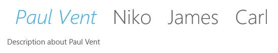

# Appearance and Styling in UWP Tab Control (SfTabControl)

## Customizing item header

The header of tab item can be customized using the HeaderTemplate property. HeaderTemplateSelector property is also available to pick a data template using selection logic.





<navigation:SfTabControl>

<navigation:SfTabItem Header="Paul Vent" Content="Description about Paul Vent">

<navigation:SfTabItem.HeaderTemplate>

<DataTemplate>

<TextBlock Text="{Binding}" FontStyle="Italic"/>

</DataTemplate>

</navigation:SfTabItem.HeaderTemplate>

</navigation:SfTabItem>

<navigation:SfTabItem Header="Niko" Content="Description about Niko" />

<navigation:SfTabItem Header="James" Content="Description about James" />

<navigation:SfTabItem Header="Carl" Content="Description about Carl" />

</navigation:SfTabControl>





## Customizing content transitions

Transition effects of selecting an item can be customized using ContentTransitions property.





<navigation:SfTabControl x:Name="tabControl">

<navigation:SfTabControl.ContentTransitions>

<TransitionCollection>

<EntranceThemeTransition FromHorizontalOffset="100">

</EntranceThemeTransition>

</TransitionCollection>

</navigation:SfTabControl.ContentTransitions>

</navigation:SfTabControl>









tabControl.ContentTransitions = new Windows.UI.Xaml.Media.Animation.TransitionCollection();

tabControl.ContentTransitions.Add(new EntranceThemeTransition() { FromHorizontalOffset = 100.0 });





tabControl.ContentTransitions = New Windows.UI.Xaml.Media.Animation.TransitionCollection()

tabControl.ContentTransitions.Add(New EntranceThemeTransition() With {.FromHorizontalOffset = 100.0})





## TabControlHorizontalTemplate

Template of the SfTabControl can be modified using TabControlHorizontalTemplate property in horizontal orientation.

## TabControlVerticalTemplate

Template of the SfTabControl can be modified using TabControlVerticalTemplate property in vertical orientation.

