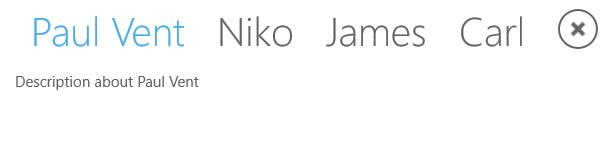
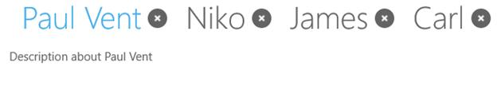
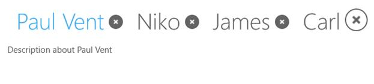
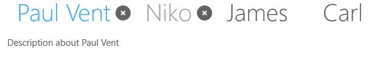
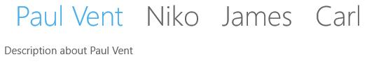

# Close and Scroll button functionalities in UWP Tab Control (SfTabControl)

SfTabControl provides buttons to scroll and close tab items. 

## Tab scroll buttons

Visibility of the scroll buttons can be changed. Events to notify the tab panel scrolling are also provided.

### Setting TabScrollButtonVisibility

Tab scroll buttons can be enabled or disabled for SfTabControl using the TabScrollButtonVisibility property. The possible visibility options are Auto, Visible and Collapsed.





<navigation:SfTabControl x:Name="tabControl" TabScrollButtonVisibility="Visible">

<navigation:SfTabItem Header="Paul Vent" Content="Description about Paul Vent"/>

<navigation:SfTabItem Header="Niko" Content="Description about Niko"/>

<navigation:SfTabItem Header="James" Content="Description about James"/>

<navigation:SfTabItem Header="Carl" Content="Description about Carl"/>

</navigation:SfTabControl>









tabControl.TabScrollButtonVisibility = Syncfusion.UI.Xaml.Controls.Navigation.TabScrollButtonVisibility.Visible;





tabControl.TabScrollButtonVisibility = Syncfusion.UI.Xaml.Controls.Navigation.TabScrollButtonVisibility.Visible





### PreviousTab event

PreviousTab event is fired when tab item is scrolled to view previous item i.e., by clicking the previous button.





<navigation:SfTabControl Width="400" TabScrollButtonVisibility="Visible"
                         PreviousTab="tabControl_PreviousTab">

<navigation:SfTabItem Header="Paul Vent" Content="Description about Paul Vent"/>

<navigation:SfTabItem Header="Niko" Content="Description about Niko" />

<navigation:SfTabItem Header="James" Content="Description about James"/>

<navigation:SfTabItem Header="Carl" Content="Description about Carl"/>

</navigation:SfTabControl>









private void tabControl_PreviousTab(object Sender, ScrollTabEventArgs args)

{

}





Private Sub tabControl_PreviousTab(ByVal Sender As Object, ByVal args As ScrollTabEventArgs)

End Sub





### NextTab event

NextTab event is fired when tab item is scrolled to view next item i.e., by clicking the next button.





<navigation:SfTabControl Width="400" TabScrollButtonVisibility="Visible"
                         NextTab="tabControl_NextTab">

<navigation:SfTabItem Header="Paul Vent" Content="Description about Paul Vent"/>

<navigation:SfTabItem Header="Niko" Content="Description about Niko" />

<navigation:SfTabItem Header="James" Content="Description about James"/>

<navigation:SfTabItem Header="Carl" Content="Description about Carl"/>

</navigation:SfTabControl>









private void tabControl_NextTab(object Sender, ScrollTabEventArgs args)

{

}





Private Sub tabControl_NextTab(ByVal Sender As Object, ByVal args As ScrollTabEventArgs)

End Sub





## Tab close buttons

A tab item can be closed with the help of close button in tab header or a common close button.

## Closing a tab item

CanClose property is used to decide whether a tab item can be closed or not even in the existence of common close button. CloseButtonType property has effect in displaying close button even if the CanClose property is set to true.





<navigation:SfTabItem x:Name="Paul" Header="Paul Vent"
                      Content="Description about Paul Vent" CanClose="true"/>









Paul.CanClose = true;





Paul.CanClose = True





## Setting CloseButtonType

Default close button type is Hide. The possible close button types are:

* Common – A single close button for all the tab  items
* Individual – Individual close button for each tab item
* Both – Both common and individual close buttons for tab item
* Hide – Close button is hidden
* IndividualOnPointerOver – Individual close button is shown on pointer hover
* Extended – Close button displayed for selected item. Show on pointer hover for other tab items 





<navigation:SfTabControl x:Name="tabControl" CloseButtonType="Both">

<navigation:SfTabItem Header="Paul Vent"
                      Content="Description about Paul Vent" CanClose="true"/>

<navigation:SfTabItem Header="Niko" Content="Description about Niko" CanClose="true"/>

<navigation:SfTabItem Header="James" Content="Description about James" CanClose="true"/>

<navigation:SfTabItem Header="Carl" Content="Description about Carl" CanClose="true"/>

</navigation:SfTabControl>









tabControl.CloseButtonType = Syncfusion.UI.Xaml.Controls.Navigation.CloseButtonType.Both;





tabControl.CloseButtonType = Syncfusion.UI.Xaml.Controls.Navigation.CloseButtonType.Both





**Common**

**Individual**

**Both**

**IndividualOnMouseOver**

**Extended**

**Hide**

## TabClosing event

Whenever the close button is clicked, TabClosing event is fired just before the tab is closed.





<navigation:SfTabControl TabClosing="tabControl_TabClosing">









private void tabControl_TabClosing(object Sender, CancelingEventArgs args)

{

}





Private Sub tabControl_TabClosing(ByVal Sender As Object, ByVal args As CancelingEventArgs)

End Sub





## TabClosed event

TabClosed event is fired after the tab item has closed.





<navigation:SfTabControl TabClosed="tabControl_TabClosed">









private void tabControl_TabClosed(object Sender, CloseTabEventArgs args)

{

}





Private Sub tabControl_TabClosed(ByVal Sender As Object, ByVal args As CloseTabEventArgs)

End Sub





## Dispose

When the control is no longer used, we have to clear all the reference of the control from the application. Dispose method is used to  release all the reference for SfTabControl from the application, so the memory which is held by the SfTabControl is reclaimed.  





this.tabcontrol.Dispose();




