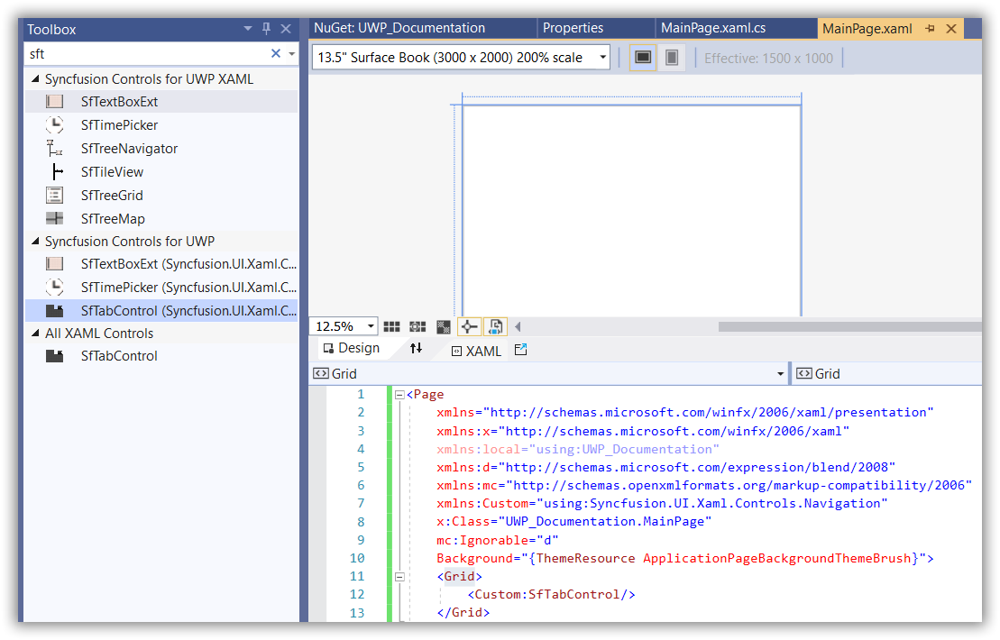
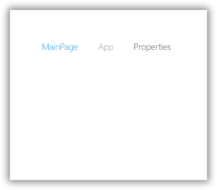
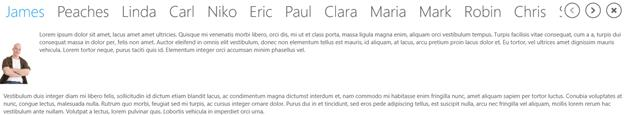

# Getting Started with UWP Tab Control (SfTabControl)

This section explains how to create a high level tab navigation using [SfTabControl](https://help.syncfusion.com/cr/uwp/Syncfusion.UI.Xaml.Controls.Navigation.SfTabControl.html) control.

## Assembly deployment
Refer to the [control dependencies](https://help.syncfusion.com/uwp/control-dependencies#sftabcontrol) section to get the list of assemblies or NuGet package that needs to be added as a reference to use the [SfTabControl](https://help.syncfusion.com/cr/uwp/Syncfusion.UI.Xaml.Controls.Navigation.SfTabControl.html) in any application.

You can refer this [documentation](https://help.syncfusion.com/uwp/visual-studio-integration/nuget-packages) to find more details about installing the NuGet package in a UWP application.

## Creating Application with SfTabControl
In this walk through, user will create a UWP application that contains [SfTabControl](https://help.syncfusion.com/cr/uwp/Syncfusion.UI.Xaml.Controls.Navigation.SfTabControl.html).
1. [Creating project](#Creating-the-project)
2. [Adding control via designer](#Adding-control-via-designer)
3. [Adding control manually in XAML](#Adding-control-manually-in-XAML)
4. [Adding control manually in C#](#Adding-control-manually-in-C#)

## Creating project 
Below section provides detailed information to create new project in Visual Studio to display [SfTabControl](https://help.syncfusion.com/cr/uwp/Syncfusion.UI.Xaml.Controls.Navigation.SfTabControl.html).

## Adding control via designer
The [SfTabControl](https://help.syncfusion.com/cr/uwp/Syncfusion.UI.Xaml.Controls.Navigation.SfTabControl.html) can be added to the application by dragging it from Toolbox and dropping it in designer. The required assembles will be added automatically.

## Adding control manually in XAML

In order to add [SfTabControl](https://help.syncfusion.com/cr/uwp/Syncfusion.UI.Xaml.Controls.Navigation.SfTabControl.html) manually in XAML, do the below steps,

1. Add the below required assembly references to the project,

    * Syncfusion.SfTabControl.UWP
    * Syncfusion.SfShared.UWP

2. Include the namespace for Syncfusion.SfTabControl.UWP assembly in MainPage.XAML.




<Page xmlns="http://schemas.microsoft.com/winfx/2006/xaml/presentation"

xmlns:x="http://schemas.microsoft.com/winfx/2006/xaml"

xmlns:syncfusion="using:Syncfusion.UI.Xaml.Controls.Navigation">




3. Now add the [SfTabControl](https://help.syncfusion.com/cr/uwp/Syncfusion.UI.Xaml.Controls.Navigation.SfTabControl.html) in MainPage.XAML.



<Grid>
    <syncfusion:SfTabControl>
        <syncfusion:SfTabItem Header="MainPage"/>
        <syncfusion:SfTabItem Header="App" />
        <syncfusion:SfTabItem Header="Properties" />
    </syncfusion:SfTabControl>
</Grid>



## Adding control manually in C#

In order to add [SfTabControl](https://help.syncfusion.com/cr/uwp/Syncfusion.UI.Xaml.Controls.Navigation.SfTabControl.html) manually in C#, do the below steps,

1. Add the below required assembly references to the project,

    * Syncfusion.SfTabControl.UWP
    * Syncfusion.SfShared.UWP

2. Import SfTabControl namespace **Syncfusion.UI.Xaml.Controls.Navigation**.

3. Create SfTabControl instance and add it to the page.




SfTabControl sfTabControl1 = new SfTabControl();

SfTabItem tabitem1 = new SfTabItem() { Header = "MainPage" };
SfTabItem tabitem2 = new SfTabItem() { Header = "App" };
SfTabItem tabitem3 = new SfTabItem() { Header = "Properties" };

sfTabControl1.Items.Add(tabitem1);
sfTabControl1.Items.Add(tabitem2);
sfTabControl1.Items.Add(tabitem3);




Dim sfTabControl1 As SfTabControl = New SfTabControl()

Dim tabitem1 As SfTabItem = New SfTabItem() With {
    .Header = "MainPage"
}
Dim tabitem2 As SfTabItem = New SfTabItem() With {
    .Header = "App"
}
Dim tabitem3 As SfTabItem = New SfTabItem() With {
    .Header = "Properties"
}
sfTabControl1.Items.Add(tabitem1)
sfTabControl1.Items.Add(tabitem2)
sfTabControl1.Items.Add(tabitem3)




### Adding items by DataBinding

In [SfTabControl](https://help.syncfusion.com/cr/uwp/Syncfusion.UI.Xaml.Controls.Navigation.SfTabControl.html) you can add tab items by [ItemsSource](https://help.syncfusion.com/cr/uwp/Syncfusion.UI.Xaml.Controls.Navigation.SfTabControl.html#) in which each tab item must have property for `Header` and `Content`.

1.Define the properties required in Model class.




public class Person
{
    public string Name { get; set; }
    public string Image { get; set; }

    public Person(string name, string image)
    {
        Name = name;
        Image = image;
    }
}




Public Class Person

Public Property Name() As String
Public Property Image() As String

Public Sub New(ByVal name As String, ByVal image As String)
	Me.Name = name
	Me.Image = image
End Sub

End Class




2. Define and populate the collection in ViewModel class.




public class TabControlViewModel : NotificationObject
{		
    public TabControlViewModel()
    {
	    TabControlItems = new ObservableCollection<Person>();
	    TabControlItems.Add(new Person("James", "Assets/1.jpg"));
        TabControlItems.Add(new Person("Peaches", "Assets/2.jpg"));
        TabControlItems.Add(new Person("Linda", "Assets/3.jpg"));
        TabControlItems.Add(new Person("Carl", "Assets/4.jpg"));
        TabControlItems.Add(new Person("Niko", "Assets/5.jpg"));
        TabControlItems.Add(new Person("Eric", "Assets/Employee2.png"));
        TabControlItems.Add(new Person("Paul", "Assets/Employee4.png"));
        TabControlItems.Add(new Person("Clara", "Assets/Employee6.png"));
        TabControlItems.Add(new Person("Maria", "Assets/Employee11.png"));
        TabControlItems.Add(new Person("Mark", "Assets/Employee13.png"));
        TabControlItems.Add(new Person("Robin", "Assets/Employee16.png"));
        TabControlItems.Add(new Person("Chris", "Assets/Employee21.png"));
        TabControlItems.Add(new Person("James", "Assets/Employee23.png"));
        TabControlItems.Add(new Person("Mathew", "Assets/Employee25.png"));
	}

    private ObservableCollection<Person> items;
		
    public ObservableCollection<Person> TabControlItems
	{
		get { return items; }
		set { items = value; }
    }
}




Public Class TabControlViewModel
    Inherits NotificationObject

    Public Sub New()
        TabControlItems = New ObservableCollection(Of Person)()
        TabControlItems.Add(New Person("James", "Assets/1.jpg"))
        TabControlItems.Add(New Person("Peaches", "Assets/2.jpg"))
        TabControlItems.Add(New Person("Linda", "Assets/3.jpg"))
        TabControlItems.Add(New Person("Carl", "Assets/4.jpg"))
        TabControlItems.Add(New Person("Niko", "Assets/5.jpg"))
        TabControlItems.Add(New Person("Eric", "Assets/Employee2.png"))
        TabControlItems.Add(New Person("Paul", "Assets/Employee4.png"))
        TabControlItems.Add(New Person("Clara", "Assets/Employee6.png"))
        TabControlItems.Add(New Person("Maria", "Assets/Employee11.png"))
        TabControlItems.Add(New Person("Mark", "Assets/Employee13.png"))
        TabControlItems.Add(New Person("Robin", "Assets/Employee16.png"))
        TabControlItems.Add(New Person("Chris", "Assets/Employee21.png"))
        TabControlItems.Add(New Person("James", "Assets/Employee23.png"))
        TabControlItems.Add(New Person("Mathew", "Assets/Employee25.png"))
    End Sub

    Private items As ObservableCollection(Of Person)

    Public Property TabControlItems As ObservableCollection(Of Person)
        Get
            Return items
        End Get
        Set(ByVal value As ObservableCollection(Of Person))
            items = value
        End Set
    End Property
End Class




3. Add the TabControlViewModel in DataContext of MainPage and bind the the ItemSource property of SfTabControl with collection in TabControlViewModel. Bind the property from Model class which will be used as tab item header to [DisplayMemberPath](https://help.syncfusion.com/cr/uwp/Syncfusion.UI.Xaml.Controls.Navigation.SfTabControl.html#) property. 
4. Content of tab items can be set using [ContentTemplate](https://help.syncfusion.com/cr/uwp/Syncfusion.UI.Xaml.Controls.Navigation.SfTabControl.html#Syncfusion_UI_Xaml_Controls_Navigation_SfTabControl_ContentTemplate) property.



<Page.DataContext>
    <local:TabControlViewModel />
</Page.DataContext>
<Grid>
<syncfusion:SfTabControl ItemsSource="{Binding TabControlItems}" DisplayMemberPath="Name">
    <syncfusion:SfTabControl.ContentTemplate>
        <DataTemplate>
            <Image Source="{Binding Image}" />
        </DataTemplate>
    </syncfusion:SfTabControl.ContentTemplate>
</syncfusion:SfTabControl>
</Grid>




## Design view for content 

You can show scroll button for [SfTabControl](https://help.syncfusion.com/cr/uwp/Syncfusion.UI.Xaml.Controls.Navigation.SfTabControl.html) tab items by setting [TabScrollButtonVisibility](https://help.syncfusion.com/cr/uwp/Syncfusion.UI.Xaml.Controls.Navigation.SfTabControl.html#Syncfusion_UI_Xaml_Controls_Navigation_SfTabControl_TabScrollButtonVisibility) property value to `Visible`.You can bind the view model collection to [ItemsSource](https://help.syncfusion.com/cr/uwp/Syncfusion.UI.Xaml.Controls.Navigation.SfTabControl.html#) property and design the template for content.




<syncfusion:SfTabControl x:Name="tabControl" SelectedIndex="0"
                         DisplayMemberPath="Name"
						 ItemsSource="{Binding TabControlItems}"
						 TabScrollButtonVisibility="Visible">
    <syncfusion:SfTabControl.ContentTemplate>

        <DataTemplate>
        <Grid>
            <Grid.ColumnDefinitions>
                <ColumnDefinition Width="Auto"/>
                <ColumnDefinition Width="*"/>
            </Grid.ColumnDefinitions>
            <Grid.RowDefinitions>
                <RowDefinition Height="Auto"/>
                <RowDefinition />
            </Grid.RowDefinitions>

            <Grid Margin="0 10">
                <Image Source="{Binding Image}" Height="140"
                       VerticalAlignment="Top" Stretch="Uniform"/>
            </Grid>

            <RichTextBlock Grid.Column="1" Margin="10">
                <Paragraph>
                    <Run FontSize="18">
                    TabItem contain the details of Employee in TabControl.
                    </Run>
                </Paragraph>

            </RichTextBlock>
        </Grid>
        </DataTemplate>

    </syncfusion:SfTabControl.ContentTemplate>
</syncfusion:SfTabControl>




