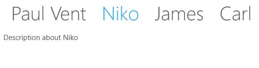

# Selecting Items in UWP Tab Control (SfTabControl)

SfTabControl can have only one selected item at a time. Tab items can be selected by 

* Touching the header text of SfTabItem 
* Using tab strip/list menu
* Programmatically using the properties SelectedItem, SelectedIndex, IsSelected

## Selecting item through Tab strip menu

Tab strip menu is a list containing the collection of tab item headers displayed at the end of TabPanel. Any tab item can be selected using this menu. To enable/disable this menu set the property ShowTabStripMenu in SfTabControl.

## Selecting item using SelectedItem

SelectedItem property is used to select an item using its instance.





<navigation:SfTabControl SelectedItem="niko" x:Name="tabControl">

<navigation:SfTabItem Header="Paul Vent" Content="Description about Paul Vent"/>

<navigation:SfTabItem x:Name="Niko" Header="Niko" Content="Description about Niko"/>

<navigation:SfTabItem Header="James" Content="Description about James"/>

<navigation:SfTabItem Header="Carl" Content="Description about Carl"/>

</navigation:SfTabControl>









tabControl.SelectedItem = Niko;





tabControl.SelectedItem = Niko





## Selecting item using SelectedIndex

SelectedIndex property is used to select an item using its index.





<navigation:SfTabControl SelectedIndex="1" x:Name="tabControl">

<navigation:SfTabItem Header="Paul Vent" Content="Description about Paul Vent"/>

<navigation:SfTabItem Header="Niko" Content="Description about Niko"/>

<navigation:SfTabItem Header="James" Content="Description about James"/>

<navigation:SfTabItem Header="Carl" Content="Description about Carl"/>

</navigation:SfTabControl>









tabControl.SelectedIndex = 1;





tabControl.SelectedIndex = 1





## Selecting item using IsSelected

IsSelected property is used to check whether an item is selected or not. An item can also be selected by setting its IsSelected to true.





<navigation:SfTabControl>

<navigation:SfTabItem Header="Paul Vent" Content="Description about Paul Vent"/>

<navigation:SfTabItem x:Name="Niko" IsSelected="true"
                      Header="Niko" Content="Description about Niko"/>

<navigation:SfTabItem Header="James" Content="Description about James"/>

<navigation:SfTabItem Header="Carl" Content="Description about Carl"/>

</navigation:SfTabControl>









Niko.IsSelected = true;





Niko.IsSelected = True





## Selection change by Swipe Gestures

`SfTabControl` SelectedItem can be changed by Swipe Gestures. This can be enabled by set `EnableSwipeGestures` property of SfTabControl as true. By default, `EnableSwipeGestures` value is false.





<navigation:SfTabControl EnableSwipeGestures ="true">

<navigation:SfTabItem Header="Paul Vent" Content="Description about Paul Vent"/>

<navigation:SfTabItem x:Name="niko" IsSelected="true"
                      Header="Niko" Content="Description about Niko"/>

<navigation:SfTabItem Header="James" Content="Description about James"/>

<navigation:SfTabItem Header="Carl" Content="Description about Carl"/>

</navigation:SfTabControl>





## Notify on SelectionChanged

SelectionChanged event fires when an item is selected. The parameters of SelectionChanged event are AddedItems and RemovedItems. Added items have the list of recently selected items whereas RemovedItems have the list of recently unselected items.





<navigation:SfTabControl Margin="50" x:Name="tabControl"
                         SelectionChanged="tabControl_SelectionChanged">
						 
</navigation:SfTabControl>









private void tabControl_SelectionChanged(object sender, SelectionChangedEventArgs e)

{
	
}





Private Sub tabControl_SelectionChanged(ByVal sender As Object, ByVal e As SelectionChangedEventArgs)

End Sub




