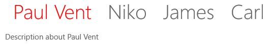
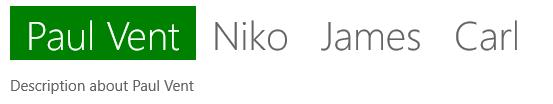

# Selection Style in UWP Tab Control (SfTabControl)

Header of a selected item can be customized in SfTabControl.

## Selected header style

Foreground and background of a selected tab item can be changed using SelectedForeground and SelectedBackground properties. These properties are dependent on the value of SfTabControl.SelectionStyle property. The enum values of SelectionStyle are HeaderText and CompleteHeader. The default value is HeaderText.

## Setting Selected Foreground

SelectedForeground property is used to customize the foreground color of the header text when that tab item is selected and SelectionStyle=”HeaderText”. SelectedBackground has no effect when set in HeaderText selection style.





<navigation:SfTabControl x:Name="tabControl" SelectionStyle="HeaderText">

<navigation:SfTabItem x:Name="Paul" Header="Paul Vent"
                      Content="Description about Paul Vent"
					  SelectedBackground="Green" SelectedForeground="Red"/>

<navigation:SfTabItem Header="Niko" Content="Description about Niko"/>

<navigation:SfTabItem Header="James" Content="Description about James"/>

<navigation:SfTabItem Header="Carl" Content="Description about Carl"/>

</navigation:SfTabControl>









tabControl.SelectionStyle = Syncfusion.UI.Xaml.Controls.Navigation.SelectionStyle.HeaderText;

Paul.SelectedBackground = new SolidColorBrush(Colors.Green);

Paul.SelectedForeground = new SolidColorBrush(Colors.Red);





tabControl.SelectionStyle = Syncfusion.UI.Xaml.Controls.Navigation.SelectionStyle.HeaderText

Paul.SelectedBackground = New SolidColorBrush(Colors.Green)

Paul.SelectedForeground = New SolidColorBrush(Colors.Red)





## Setting Selected Background

SelectedBackground property is used to customize the background color of the header when that tab item is selected and SelectionStyle=”CompleteHeader”. SelectedForeground has no effect when set in CompleteHeader selection style.





<navigation:SfTabControl x:Name="tabControl" SelectionStyle="CompleteHeader">
<navigation:SfTabItem x:Name="Paul" Header="Paul Vent"
                      Content="Description about Paul Vent"
					  SelectedBackground="Green" SelectedForeground="Red"/>

<navigation:SfTabItem Header="Niko" Content="Description about Niko"/>

<navigation:SfTabItem Header="James" Content="Description about James"/>

<navigation:SfTabItem Header="Carl" Content="Description about Carl"/>

</navigation:SfTabControl>









tabControl.SelectionStyle = Syncfusion.UI.Xaml.Controls.Navigation.SelectionStyle.CompleteHeader;

Paul.SelectedBackground = new SolidColorBrush(Colors.Green);

Paul.SelectedForeground = new SolidColorBrush(Colors.Red);





tabControl.SelectionStyle = Syncfusion.UI.Xaml.Controls.Navigation.SelectionStyle.CompleteHeader

Paul.SelectedBackground = New SolidColorBrush(Colors.Green)

Paul.SelectedForeground = New SolidColorBrush(Colors.Red)





