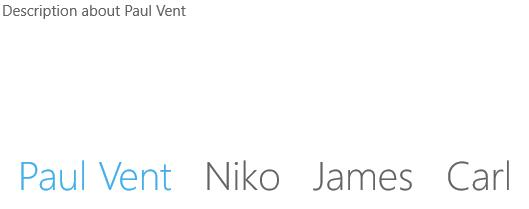
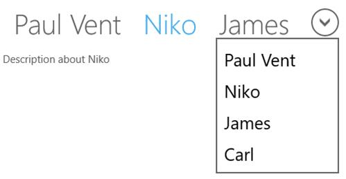
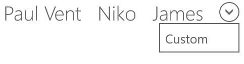
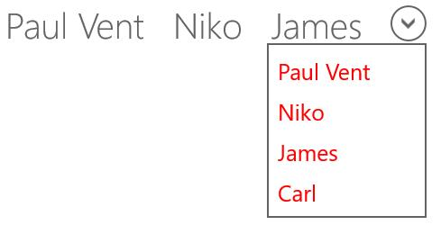

# TabStripPlacement and Menu in UWP Tab Control (SfTabControl)

## Change placement of Tabs

The tab strip of SfTabControl can be aligned in all the four sides of SfTabControl using the TabStripPlacement property. It has the following options and by default it is top:

* Left
* Top
* Right
* Bottom





<navigation:SfTabControl x:Name="tabControl" TabStripPlacement="Bottom">

<navigation:SfTabItem Header="Paul Vent" Content="Description about Paul Vent"/>

<navigation:SfTabItem Header="Niko" Content="Description about Niko"/>

<navigation:SfTabItem Header="James" Content="Description about James"/>

<navigation:SfTabItem Header="Carl" Content="Description about Carl"/>

</navigation:SfTabControl>









tabControl.TabStripPlacement = Syncfusion.UI.Xaml.Controls.Navigation.TabStripPlacement.Bottom;





tabControl.TabStripPlacement = Syncfusion.UI.Xaml.Controls.Navigation.TabStripPlacement.Bottom





## TabStripMenu

Tab strip menu is a list containing the collection of tab item headers displayed at the end of TabPanel. Any tab item can be selected using this menu.

### ShowTabStripMenu

To enable/disable this menu set the property ShowTabStripMenu in SfTabControl





<navigation:SfTabControl x:Name="tabControl" ShowTabstripMenu="true">

<navigation:SfTabItem Header="Paul Vent" Content="Description about Paul Vent"/>

<navigation:SfTabItem Header="Niko" Content="Description about Niko"/>

<navigation:SfTabItem Header="James" Content="Description about James"/>

<navigation:SfTabItem Header="Carl" Content="Description about Carl"/>

</navigation:SfTabControl>









tabControl.ShowTabstripMenu = true;





tabControl.ShowTabstripMenu = True





### Adding custom items to TabStrip menu

Custom menu items can be added to the tab strip menu using TabStripMenuItems property as follows:





<navigation:SfTabControl x:Name="tabControl" ShowTabstripMenu="true">

<navigation:SfTabItem Header="Paul Vent" Content="Description about Paul Vent"/>

<navigation:SfTabItem Header="Niko" Content="Description about Niko"/>

<navigation:SfTabItem Header="James" Content="Description about James"/>

<navigation:SfTabItem Header="Carl" Content="Description about Carl"/>

</navigation:SfTabControl>









tabControl.TabstripMenuItems = new List<object>();

tabControl.TabstripMenuItems.Add("Custom");





tabControl.TabstripMenuItems = New List(Of Object)()

tabControl.TabstripMenuItems.Add("Custom")





### Customizing TabStrip menu item

Tab strip menu items can be customized using the TabStripMenuItemTemplate property. 





<navigation:SfTabControl ShowTabstripMenu="true">

<navigation:SfTabItem Header="Paul Vent" Content="Description about Paul Vent"/>

<navigation:SfTabItem Header="Niko" Content="Description about Niko"/>

<navigation:SfTabItem Header="James" Content="Description about James"/>

<navigation:SfTabItem Header="Carl" Content="Description about Carl"/>

<navigation:SfTabControl.TabstripMenuItemTemplate>

<DataTemplate>

<TextBlock Text="{Binding}" Foreground="Red"/>

</DataTemplate>

</navigation:SfTabControl.TabstripMenuItemTemplate>

</navigation:SfTabControl>





