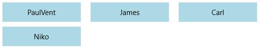
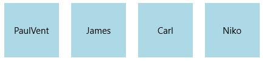

# Appearance and Styling in UWP Tile View (SfTileView)

## Customizing item height

`ItemHeight` property is used to set a common height value for all the items in TileView control only in Normal state.





<layout:SfTileView x:Name="tileView" ItemHeight="50">

<layout:SfTileViewItem Background="LightBlue" Content="PaulVent"
                       MaximizedContent="Description about Paul"/>

<layout:SfTileViewItem Background="LightBlue" Content="James"
                       MaximizedContent="Description about James"/>

<layout:SfTileViewItem Background="LightBlue" Content="Carl"
                       MaximizedContent="Description about Carl"/>

<layout:SfTileViewItem Background="LightBlue" Content="Niko"
                       MaximizedContent="Description about Niko"/>

</layout:SfTileView>









tileView.ItemHeight = 50.0;





tileView.ItemHeight = 50.0





## Customizing item width

`ItemWidth` property is used to set a common width value for all the items in TileView control only in Normal state.





<layout:SfTileView x:Name="tileView" ItemWidth="100">

<layout:SfTileViewItem Background="LightBlue" Content="PaulVent"
                       MaximizedContent="Description about Paul"/>

<layout:SfTileViewItem Background="LightBlue" Content="James"
                       MaximizedContent="Description about James"/>

<layout:SfTileViewItem Background="LightBlue" Content="Carl"
                       MaximizedContent="Description about Carl"/>

<layout:SfTileViewItem Background="LightBlue" Content="Niko"
                       MaximizedContent="Description about Niko"/>

</layout:SfTileView>









tileView.ItemWidth = 100.0;





tileView.ItemWidth = 100.0





