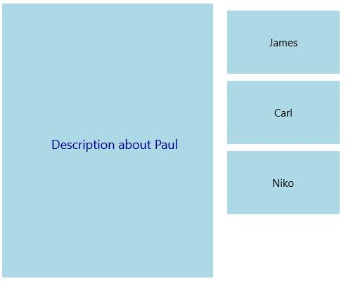
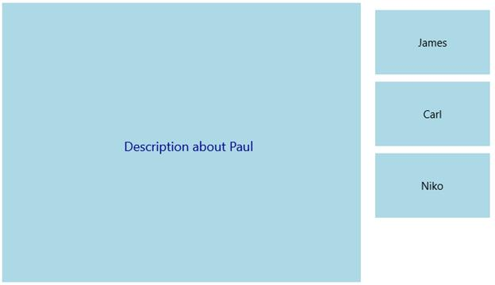
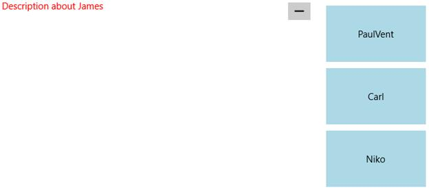

# Customizing Maximized Item in UWP Tile View (SfTileView)

`SfTileView` provides several properties for customizing the maximized item.

## Changing maximized item height

`MaximizedItemHeight` property is used to set height for the maximized item.





<layout:SfTileView x:Name="tileView" MaximizedItemHeight="400">

</layout:SfTileView>









tileView.MaximizedItemHeight = 400.0;





tileView.MaximizedItemHeight = 400.0





## Changing maximized item width

`MaximizedItemWidth` property is used to set width for the maximized item.





<layout:SfTileView x:Name="tileView" MaximizedItemWidth="400">

</layout:SfTileView>









tileView.MaximizedItemWidth = 400.0;





tileView.MaximizedItemWidth = 400.0





## Animating maximized content

`MaximizedContentTransitions` property is used to apply a set of transitions when an item is maximized.





<layout:SfTileView x:Name="tileView">

<layout:SfTileView.MaximizedContentTransitions>

<TransitionCollection>

<PopupThemeTransition/>

</TransitionCollection>

</layout:SfTileView.MaximizedContentTransitions>

</layout:SfTileView>









tileView.MaximizedItemHeight = 400.0;

tileView.Transitions = new TransitionCollection();

tileView.Transitions.Add(new PopupThemeTransition());





tileView.MaximizedItemHeight = 400.0

tileView.Transitions = New TransitionCollection()

tileView.Transitions.Add(New PopupThemeTransition())





## Customizing maximized item

`MaximizedItemContainerStyle` property is used to set style for the ContentControl that holds the MaximizedContent. It can be set as follows:





<layout:SfTileView>

<layout:SfTileView.MaximizedItemContainerStyle>

</layout:SfTileView.MaximizedItemContainerStyle>

<layout:SfTileViewItem Background="LightBlue" Content="PaulVent" MaximizedContent="Description about Paul"/>

<layout:SfTileViewItem Background="LightBlue" Content="James" MaximizedContent="Description about James"/>

<layout:SfTileViewItem Background="LightBlue" Content="Carl" MaximizedContent="Description about Carl"/>

<layout:SfTileViewItem Background="LightBlue" Content="Niko" MaximizedContent="Description about Niko"/>

</layout:SfTileView>





