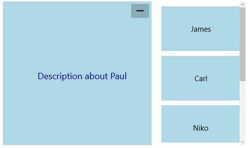

# Dealing with State in UWP Tile View (SfTileView)

## Setting item state

`State` property is used to set the state of tile view item. The possible values of State are:

* Maximized 
* Normal

At most only one item can be in maximized state and the remaining items are in normal state.





<layout:SfTileView Width="500" Height="300"
                   x:Name="tileView" MinimizedItemsOrientation="Right">

<layout:SfTileViewItem Background="LightBlue" x:Name="tileItem1"
                       Content="PaulVent" State="Maximized">

<layout:SfTileViewItem.MaximizedContent>

<Border Background="LightBlue">

<TextBlock Text="Description about Paul"/>

</Border>

</layout:SfTileViewItem.MaximizedContent>

</layout:SfTileViewItem>

<layout:SfTileViewItem Background="LightBlue" Content="James">

<layout:SfTileViewItem.MaximizedContent>

<Border Background="LightBlue">

<TextBlock Text="Description about James"/>

</Border>

</layout:SfTileViewItem.MaximizedContent>

</layout:SfTileViewItem>

<layout:SfTileViewItem Background="LightBlue" Content="Carl">

<layout:SfTileViewItem.MaximizedContent>

<Border Background="LightBlue">

<TextBlock Text="Description about Carl"/>

</Border>

</layout:SfTileViewItem.MaximizedContent>

</layout:SfTileViewItem>

<layout:SfTileViewItem Background="LightBlue" Content="Niko">

<layout:SfTileViewItem.MaximizedContent>

<Border Background="LightBlue">

<TextBlock Text="Description about Niko"/>

</Border>

</layout:SfTileViewItem.MaximizedContent>

</layout:SfTileViewItem>

</layout:SfTileView>









tileItem1.State = Syncfusion.UI.Xaml.Controls.Layout.TileViewItemState.Maximized;





tileItem1.State = Syncfusion.UI.Xaml.Controls.Layout.TileViewItemState.Maximized





## Maximizing item programmatically

`MaximizedItem` property is used to get the instance of maximized tile view item. It is a read-only property.





SfTileViewItem maximizedItem = tileView.MaximizedItem;





Dim maximizedItem As SfTileViewItem = tileView.MaximizedItem





## Retrieving the Minimized items

`MinimizedItems` property is used to get a collection of minimized tile view items. It is a read-only property.





ObservableCollection<object> minimizedItems = tileView.MinimizedItems;





Dim minimizedItems As ObservableCollection(Of Object) = tileView.MinimizedItems





