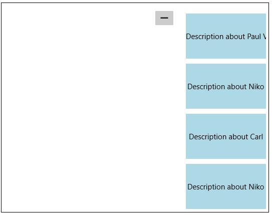
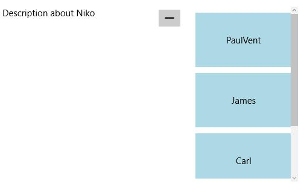
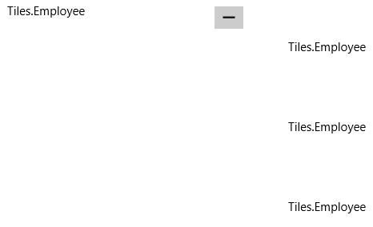
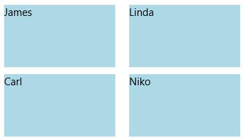
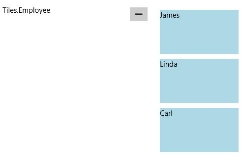
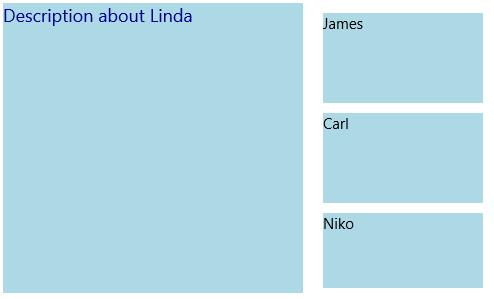

# Populating Items in UWP Tile View (SfTileView)

`SfTileViewItem` are added as items of `SfTileView`. Items can be added using `Items` or `ItemSource` property.

## Using Items

`SfTileView` accepts SfTileViewItem as its children when added directly.

### Adding items to the control

`SfTileView` accepts `SfTileViewItem` as its children when added directly. Here five `SfTileViewItems` are added as the children of `SfTileView`. Adding items as follows display a blank screen.





<layout:SfTileView>

<layout:SfTileViewItem/>

<layout:SfTileViewItem/>

<layout:SfTileViewItem/>

<layout:SfTileViewItem/>

<layout:SfTileViewItem/>

</layout:SfTileView>









SfTileView tileView = new SfTileView();

tileView.Items.Add(new SfTileViewItem());

tileView.Items.Add(new SfTileViewItem());

tileView.Items.Add(new SfTileViewItem());

tileView.Items.Add(new SfTileViewItem());

tileView.Items.Add(new SfTileViewItem());





Dim tileView As New SfTileView()

tileView.Items.Add(New SfTileViewItem())

tileView.Items.Add(New SfTileViewItem())

tileView.Items.Add(New SfTileViewItem())

tileView.Items.Add(New SfTileViewItem())

tileView.Items.Add(New SfTileViewItem())





### Setting content for items

`Content` property helps to set the content for `SfTileViewItem`. `SfTileViewItem` is a ContentControl so that any object can be added as its content. Content is visible only if the item is minimized.





<layout:SfTileView>

<layout:SfTileViewItem Background="LightBlue" Content="Description about Paul Vent"/>

<layout:SfTileViewItem Background="LightBlue" Content="Description about Niko"/>

<layout:SfTileViewItem Background="LightBlue" Content="Description about James"/>

<layout:SfTileViewItem Background="LightBlue" Content="Description about Carl"/>

<layout:SfTileViewItem Background="LightBlue" Content="Description about Niko"/>

</layout:SfTileView>









SfTileView tileView = new SfTileView();

tileView.Items.Add(new SfTileViewItem() {
Content = "Description about Paul Vent" });

tileView.Items.Add(new SfTileViewItem() {
Content = "Description about Niko "});

tileView.Items.Add(new SfTileViewItem() {
Content = "Description about James " });

tileView.Items.Add(new SfTileViewItem() {
Content = "Description about Paul "});

tileView.Items.Add(new SfTileViewItem() {
Content = "Description about Paul "});





Dim tileView As New SfTileView()

tileView.Items.Add(New SfTileViewItem() With {.Content = "Description about Paul Vent"})

tileView.Items.Add(New SfTileViewItem() With {.Content = "Description about Niko "})

tileView.Items.Add(New SfTileViewItem() With {.Content = "Description about James "})

tileView.Items.Add(New SfTileViewItem() With {.Content = "Description about Paul "})

tileView.Items.Add(New SfTileViewItem() With {.Content = "Description about Paul "})





### Setting MaximizedContent for items

`MaximizedContent` property helps to set the maximized content for `SfTileViewItem`. MaximizedContent is visible only if the item is maximized.

Set the `MaximizedContent` property as given below:





<layout:SfTileView Width="500" Height="300">

<layout:SfTileViewItem Background="LightBlue" Content="PaulVent" 

MaximizedContent="Description about Paul" />

<layout:SfTileViewItem Background="LightBlue" Content="James" 

MaximizedContent="Description about James"/>

<layout:SfTileViewItem Background="LightBlue" Content="Carl" 

MaximizedContent="Description about Carl"/>

<layout:SfTileViewItem Background="LightBlue" Content="Niko"

MaximizedContent="Description about Niko"/> 

</layout:SfTileView>









SfTileView tileView = new SfTileView();

tileView.Items.Add(new SfTileViewItem()
{
   Content = "PaulVent",
   MaximizedContent = "Description about Paul"
});

tileView.Items.Add(new SfTileViewItem()
{
   Content = "James",
   MaximizedContent="Description about James"
});

tileView.Items.Add(new SfTileViewItem()
{
   Content = "Carl",
   MaximizedContent="Description about Carl"
});

tileView.Items.Add(new SfTileViewItem()
{
   Content = "Niko",
   MaximizedContent="Description about Niko"
});





Dim tileView As New SfTileView()

tileView.Items.Add(New SfTileViewItem() With {
	.Content = "PaulVent",
	.MaximizedContent = "Description about Paul"
})

tileView.Items.Add(New SfTileViewItem() With {
	.Content = "James",
	.MaximizedContent="Description about James"
})

tileView.Items.Add(New SfTileViewItem() With {
	.Content = "Carl",
	.MaximizedContent="Description about Carl"
})

tileView.Items.Add(New SfTileViewItem() With {
	.Content = "Niko",
	.MaximizedContent="Description about Niko"
})





## Using ItemsSource

### Adding items to the control

`SfTileView` accepts any business object collection to be bound to its `ItemsSource` property. 

1.Create a model





public class Employee

{
	
public string Name { get; set; }

public string Description { get; set; }

}





Public Class Employee

Public Property Name() As String

Public Property Description() As String

End Class





2.Create a collection of model





private List<Employee> employees;

public List<Employee> Employees

{
	
get { return employees; }

set { employees = value; }

}





Private employees_Renamed As List(Of Employee)

Public Property Employees() As List(Of Employee)

Get
	Return employees_Renamed
End Get

Set(ByVal value As List(Of Employee))
	employees_Renamed = value
End Set

End Property





3.Populate the collection





Employees = new List<Employee>();

Employees.Add(new Employee() { Name = "James", Description = "Description about James" });

Employees.Add(new Employee() { Name = "Linda", Description = "Description about Linda" });

Employees.Add(new Employee() { Name = "Carl", Description = "Description about Carl" });

Employees.Add(new Employee() { Name = "Niko", Description = "Description about Niko" });





Employees = New List(Of Employee)()

Employees.Add(New Employee() With {
	.Name = "James",
	.Description = "Description about James"
})

Employees.Add(New Employee() With {
	.Name = "Linda",
	.Description = "Description about Linda"
})

Employees.Add(New Employee() With {
	.Name = "Carl",
	.Description = "Description about Carl"
})

Employees.Add(New Employee() With {
	.Name = "Niko",
	.Description = "Description about Niko"
})





4.Bind the Employees collection to ItemsSource property of SfTileView Control





<layout:SfTileView ItemsSource="{Binding Employees}"/>





Tile view items need a template to render so `SfTileView` control is populated as follows:

### Setting content for items

Template for tile view items can be set using the `ItemTemplate` property. ItemTemplate helps to decorate the item with visual elements. At this point, the control is populated with a list of employees. The class Employee has two properties, Name and Description. In this case, control is set to display content based on Name:





<layout:SfTileView ItemsSource="{Binding Employees}">

<layout:SfTileView.ItemTemplate>

<DataTemplate>

<TextBlock Text="{Binding Name}"/>

</DataTemplate>

</layout:SfTileView.ItemTemplate> 

<layout:SfTileView.ItemContainerStyle>

</layout:SfTileView.ItemContainerStyle>

</layout:SfTileView>





Click on the Tile “Niko” to maximize it. Maximized item is not rendered because it requires  MaximizedItemTemplate other than ItemTemplate.

### Setting maximized content for items

Template for maximized item is set using `MaximizedItemTemplate` property. It can be set as follows:





<layout:SfTileView Width="500" Height="300" ItemsSource="{Binding Employees}" >

<layout:SfTileView.ItemContainerStyle>

</layout:SfTileView.ItemContainerStyle>

<layout:SfTileView.ItemTemplate>

<DataTemplate>

<Border Background="LightBlue">

<TextBlock Text="{Binding Name}"/>

</Border>

</DataTemplate>

</layout:SfTileView.ItemTemplate>

<layout:SfTileView.MaximizedItemTemplate>

<DataTemplate>

<Border Background="LightBlue" >

<TextBlock Text="{Binding Description}" Foreground="DarkBlue" FontSize="18"/>

</Border>

</DataTemplate>

</layout:SfTileView.MaximizedItemTemplate>

</layout:SfTileView>





