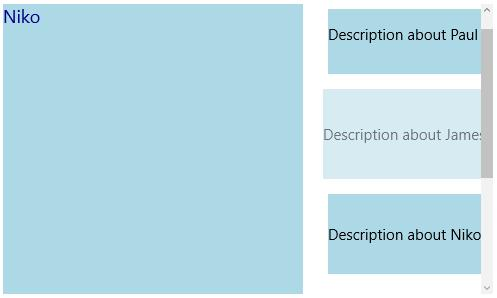
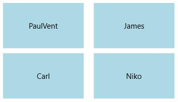
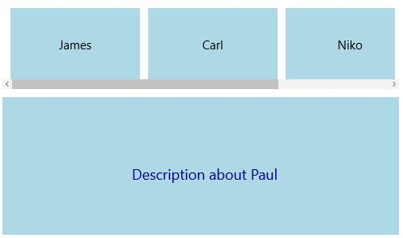
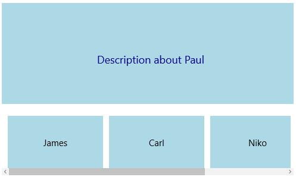
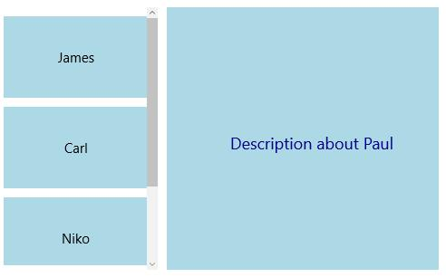
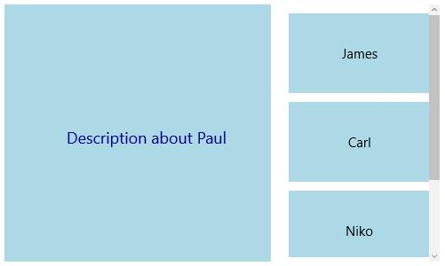

# Re-ordering and Orientation in UWP Tile View (SfTileView)

## Reordering through touch

`SfTileView` control provides tab reordering feature through touch drag and drop. Set the properties AllowDragDrop and AllowReorder to enable/disable this feature.





<layout:SfTileView Width="500" Height="300" ItemsSource="{Binding Employees}" >

<layout:SfTileView.ItemTemplate>

<DataTemplate>

<Border Background="LightBlue">

<TextBlock Text="{Binding Name}"/>

</Border>

</DataTemplate>

</layout:SfTileView.ItemTemplate>

<layout:SfTileView.MaximizedItemTemplate>

<DataTemplate>

<Border Background="LightBlue" >

<TextBlock Text="{Binding Description}" Foreground="DarkBlue" FontSize="18"/>

</Border>

</DataTemplate>

</layout:SfTileView.MaximizedItemTemplate>

</layout:SfTileView>





## Orientation

### Orientation for TileView

Orientation specifies the arrangement sequence of tile view items. Both horizontal and vertical orientation are supported.

**Horizontal**





<layout:SfTileView x:Name="tileView" Width="500" Height="300" Orientation="Horizontal">

<layout:SfTileViewItem Background="LightBlue" Content="PaulVent" MaximizedContent="Description about Paul" />

<layout:SfTileViewItem Background="LightBlue" Content="James" MaximizedContent="Description about James"/>

<layout:SfTileViewItem Background="LightBlue" Content="Carl" MaximizedContent="Description about Carl"/>

<layout:SfTileViewItem Background="LightBlue" Content="Niko" MaximizedContent="Description about Niko"/>

</layout:SfTileView>









tileView.Orientation = Orientation.Horizontal;





tileView.Orientation = Orientation.Horizontal





**Vertical**





<layout:SfTileView x:Name="tileView" Width="500" Height="300" Orientation="Vertical">

<layout:SfTileViewItem Background="LightBlue" Content="PaulVent" MaximizedContent="Description about Paul" />

<layout:SfTileViewItem Background="LightBlue" Content="James" MaximizedContent="Description about James"/>

<layout:SfTileViewItem Background="LightBlue" Content="Carl" MaximizedContent="Description about Carl"/>

<layout:SfTileViewItem Background="LightBlue" Content="Niko" MaximizedContent="Description about Niko"/>

</layout:SfTileView>









tileView.Orientation = Orientation.Vertical;





tileView.Orientation = Orientation.Vertical





### Orientation for MinimizedTileViewItems

The orientation of minimized items panel can be changed using `MinimizedItemsOrientation` property. The supported orientations are 

* Top 
* Bottom
* Left 
* Right

**Top**

Minimized items are placed at top of the control and maximized item at the bottom of the control.





<layout:SfTileView x:Name="tileView" MinimizedItemsOrientation="Top">

<layout:SfTileViewItem Background="LightBlue" Content="PaulVent">

<layout:SfTileViewItem.MaximizedContent>

<Border Background="LightBlue">

<TextBlock Text="Description about Paul"/>

</Border>

</layout:SfTileViewItem.MaximizedContent>

</layout:SfTileViewItem>

<layout:SfTileViewItem Background="LightBlue" Content="James">

<layout:SfTileViewItem.MaximizedContent>

<Border Background="LightBlue">

<TextBlock Text="Description about James"/>

</Border>

</layout:SfTileViewItem.MaximizedContent>

</layout:SfTileViewItem>

<layout:SfTileViewItem Background="LightBlue" Content="Carl">

<layout:SfTileViewItem.MaximizedContent>

<Border Background="LightBlue">

<TextBlock Text="Description about Carl"/>

</Border>

</layout:SfTileViewItem.MaximizedContent>

</layout:SfTileViewItem>

<layout:SfTileViewItem Background="LightBlue" Content="Niko">

<layout:SfTileViewItem.MaximizedContent>

<Border Background="LightBlue">

<TextBlock Text="Description about Niko"/>

</Border>

</layout:SfTileViewItem.MaximizedContent>

</layout:SfTileViewItem>

</layout:SfTileView>









tileView.MinimizedItemsOrientation = Syncfusion.UI.Xaml.Controls.Layout.MinimizedItemsOrientation.Top;





tileView.MinimizedItemsOrientation = Syncfusion.UI.Xaml.Controls.Layout.MinimizedItemsOrientation.Top





**Bottom**

Minimized items are placed at bottom of the control and maximized item at the top of the control.





<layout:SfTileView x:Name="tileView" MinimizedItemsOrientation="Bottom">

</layout:SfTileView>









tileView.MinimizedItemsOrientation = Syncfusion.UI.Xaml.Controls.Layout.MinimizedItemsOrientation.Bottom;





tileView.MinimizedItemsOrientation = Syncfusion.UI.Xaml.Controls.Layout.MinimizedItemsOrientation.Bottom





**Left**

Minimized items are placed at left side of the control and maximized item at the right side of the control. 





<layout:SfTileView x:Name="tileView" MinimizedItemsOrientation="Left">

</layout:SfTileView>









tileView.MinimizedItemsOrientation = Syncfusion.UI.Xaml.Controls.Layout.MinimizedItemsOrientation.Left;





tileView.MinimizedItemsOrientation = Syncfusion.UI.Xaml.Controls.Layout.MinimizedItemsOrientation.Left





**Right**

Minimized items are placed at right side of the control and maximized item at the left side of the control. 





<layout:SfTileView x:Name="tileView" MinimizedItemsOrientation="Right">

</layout:SfTileView>









tileView.MinimizedItemsOrientation = Syncfusion.UI.Xaml.Controls.Layout.MinimizedItemsOrientation.Right;





tileView.MinimizedItemsOrientation = Syncfusion.UI.Xaml.Controls.Layout.MinimizedItemsOrientation.Right





