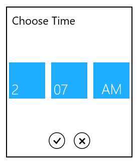

# Customizing DropDown in UWP TimePicker (SfTimePicker)

## DropDown height

The height of drop down can be changed using DropDownHeight property.





 <syncfusion:SfTimePicker x:Name="timePicker" HorizontalAlignment="Center" VerticalAlignment="Center"  Width="200" Margin="15" DropDownHeight="300" />









timePicker.DropDownHeight = 200;





timePicker.DropDownHeight = 200





## IsDropDownOpen

Drop down can be programmatically opened or closed using the property IsDropDownOpen.

## ShowDropDownButton

DropDownButton visibility can be changed by using the ShowDropDownButton property





   <syncfusion:SfTimePicker x:Name="timePicker" VerticalAlignment="Center"  Width="200" Margin="15" ShowDropDownButton="true"/>









 timePicker.ShowDropDownButton = true;





 timePicker.ShowDropDownButton = True





