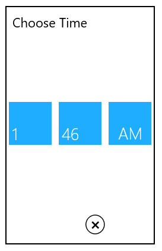
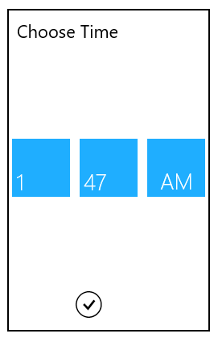

# Footer in UWP TimePicker (SfTimePicker)

## Done and Cancel Buttons

The Done and Cancel buttons can be made visible or hidden using the following properties:

## ShowDoneButton

The ShowDoneButton property is used to show or hide the Done button. The default value is true.

The following code sample shows how to hide the Done button:



<Page
   ...
   xmlns:input="using:Syncfusion.UI.Xaml.Controls.Input">

    <syncfusion:SfTimePicker VerticalAlignment="Center"

                                   HorizontalAlignment="Center"

                                   Width="200">

                <syncfusion:SfTimePicker.SelectorStyle>

                    

                </syncfusion:SfTimePicker.SelectorStyle>         
     
     </syncfusion:SfTimePicker>

</Page>



## ShowCancelButton

The ShowCancelButton property is used to show or hide the Cancel button. The default value is true.

The following code sample shows how to hide the Cancel button:


<Page
   ...
   xmlns:input="using:Syncfusion.UI.Xaml.Controls.Input">

    <syncfusion:SfTimePicker VerticalAlignment="Center"

                                   HorizontalAlignment="Center"

                                   Width="200">

                <syncfusion:SfTimePicker.SelectorStyle>

                    

                </syncfusion:SfTimePicker.SelectorStyle>       
                
    </syncfusion:SfTimePicker>

</Page>



