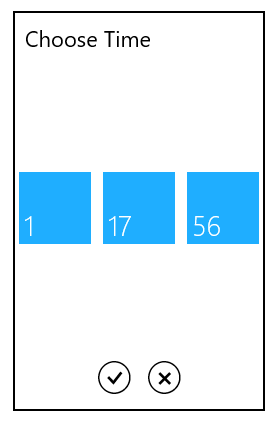

# Formatting in UWP TimePicker (SfTimePicker)

The SfTimePicker control allows users to format the display text in various ways.

## Using the FormatString

The FormatString property determines the format specifier by which the display text has to be formatted.

The example below shows how to create a time picker with a [Long Time pattern](https://learn.microsoft.com/en-us/dotnet/api/system.globalization.datetimeformatinfo.longtimepattern?view=net-10.0&redirectedfrom=MSDN#System_Globalization_DateTimeFormatInfo_LongTimePattern).





<Page
   ...
   xmlns:input="using:Syncfusion.UI.Xaml.Controls.Input">

       <Grid Background="{StaticResource ApplicationPageBackgroundThemeBrush}">

                <syncfusion:SfTimePicker VerticalAlignment="Center" 

                                       Width="200" Margin="15"

                                       FormatString="HH:mm:ss"/>

       </Grid>

</Page>









using Syncfusion.UI.Xaml.Controls.Input;

 timePicker.FormatString = "HH:mm:ss";





Imports Syncfusion.UI.Xaml.Controls.Input;

timePicker.FormatString = "HH:mm:ss"





## Specifying format for the TimeSelector

The SelectorFormatString property is used to specify the format for the TimeSelector.





<Page
   ...
   xmlns:input="using:Syncfusion.UI.Xaml.Controls.Input">

    <Grid Background="{StaticResource ApplicationPageBackgroundThemeBrush}">

        <syncfusion:SfTimePicker HorizontalAlignment="Center" VerticalAlignment="Center" 

                                       Width="200" Margin="15"

                                       SelectorFormatString="HH:mm:ss"/>
    </Grid>

</Page>









using Syncfusion.UI.Xaml.Controls.Input;

 timePicker.SelectorFormatString = "HH:mm:ss";





Imports Syncfusion.UI.Xaml.Controls.Input;

 timePicker.SelectorFormatString = "HH:mm:ss"





N>  A detailed explanation of standard date time formatting is available [here](https://learn.microsoft.com/en-us/previous-versions/dotnet/netframework-1.1/az4se3k1(v=vs.71)). The result string produced by these format specifiers is influenced by the settings in the Regional Options control panel. Computers with different cultures or different date and time settings will generate different result strings.
